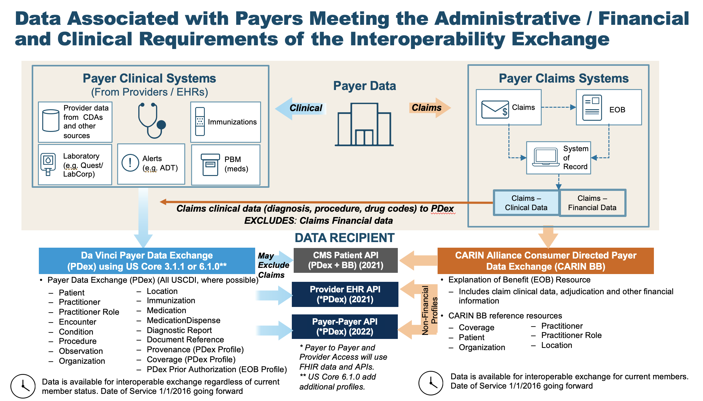

# Home - Da Vinci Payer Data Exchange v2.2.0

* [**Table of Contents**](toc.md)
* **Home**

## Home

| | | |
| :--- | :--- | :--- |
| *Official URL*:http://hl7.org/fhir/us/davinci-pdex/ImplementationGuide/hl7.fhir.us.davinci-pdex | *Version*:2.2.0 | |
| * IG Standards status: *[Trial-use](http://hl7.org/fhir/R4/versions.html#std-process) | [Maturity Level](http://hl7.org/fhir/versions.html#maturity): 2 | *Computable Name*:DaVinciPayerDataExchange |
| **Copyright/Legal**: Used by permission of HL7 International, all rights reserved Creative Commons License | | |

***This page has been updated to reflect the release of the CMS Prior Authorization Rule (CMS-0057) in 2024. The guide has also been updated to support the adoption of US Core 6.1.0, in addition to existing support for US Core 3.1.1 and support for US Core 7.0.0. This change is implemented to enable implementers to comply with both the CMS-0057 Rule and the ONC's HTI-1 rule that implements US Core 6.1.0 as the base standard of US Core as of January 1, 2026.***

# In this PDex version

The PDex work group has made changes to the original version of the IG following the publication of the final CMS Interoperability and Patient Access Rule (CMS-9115) and the subsequent Advancing Interoperability and Improving Prior Authorization Rule (CMS-0057).

The STU 2.1 version of the IG incorporates changes to support the sharing of Prior Authorization information with members, providers and other payers. This is done through the profiling of the [ExplanationOfBenefit](PDexPriorAuthorization.md) resource. This version of the Implementation guide also introduces two Bulk APIs that enable the data available through the Patient Access API to also be made available to In-Network/Contracted Providers and other Health Plans through the [Provider Access API](provider-access-api.md) and the [Payer-to-Payer Bulk API](payertopayerbulkexchange.md).

CMS Guidance defines two sets of data to be made available by payers in the Patient Access API: Claims and Encounter Data and Clinical data. They provide links to specific implementations guides for the Patient Access API to provide guidance. Use of these implementation guides is not required but is recommended. If used these guides will provide information payers can employ to meet the requirements of the policies being finalized. The [CARIN Consumer Directed Payer Data Exchange IG (CARIN IG for Blue Button®)]() defines how Claims and Encounter Data are to be provided; This Da Vinci Payer Data Exchange IG (PDex) and the [US Core 3.1.1 IG](http://hl7.org/fhir/us/core/3.1.1), [US Core 6.1.0 IG](http://hl7.org/fhir/us/core/STU6.1) or [US Core 7.0.0 IG](http://hl7.org/fhir/us/core/STU7) define how Clinical Data is to be provided.

This version of the Implementation Guide introduces support for [US Core 7.0.0 IG](http://hl7.org/fhir/us/core/STU7). Since the IG embraces US Core the support for [US Core 7.0.0](http://hl7.org/fhir/us/core/STU7) is similar to the support for [US Core 6.1.0](http://hl7.org/fhir/us/core/STU6.1) which required minimal changes to the PDex IG. Throughout this IG references to [US Core 6.1.0](http://hl7.org/fhir/us/core/STU6.1) can also be interpreted as supporting [US Core 7.0.0](http://hl7.org/fhir/us/core/STU7) which is expected to supercede [US Core 6.1.0](http://hl7.org/fhir/us/core/STU6.1) in 2028.

### Continuing Standards Evolution

This IG recognizes that the healthcare industry is rapidly evolving methods, such as TEFCA, to enable the secure exchange of information between Providers and Payers and between payers. Incorporating prescriptive definitions for connecting, registering and authorizing access to the Provider Access or Payer-to-Payer API risks complicating the adoption of solutions that will enable secure exchange of data, at scale. Health Plans implementing the Da Vinci guides that address the CMS Prior Authorization Rule (Payer Data Exchange, Coverage Requirements Discovery, Documents templates and Rules and Prior Authorization Support) are urged to continue to engage with their respective work groups in order to be aware of ongoing developments and emergent implementation approaches, as the industry works to evolve methods that will enable adoption of these Interoperability Standards at scale. Developments are to be expected in the area of automated registration and access to the secure APIs documented in these IGs.

### Background

There are two parallel paths pursued by the CARIN Alliance (**C**reating **A**ccess to **R**eal-time **In**formation) and the Da Vinci Project related to providing health plan data to various stakeholders. CARIN Alliance approaches the issue primarily from a financial (claims) perspective, with some limited associated clinical data. The Da Vinci Project approaches the issue primarily from a clinical perspective and leaves financial data out of scope.

The CARIN Alliance focused on replicating the CMS Blue Button 2.0 solution directed at providing beneficiaries access to claims information for Medicare Fee For Service (FFS) in the form of a FHIR based ExplanationOfBenefit (EOB). The CARIN Alliance Consumer-Directed Payer Data Exchange (CARIN IG for Blue Button®) solution was intended to provide the same information based on commercial payer databases, at least for Medicare Advantage products. The CMS Interoperability and Patient Access Final Rule expanded the scope of a Blue Button 2.0 equivalent to include not just Medicare Advantage but also Medicaid HMO, CHIP HMO and QHP's in the federal marketplace.

The Da Vinci Payer Data Exchange (PDex) solution started with the goal of providing payer sourced information to providers in the form of FHIR resources consistent with US Core profiles for FHIR Release 4 (R4). The CMS Interoperability Final Rule directs covered payers (as noted above) to make Encounter and Clinical data available to members through an API (defined by the ONC 21st Century Cures Act Final Rule) for, at a minimum, information defined in USCDI release 1.1. Since PDex was already focused on making the same information available through a compliant API, Da Vinci expanded the scope of PDex to include not only payer to provider exchange at the request of the provider but also payer to third party application exchange at the request of the member.

In addition, the CMS Interoperability Final Rule requires a covered plan, at the member’s request, to make their information (as defined by USCDI release 1.1), at a minimum available to any other plan as directed by the member. This ability must exist for up to 5 years after the member leaves the plan. Da Vinci expanded the scope of the PDex Implementation Guide to support this exchange. This aspect of the CMS-9115 Interoperability and Patient Access Rule was never enforced. However, in the following Prior Authorization Rule (CMS-0057) CMS requires Payers to enable Payers to perform a Payer-to-Payer exchange of data for opted-in and matched members that have moved to a new plan from a regulated health plan.

At this point we have two solutions that provide an overlapping but different set of information for the members of a health plan. The first is the CARIN IG for Blue Button® which is focused on providing claims information, including the adjudication information, in the form of a FHIR ExplanationOfBenefit (EOB). The second solution is to provide all payer information related to the clinical condition and care of the patient using US Core profiles on FHIR R4 resources. In the latter case, USCDI information coming from claims is represented as US Core resources and includes, at a minimum: encounters, providers, organizations, locations, dates of service, diagnoses (conditions), procedures and observations. This information would also include clinical information from sources other than claims maintained by the payer, such as:

1. Laboratory results received via HL7 V2 ORU transactions,
1. Clinical data from HL7 consolidated CDAs,
1. Information derived from HL7 V2 ADT transactions,
1. Information received or extracted from immunization registries,
1. Information related to medication administration from pharmacy benefit managers in pharmacy networks,
1. FHIR resources, and any other source of clinical information related to the member.

Unlike the [US Core 3.1.1 IG](http://hl7.org/fhir/us/core/3.1.1) or [US Core 6.1.0 IG](http://hl7.org/fhir/us/core/STU6.1), PDex provides guidance to payers on how to make the following information available via the Patient Access API:

1. Provenance appropriate for payer data exchange (extended US Core Provenance)
1. Dispensed medications (not covered in[US Core 3.1.1](http://hl7.org/fhir/us/core/3.1.1))
1. Medical devices that are not implantable devices (not covered in US Core)
1. Common Payer Consumer Data Set (CPCDS) to US Core and PDex profiles to satisfy the requirement for exchange of USCDI V1 information
1. Clinical data received by payers (e.g., laboratory results) from multiple sources (e.g., claims, HL7 V2, CDA) to the appropriate FHIR US Core and PDex profile data elements.

| |
| :--- |
|  |

This IG uses the same Member Health History "payload" for member-authorized exchange of information with other Health Plans, in network providers and with Third-Party Applications. It describes the interaction patterns that, when followed, allow the various parties involved in managing healthcare and payer data to more easily integrate and exchange data securely and effectively.

This IG covers the exchange of:

* Claims-based information via clinical FHIR profiles, namely US Core plus payer-specific profiles for Device and MedicationDispense
* Clinical Information (such as Lab Results, Allergies and Conditions)

In support of the Prior Authorization Rule (CMS-0057) This IG adds support for Prior Authorizations and the supporting clinical information used in reaching a decision. This information is added to the Patient Access API and is also available to In-Network Providers and other Payers through the Provider Access and Payer-to-Payer Bulk APIs.

This IG covers the exchange of this information using US Core and Da Vinci Health Record Exchange (HRex) Profiles. This superset of clinical profiles forms the Health Plan Member's Health History.

This IG covers the exchange of a Member's Health History in the following scenarios:

* Provider requested Provider-Health Plan Exchange using CDS-Hooks and SMART-on-FHIR
* Member-authorized Health Plan to Health Plan exchange
* Member-authorized Health Plan to Third-Party Application exchange

The latter two scenarios are provided to meet the requirements identified in the CMS Interoperability Notice for Proposed Rule Making issued on February 11, 2019. To meet the requirements of the CMS Prior Authorization Rule this IG adds two new APIs:

* [Provider Access Bulk API](provider-access-api.md)
* [Payer-to-Payer Bulk API](payertopayerbulkexchange.md)

**There are items in this guide that are subject to update**. This includes:

* Value Sets
* Code Systems
* Examples.

See the [Table of Contents](toc.md) for more information.

### Mapping Adjudicated Claims, Encounter and Prior Authorization Information

The [Data Mapping](datamapping.md) section addresses the mapping of Claims and Encounter data to Clinical profiles. Some US Core profiles correlate with data provided in the [Consumer-Directed Payer Data Exchange (Blue Button 2.0) IG](). The Data Mapping section provides tables to assist implementers in mapping between these IGs.

With the CMS Prior Authorization Rule (CMS-0057) recommending the series of Da Vinci Burden Reduction Implementation Guides (Coverage Requirements Discovery, Documents Templates and Rules and Prior Authorization Support) it is expected that Payers will receive more clinical data from Providers. Much of that data will be in structured form, as defined by the US Core Implementation Guide. The Payer-to-Payer Bulk API also requires the exchange of unstructured data that supports a Prior Authorization decision. Such data would be embedded in a DocumentReference resource for exchange. This is likely to result in Payers having far more clinical data to exchange wih Members, Providers and other Payers.

The IG will continue to be tested at connectathons and will continue to utilize commonly adopted standards (e.g., US Core profiles) that have been tested by other groups (e.g., Argonaut). USCDI concepts are encapsulated in US Core Profiles on FHIR Resources. The Code Systems, Value Sets and codings used in this IG are based on US Core Profiles. Regardless of the way in which payers store their administrative and clinical information they will need to map it appropriately to these profiles.

In addition, we are creating a supplemental guide to provide more examples of how to populate the resources that are being exchanged based on the nature of the source information (e.g., lab results via V2 transactions, CDA, or claims).

### Endpoint Discovery

§pdex-88: Implementers of this IG **SHOULD** support the [endpoint discovery](http://hl7.org/fhir/us/davinci-hrex/STU1.1/endpoint-discovery.html) mechanism defined in the HRex specification to allow discovery of the endpoints used in this IG - specifically the following: §

* Patient Access API.
* Provider Access API.
* Payer-to-Payer API (single member and multiple members).

### Intellectual Property Considerations

This HL7 specification contains and references intellectual property owned by third parties ("Third Party IP"). §pdex-89: Implementers and testers of this specification **SHALL** abide by the license requirements for each terminology content artifact utilized within a functioning implementation. § §pdex-90: Terminology licenses **SHALL** be obtained from the Third-Party IP owner for each code system and/or other specified artifact used. § It is the sole responsibility of each organization deploying or testing this specification to ensure their implementations comply with licensing requirements of each Third-Party IP.

This publication includes IP covered under the following statements.

* All X12 products are subject to this IP policy, including published and draft works.X12 is the only organization authorized to grant permission for use of X12 products. Users of all X12 products should make sure that they understand the permissible uses, as well as the limitations on such usage, as outlined below.Additional IP information can be found [here](https://x12.org/products/ip-use) Send an email to ip@x12.org to request permission to reproduce X12 IP. Include your name, organization, title, address, city, state, zip, email, a detailed description of the Submitted Artifact, including the underlying or cited X12 Product, and a detailed description of the intended audience and planned distribution method for the Artifact.Additional information on X12 licensing program can be found [here](https://x12.org/products/licensing-program) To purchase code list subscriptions call (425) 562-2245 or email admin@wpc-edi.com.

* [X12 Claim Adjustment Reason Codes](http://terminology.hl7.org/6.3.0/CodeSystem-X12ClaimAdjustmentReasonCodes.html): [PdexPriorAuthorization](StructureDefinition-pdex-priorauthorization.md) and [X12ClaimAdjustmentReasonCodesCMSRemittanceAdviceRemarkCodes](ValueSet-X12ClaimAdjustmentReasonCodesCMSRemittanceAdviceRemarkCodes.md)


* All X12 work products are copyrighted. Any use of any X12 work product must be compliant with US Copyright laws and X12 Intellectual Property policies.Please see [[https://x12.org/products/licensing-program](https://x12.org/products/licensing-program)](https://x12.org/products/licensing-program) 

* [X12 Service Type Codes](http://terminology.hl7.org/6.3.0/CodeSystem-X12ServiceTypeCodes.html): [ExplanationOfBenefit/PDexPriorAuth1](ExplanationOfBenefit-PDexPriorAuth1.md), [PdexPriorAuthorization](StructureDefinition-pdex-priorauthorization.md) and [PriorAuthServiceTypeCodes](ValueSet-PriorAuthServiceTypeCodes.md)


* CMS maintains HIPPS. There are no known constraints on the use of HIPPS.

* [Health Insurance Prospective Payment System (HIPPS)](http://terminology.hl7.org/6.3.0/CodeSystem-HIPPS.html): [ExplanationOfBenefit/PDexPriorAuth1](ExplanationOfBenefit-PDexPriorAuth1.md), [PDexPAInstitutionalProcedureCodes](ValueSet-PDexPAInstitutionalProcedureCodes.md), [PDexPAInstitutionalProcedureCodesVS](ValueSet-PDexPAInstitutionalProcedureCodesVS.md) and [PdexPriorAuthorization](StructureDefinition-pdex-priorauthorization.md)


* ISO maintains the copyright on the country codes, and controls its use carefully. For further details see the ISO 3166 web page: [https://www.iso.org/iso-3166-country-codes.html](https://www.iso.org/iso-3166-country-codes.html)

* [ISO 3166-1 Codes for the representation of names of countries and their subdivisions — Part 1: Country code](http://terminology.hl7.org/6.3.0/CodeSystem-ISO3166Part1.html): [AssociatedServers](StructureDefinition-base-ext-associatedServers.md), [AttestationProvisionTypeValueSet](ValueSet-attestation-provision-type-valueset.md)... Show 106 more, [AttestationStatusValueSet](ValueSet-attestation-status-valueset.md), [BulkMemberMatch](OperationDefinition-BulkMemberMatch.md), [ContactPointAvailableTime](StructureDefinition-base-ext-contactpoint-availabletime.md), [DaVinciPayerDataExchange](index.md), [DispenseRefill](StructureDefinition-DispenseRefill.md), [DynamicRegistration](StructureDefinition-base-ext-dynamicRegistration.md), [EndpointAccessControlMechanism](StructureDefinition-base-ext-endpointAccessControlMechanism.md), [EndpointPayloadTypeCS](CodeSystem-EndpointPayloadTypeCS.md), [EndpointPayloadTypeVS](ValueSet-EndpointPayloadTypeVS.md), [EndpointRank](StructureDefinition-base-ext-endpoint-rank.md), [EndpointUsecase](StructureDefinition-base-ext-endpoint-usecase.md), [ExplanationOfBenefit_Identifier](SearchParameter-explanationofbenefit-identifier.md), [ExplanationOfBenefit_Patient](SearchParameter-explanationofbenefit-patient.md), [ExplanationOfBenefit_ServiceDate](SearchParameter-explanationofbenefit-service-date.md), [ExplanationOfBenefit_Type](SearchParameter-explanationofbenefit-type.md), [ExplanationOfBenefit_Use](SearchParameter-explanationofbenefit-use.md), [FDANationalDrugCode](ValueSet-FDANationalDrugCode.md), [FhirIg](StructureDefinition-base-ext-fhir-ig.md), [Group_Code](SearchParameter-group-code.md), [IdentifierStatus](StructureDefinition-base-ext-identifier-status.md), [LevelOfServiceCode](StructureDefinition-extension-levelOfServiceCode.md), [MatchCoverage](StructureDefinition-base-ext-match-coverage.md), [MatchParameters](StructureDefinition-base-ext-match-parameters.md), [MemberOptOut](StructureDefinition-pdex-member-opt-out.md), [MemberProviderTreatmentRelationship](StructureDefinition-pdex-treatment-relationship.md), [MembersOptedOut](StructureDefinition-base-ext-members-opted-out.md), [MtlsBundle](StructureDefinition-mtls-bundle.md), [MtlsEndpoint](StructureDefinition-mtls-endpoint.md), [MtlsObjectCodeCS](CodeSystem-MtlsObjectCodeCS.md), [MtlsObjectTypeVS](ValueSet-MtlsObjectTypeVS.md), [MtlsOrganization](StructureDefinition-mtls-organization.md), [MtlsSignedObject](StructureDefinition-pdex-mtls-signedobject-extension.md), [OptOutDetails](StructureDefinition-opt-out-details.md), [OptOutReason](StructureDefinition-opt-out-reason.md), [OptOutReasonCodeSystem](CodeSystem-opt-out-reason.md), [OptOutReasonValueSet](ValueSet-opt-out-reason-valueset.md), [OptOutScopeCodeSystem](CodeSystem-opt-out-scope.md), [OptOutScopeValueSet](ValueSet-opt-out-scope-valueset.md), [OrgTypeCS](CodeSystem-OrgTypeCS.md), [OrgTypeVS](ValueSet-OrgTypeVS.md), [PDexAdjudication](ValueSet-PDexAdjudication.md), [PDexAdjudicationCategoryDiscriminator](ValueSet-PDexAdjudicationCategoryDiscriminator.md), [PDexAdjudicationDiscriminator](CodeSystem-PDexAdjudicationDiscriminator.md), [PDexConsentAction](SearchParameter-pdex-consent-action.md), [PDexConsentApiPurposeCS](CodeSystem-pdex-consent-api-purpose.md), [PDexConsentApiPurposeVS](ValueSet-pdex-consent-api-purpose-vs.md), [PDexConsentProviderAccess](SearchParameter-pdex-consent-provider-access.md), [PDexConsentProvisionType](SearchParameter-pdex-consent-provision-type.md), [PDexGroupCharacteristicValueReference](SearchParameter-pdex-group-characteristic-value-reference.md), [PDexIdentifierType](CodeSystem-PDexIdentifierType.md), [PDexMemberCharacteristicCode](CodeSystem-pdex-member-characteristic-code.md), [PDexMemberMatchGroup](StructureDefinition-pdex-member-match-group.md), [PDexMemberNoMatchGroup](StructureDefinition-pdex-member-no-match-group.md), [PDexMultiMemberMatchRequestParameters](StructureDefinition-pdex-parameters-multi-member-match-bundle-in.md), [PDexMultiMemberMatchResponseParameters](StructureDefinition-pdex-parameters-multi-member-match-bundle-out.md), [PDexMultiMemberMatchResultVS](ValueSet-PDexMultiMemberMatchResultVS.md), [PDexPAInstitutionalProcedureCodes](ValueSet-PDexPAInstitutionalProcedureCodes.md), [PDexPAInstitutionalProcedureCodesVS](ValueSet-PDexPAInstitutionalProcedureCodesVS.md), [PDexPayerAdjudicationStatus](CodeSystem-PDexPayerAdjudicationStatus.md), [PDexPayerBenefitPaymentStatus](ValueSet-PDexPayerBenefitPaymentStatus.md), [PDexProviderGroup](StructureDefinition-pdex-provider-group.md), [PDexProviderSharingConsent](StructureDefinition-pdex-provider-consent.md), [PDexServerCapabilityStatement61](CapabilityStatement-pdex-server-6-1.md), [PDexSupportingInfoType](ValueSet-PDexSupportingInfoType.md), [PDexSupportingInfoTypeCS](CodeSystem-PDexSupportingInfoTypeCS.md), [PdexDevice](StructureDefinition-pdex-device.md), [PdexMedicationDispense](StructureDefinition-pdex-medicationdispense.md), [PdexMedicationDispensePatient](SearchParameter-pdex-medicationdispense-patient.md), [PdexMedicationDispenseStatus](SearchParameter-pdex-medicationdispense-status.md), [PdexMemberAttributionCS](CodeSystem-PdexMemberAttributionCS.md), [PdexMultiMemberMatchResultCS](CodeSystem-PdexMultiMemberMatchResultCS.md), [PdexPayerAccessServerCapabilityStatement](CapabilityStatement-pdex-payer-access-server.md), [PdexPriorAuthorization](StructureDefinition-pdex-priorauthorization.md), [PdexProviderAccessServerCapabilityStatement](CapabilityStatement-pdex-provider-access-server.md), [PdexServerCapabilityStatement](CapabilityStatement-pdex-server.md), [PriorAuthServiceTypeCodes](ValueSet-PriorAuthServiceTypeCodes.md), [PriorAuthorizationAmounts](ValueSet-PriorAuthorizationAmounts.md), [PriorAuthorizationUtilization](StructureDefinition-PriorAuthorizationUtilization.md), [PriorAuthorizationValueCodes](CodeSystem-PriorAuthorizationValueCodes.md), [Provenance](StructureDefinition-pdex-provenance.md), [ProvenanceAgentRoleType](CodeSystem-ProvenanceAgentRoleType.md), [ProvenanceAgentType](ValueSet-ProvenanceAgentType.md), [ProvenancePayerDataSource](CodeSystem-ProvenancePayerDataSource.md), [ProvenancePayerSourceFormat](ValueSet-ProvenancePayerSourceFormat.md), [ProvenanceSourceFrom](StructureDefinition-ProvenanceSourceFrom.md), [ProviderAccessUseCase](StructureDefinition-pdex-provider-access-use-case.md), [ProviderMemberMatch](OperationDefinition-ProviderMemberMatch.md), [ProviderMemberMatchGroup](StructureDefinition-pdex-provider-member-match.md), [ProviderMemberNoMatchGroup](StructureDefinition-pdex-provider-member-no-match.md), [ProviderMultiMemberMatchRequestParameters](StructureDefinition-provider-parameters-multi-member-match-bundle-in.md), [ProviderMultiMemberMatchResponseParameters](StructureDefinition-provider-parameters-multi-member-match-bundle-out.md), [ProviderTreatmentAttestation](StructureDefinition-provider-treatment-relationship-consent.md), [ReviewAction](StructureDefinition-extension-reviewAction.md), [ReviewActionCode](StructureDefinition-extension-reviewActionCode.md), [SecureExchangeArtifacts](StructureDefinition-base-ext-secureExchangeArtifacts.md), [TreatmentRelationshipDetails](StructureDefinition-treatment-relationship-details.md), [TreatmentRelationshipTypeCodeSystem](CodeSystem-treatment-relationship-type.md), [TreatmentRelationshipTypeValueSet](ValueSet-treatment-relationship-type-valueset.md), [TrustFramework](StructureDefinition-base-ext-trustFramework.md), [TrustFrameworkTypeCS](CodeSystem-TrustFrameworkTypeCS.md), [TrustFrameworkTypeVS](ValueSet-TrustFrameworkTypeVS.md), [TrustProfileCS](CodeSystem-TrustProfileCS.md), [VerificationStatus](StructureDefinition-base-ext-verification-status.md), [WhenAdjudicated](StructureDefinition-base-ext-when-adjudicated.md), [X12278ReviewDecisionReasonCode](ValueSet-X12278ReviewDecisionReasonCode.md) and [X12ClaimAdjustmentReasonCodesCMSRemittanceAdviceRemarkCodes](ValueSet-X12ClaimAdjustmentReasonCodesCMSRemittanceAdviceRemarkCodes.md)


* These codes are excerpted from ASTM Standard, E1762-95(2013) - Standard Guide for Electronic Authentication of Health Care Information, Copyright by ASTM International, 100 Barr Harbor Drive, West Conshohocken, PA 19428. Copies of this standard are available through the ASTM Web Site at www.astm.org.

* [Signature Type Codes](http://hl7.org/fhir/R4/codesystem-signature-type.html): [Bundle/example-mtls-endpoint-bundle](Bundle-example-mtls-endpoint-bundle.md)


* This CodeSystem is not copyrighted.

* [C4BB Adjudication Code System](http://hl7.org/fhir/us/carin-bb/STU2.1/CodeSystem-C4BBAdjudication.html): [PDexAdjudication](ValueSet-PDexAdjudication.md), [PDexAdjudicationCategoryDiscriminator](ValueSet-PDexAdjudicationCategoryDiscriminator.md) and [PdexPriorAuthorization](StructureDefinition-pdex-priorauthorization.md)
* [PDex Adjudication Discriminator](CodeSystem-PDexAdjudicationDiscriminator.md): [PDexAdjudicationCategoryDiscriminator](ValueSet-PDexAdjudicationCategoryDiscriminator.md) and [PdexPriorAuthorization](StructureDefinition-pdex-priorauthorization.md)
* [PDex Payer Adjudication Status](CodeSystem-PDexPayerAdjudicationStatus.md): [PDexPayerBenefitPaymentStatus](ValueSet-PDexPayerBenefitPaymentStatus.md)
* [PDex Supporting Info Type](CodeSystem-PDexSupportingInfoTypeCS.md): [PDexSupportingInfoType](ValueSet-PDexSupportingInfoType.md)


* This is an example set based on ASTM Standard, E1762-95 (2013) HL7 RoleClass OID 2.16.840.1.113883.5.110, HL7 Role Code 2.16.840.1.113883.5.111, HL7 ParticipationType OID: 2.16.840.1.113883.5.90, HL7 ParticipationFunction codes at OID: 2.16.840.1.113883.5.88, and HL7 Security and Privacy Domain Analysis Model roles classes.

* [Contract Signer Type Codes](http://terminology.hl7.org/7.1.0/CodeSystem-contractsignertypecodes.html): [Bundle/1000000-1](Bundle-1000000-1.md), [Bundle/1000000-2](Bundle-1000000-2.md), [Bundle/1000000-3](Bundle-1000000-3.md) and [Provenance/1000017](Provenance-1000017.md)


* This material contains content from [LOINC](http://loinc.org). LOINC is copyright © 1995-2020, Regenstrief Institute, Inc. and the Logical Observation Identifiers Names and Codes (LOINC) Committee and is available at no cost under the [license](http://loinc.org/license). LOINC® is a registered United States trademark of Regenstrief Institute, Inc.

* [LOINC](http://terminology.hl7.org/6.3.0/CodeSystem-v3-loinc.html): [Consent/provider-treatment-attestation-1](Consent-provider-treatment-attestation-1.md), [Consent/treatment-attestation-ex1](Consent-treatment-attestation-ex1.md)... Show 7 more, [Consent/treatment-attestation-ex2](Consent-treatment-attestation-ex2.md), [DocumentReference/123456](DocumentReference-123456.md), [DocumentReference/provider-attestation-doc-1](DocumentReference-provider-attestation-doc-1.md), [DocumentReference/treatment-attestation-form-001](DocumentReference-treatment-attestation-form-001.md), [DocumentReference/treatment-attestation-form-002](DocumentReference-treatment-attestation-form-002.md), [Parameters/provider-member-match-request-001](Parameters-provider-member-match-request-001.md) and [ProviderTreatmentAttestation](StructureDefinition-provider-treatment-relationship-consent.md)


* This material contains content that is copyright of SNOMED International. Implementers of these specifications must have the appropriate SNOMED CT Affiliate license - for more information contact [https://www.snomed.org/get-snomed](https://www.snomed.org/get-snomed) or [info@snomed.org](mailto:info@snomed.org).

* [SNOMED Clinical Terms&reg; (SNOMED CT&reg;)](http://hl7.org/fhir/R4/codesystem-snomedct.html): [Bundle/1000000-1](Bundle-1000000-1.md), [Bundle/1000000-2](Bundle-1000000-2.md)... Show 7 more, [Bundle/1000000-3](Bundle-1000000-3.md), [Bundle/3000003](Bundle-3000003.md), [Device/543210](Device-543210.md), [Encounter/6](Encounter-6.md), [Encounter/7](Encounter-7.md), [Encounter/8](Encounter-8.md) and [PdexDevice](StructureDefinition-pdex-device.md)


* This material derives from the HL7 Terminology (THO). THO is copyright ©1989+ Health Level Seven International and is made available under the CC0 designation. For more licensing information see: [https://terminology.hl7.org/license.html](https://terminology.hl7.org/license.html)

* [Adjudication Value Codes](http://terminology.hl7.org/7.1.0/CodeSystem-adjudication.html): [ExplanationOfBenefit/PDexPriorAuth1](ExplanationOfBenefit-PDexPriorAuth1.md), [PDexAdjudication](ValueSet-PDexAdjudication.md) and [PdexPriorAuthorization](StructureDefinition-pdex-priorauthorization.md)
* [Claim Type Codes](http://terminology.hl7.org/7.1.0/CodeSystem-claim-type.html): [ExplanationOfBenefit/PDexPriorAuth1](ExplanationOfBenefit-PDexPriorAuth1.md)
* [Condition Category Codes](http://terminology.hl7.org/7.1.0/CodeSystem-condition-category.html): [Bundle/3000003](Bundle-3000003.md)
* [Condition Clinical Status Codes](http://terminology.hl7.org/7.1.0/CodeSystem-condition-clinical.html): [Bundle/3000003](Bundle-3000003.md)
* [ConditionVerificationStatus](http://terminology.hl7.org/7.1.0/CodeSystem-condition-ver-status.html): [Bundle/3000003](Bundle-3000003.md)
* [Consent Action Codes](http://terminology.hl7.org/7.1.0/CodeSystem-consentaction.html): [Consent/consent-2](Consent-consent-2.md), [Consent/consent-permit-1](Consent-consent-permit-1.md), [Consent/no-consent-1](Consent-no-consent-1.md), [PDexProviderSharingConsent](StructureDefinition-pdex-provider-consent.md) and [Parameters/payer-multi-member-match-in](Parameters-payer-multi-member-match-in.md)
* [Consent Category Codes](http://terminology.hl7.org/7.1.0/CodeSystem-consentcategorycodes.html): [ProviderTreatmentAttestation](StructureDefinition-provider-treatment-relationship-consent.md)
* [Consent PolicyRule Codes](http://terminology.hl7.org/7.1.0/CodeSystem-consentpolicycodes.html): [Consent/consent-permit-1](Consent-consent-permit-1.md), [Consent/no-consent-1](Consent-no-consent-1.md) and [PDexProviderSharingConsent](StructureDefinition-pdex-provider-consent.md)
* [Consent Scope Codes](http://terminology.hl7.org/7.1.0/CodeSystem-consentscope.html): [Consent/consent-2](Consent-consent-2.md), [Consent/consent-permit-1](Consent-consent-permit-1.md)... Show 8 more, [Consent/no-consent-1](Consent-no-consent-1.md), [Consent/provider-treatment-attestation-1](Consent-provider-treatment-attestation-1.md), [Consent/treatment-attestation-ex1](Consent-treatment-attestation-ex1.md), [Consent/treatment-attestation-ex2](Consent-treatment-attestation-ex2.md), [PDexProviderSharingConsent](StructureDefinition-pdex-provider-consent.md), [Parameters/payer-multi-member-match-in](Parameters-payer-multi-member-match-in.md), [Parameters/provider-member-match-request-001](Parameters-provider-member-match-request-001.md) and [ProviderTreatmentAttestation](StructureDefinition-provider-treatment-relationship-consent.md)
* [Coverage Class Codes](http://terminology.hl7.org/7.1.0/CodeSystem-coverage-class.html): [Coverage/CoverageMatchExample1](Coverage-CoverageMatchExample1.md), [Coverage/CoverageMatchExample2](Coverage-CoverageMatchExample2.md)... Show 4 more, [Coverage/coverage-2](Coverage-coverage-2.md), [Matched Members](Group-07e72a15407547bf9d03f522aa536a72.1.md), [Parameters/payer-multi-member-match-in](Parameters-payer-multi-member-match-in.md) and [Parameters/provider-member-match-request-001](Parameters-provider-member-match-request-001.md)
* [DataAbsentReason](http://terminology.hl7.org/7.1.0/CodeSystem-data-absent-reason.html): [Bundle/example-mtls-endpoint-bundle](Bundle-example-mtls-endpoint-bundle.md), [MtlsEndpoint](StructureDefinition-mtls-endpoint.md)... Show 4 more, [PDexPAInstitutionalProcedureCodes](ValueSet-PDexPAInstitutionalProcedureCodes.md), [PDexPAInstitutionalProcedureCodesVS](ValueSet-PDexPAInstitutionalProcedureCodesVS.md), [Payer-Payer Exchange](Endpoint-diamond-mtls-endpoint2.md) and [PdexPriorAuthorization](StructureDefinition-pdex-priorauthorization.md)
* [Endpoint Connection Type](http://terminology.hl7.org/7.1.0/CodeSystem-endpoint-connection-type.html): [Bundle/example-mtls-endpoint-bundle](Bundle-example-mtls-endpoint-bundle.md), [MtlsEndpoint](StructureDefinition-mtls-endpoint.md) and [Payer-Payer Exchange](Endpoint-diamond-mtls-endpoint2.md)
* [Example Diagnosis Type Codes](http://terminology.hl7.org/7.1.0/CodeSystem-ex-diagnosistype.html): [ExplanationOfBenefit/PDexPriorAuth1](ExplanationOfBenefit-PDexPriorAuth1.md)
* [Example Related Claim Relationship Codes](http://terminology.hl7.org/7.1.0/CodeSystem-ex-relatedclaimrelationship.html): [ExplanationOfBenefit/PDexPriorAuth1](ExplanationOfBenefit-PDexPriorAuth1.md)
* [Funds Reservation Codes](http://terminology.hl7.org/7.1.0/CodeSystem-fundsreserve.html): [ExplanationOfBenefit/PDexPriorAuth1](ExplanationOfBenefit-PDexPriorAuth1.md)
* [Organization type](http://terminology.hl7.org/7.1.0/CodeSystem-organization-type.html): [DiamondOnyxHealth](Organization-DiamondOnyxHealth1.md), [Example Provider Organization](Organization-provider-org-001.md) and [Second Example Provider Organization](Organization-provider-org-002.md)
* [Process Priority Codes](http://terminology.hl7.org/7.1.0/CodeSystem-processpriority.html): [ExplanationOfBenefit/PDexPriorAuth1](ExplanationOfBenefit-PDexPriorAuth1.md) and [PdexPriorAuthorization](StructureDefinition-pdex-priorauthorization.md)
* [Professional Credential Status](http://terminology.hl7.org/7.1.0/CodeSystem-professional-credential-status.html): [IdentifierStatus](StructureDefinition-base-ext-identifier-status.md)
* [SubscriberPolicyholder Relationship Codes](http://terminology.hl7.org/7.1.0/CodeSystem-subscriber-relationship.html): [Coverage/883210](Coverage-883210.md), [Coverage/Coverage1](Coverage-Coverage1.md)... Show 6 more, [Coverage/CoverageMatchExample1](Coverage-CoverageMatchExample1.md), [Coverage/CoverageMatchExample2](Coverage-CoverageMatchExample2.md), [Coverage/coverage-2](Coverage-coverage-2.md), [Coverage/coverage-link-2](Coverage-coverage-link-2.md), [Parameters/payer-multi-member-match-in](Parameters-payer-multi-member-match-in.md) and [Parameters/provider-member-match-request-001](Parameters-provider-member-match-request-001.md)
* [identifierType](http://terminology.hl7.org/7.1.0/CodeSystem-v2-0203.html): [Bundle/1000000-1](Bundle-1000000-1.md), [Bundle/1000000-2](Bundle-1000000-2.md)... Show 28 more, [Bundle/1000000-3](Bundle-1000000-3.md), [Coverage/883210](Coverage-883210.md), [Coverage/Coverage1](Coverage-Coverage1.md), [Coverage/coverage-2](Coverage-coverage-2.md), [Coverage/coverage-link-2](Coverage-coverage-link-2.md), [Group/example-pdex-member-consent-constraint-group](Group-example-pdex-member-consent-constraint-group.md), [Group/example-pdex-member-no-match-group](Group-example-pdex-member-no-match-group.md), [Matched Members](Group-07e72a15407547bf9d03f522aa536a72.1.md), [Parameters/payer-multi-member-match-in](Parameters-payer-multi-member-match-in.md), [Parameters/payer-multi-member-match-out](Parameters-payer-multi-member-match-out.md), [Parameters/provider-member-match-request-001](Parameters-provider-member-match-request-001.md), [Patient/1](Patient-1.md), [Patient/1-2](Patient-1-2.md), [Patient/100](Patient-100.md), [Patient/1001](Patient-1001.md), [Patient/2002](Patient-2002.md), [Patient/PatientMemberMatchExample1](Patient-PatientMemberMatchExample1.md), [Patient/PatientMemberMatchExample2](Patient-PatientMemberMatchExample2.md), [Patient/patient-2](Patient-patient-2.md), [Patient/patient-prov-001](Patient-patient-prov-001.md), [Patient/patient-prov-002](Patient-patient-prov-002.md), [Patient/payer-member-001](Patient-payer-member-001.md), [Patient/payer-member-002](Patient-payer-member-002.md), [Payer 1](Organization-Payer1.md), [Payer 2](Organization-Payer2.md), [Practitioner/4](Practitioner-4.md), [Provider 1](Organization-ProviderOrg1.md) and [Provider 2](Organization-ProviderOrg2.md)
* [ActCode](http://terminology.hl7.org/7.1.0/CodeSystem-v3-ActCode.html): [Bundle/1000000-1](Bundle-1000000-1.md), [Bundle/1000000-2](Bundle-1000000-2.md)... Show 20 more, [Bundle/1000000-3](Bundle-1000000-3.md), [Bundle/2000002](Bundle-2000002.md), [Bundle/3000002](Bundle-3000002.md), [Consent/consent-2](Consent-consent-2.md), [Consent/consent-permit-1](Consent-consent-permit-1.md), [Consent/no-consent-1](Consent-no-consent-1.md), [Consent/provider-treatment-attestation-1](Consent-provider-treatment-attestation-1.md), [Consent/treatment-attestation-ex1](Consent-treatment-attestation-ex1.md), [Consent/treatment-attestation-ex2](Consent-treatment-attestation-ex2.md), [Coverage/CoverageMatchExample1](Coverage-CoverageMatchExample1.md), [Coverage/CoverageMatchExample2](Coverage-CoverageMatchExample2.md), [DocumentReference/provider-attestation-doc-1](DocumentReference-provider-attestation-doc-1.md), [Encounter/6](Encounter-6.md), [Encounter/7](Encounter-7.md), [Encounter/8](Encounter-8.md), [MedicationDispense/1000001](MedicationDispense-1000001.md), [PDexProviderSharingConsent](StructureDefinition-pdex-provider-consent.md), [Parameters/payer-multi-member-match-in](Parameters-payer-multi-member-match-in.md), [Parameters/provider-member-match-request-001](Parameters-provider-member-match-request-001.md) and [PdexMedicationDispense](StructureDefinition-pdex-medicationdispense.md)
* [ActReason](http://terminology.hl7.org/7.1.0/CodeSystem-v3-ActReason.html): [Consent/provider-treatment-attestation-1](Consent-provider-treatment-attestation-1.md), [Consent/treatment-attestation-ex1](Consent-treatment-attestation-ex1.md)... Show 4 more, [Consent/treatment-attestation-ex2](Consent-treatment-attestation-ex2.md), [Parameters/provider-member-match-request-001](Parameters-provider-member-match-request-001.md), [Provenance/1000101](Provenance-1000101.md) and [ProviderTreatmentAttestation](StructureDefinition-provider-treatment-relationship-consent.md)
* [DataOperation](http://terminology.hl7.org/7.1.0/CodeSystem-v3-DataOperation.html): [Provenance/1000101](Provenance-1000101.md)
* [NullFlavor](http://terminology.hl7.org/7.1.0/CodeSystem-v3-NullFlavor.html): [Bundle/1000000-1](Bundle-1000000-1.md), [Bundle/1000000-2](Bundle-1000000-2.md)... Show 4 more, [Bundle/1000000-3](Bundle-1000000-3.md), [Patient/1](Patient-1.md), [Patient/1-2](Patient-1-2.md) and [Patient/100](Patient-100.md)
* [ParticipationType](http://terminology.hl7.org/7.1.0/CodeSystem-v3-ParticipationType.html): [Consent/consent-2](Consent-consent-2.md), [Consent/provider-treatment-attestation-1](Consent-provider-treatment-attestation-1.md)... Show 4 more, [Consent/treatment-attestation-ex1](Consent-treatment-attestation-ex1.md), [Consent/treatment-attestation-ex2](Consent-treatment-attestation-ex2.md), [Parameters/payer-multi-member-match-in](Parameters-payer-multi-member-match-in.md) and [Parameters/provider-member-match-request-001](Parameters-provider-member-match-request-001.md)
* [RoleClass](http://terminology.hl7.org/7.1.0/CodeSystem-v3-RoleClass.html): [Consent/provider-treatment-attestation-1](Consent-provider-treatment-attestation-1.md)


* Used by permission of HL7 International, all rights reserved Creative Commons License

* [US Core DocumentReferences Category Codes](http://hl7.org/fhir/us/core/STU7/CodeSystem-us-core-documentreference-category.html): [DocumentReference/123456](DocumentReference-123456.md)
* [US Core Provenance Participant Type Extension Codes](http://hl7.org/fhir/us/core/STU7/CodeSystem-us-core-provenance-participant-type.html): [Bundle/1000000-1](Bundle-1000000-1.md), [Bundle/1000000-2](Bundle-1000000-2.md)... Show 8 more, [Bundle/1000000-3](Bundle-1000000-3.md), [Bundle/3000002](Bundle-3000002.md), [Provenance](StructureDefinition-pdex-provenance.md), [Provenance/1000001](Provenance-1000001.md), [Provenance/1000016](Provenance-1000016.md), [Provenance/1000017](Provenance-1000017.md), [Provenance/1000101](Provenance-1000101.md) and [ProvenanceAgentType](ValueSet-ProvenanceAgentType.md)
* [Endpoint Payload Types Code System](CodeSystem-EndpointPayloadTypeCS.md): [EndpointPayloadTypeVS](ValueSet-EndpointPayloadTypeVS.md)
* [mTLS Object Type Code](CodeSystem-MtlsObjectCodeCS.md): [MtlsObjectTypeVS](ValueSet-MtlsObjectTypeVS.md), [MtlsSignedObject](StructureDefinition-pdex-mtls-signedobject-extension.md) and [Payer-Payer Exchange](Endpoint-diamond-mtls-endpoint2.md)
* [Organization Type](CodeSystem-OrgTypeCS.md): [Acme of CT](Organization-Acme.md) and [OrgTypeVS](ValueSet-OrgTypeVS.md)
* [PDex Provider Access API Attribution Code System](CodeSystem-PdexMemberAttributionCS.md): [Attributed List of Health Plan Members for Practitioner 1122334455.](Group-Example-PDex-Provider-Group.md), [Group/example-pdex-treatment-relationship-group](Group-example-pdex-treatment-relationship-group.md)... Show 8 more, [MemberOptOut](StructureDefinition-pdex-member-opt-out.md), [MemberProviderTreatmentRelationship](StructureDefinition-pdex-treatment-relationship.md), [PDexMemberMatchGroup](StructureDefinition-pdex-member-match-group.md), [PDexMemberNoMatchGroup](StructureDefinition-pdex-member-no-match-group.md), [PDexMultiMemberMatchResultVS](ValueSet-PDexMultiMemberMatchResultVS.md), [PDexProviderGroup](StructureDefinition-pdex-provider-group.md), [ProviderMemberMatchGroup](StructureDefinition-pdex-provider-member-match.md) and [ProviderMemberNoMatchGroup](StructureDefinition-pdex-provider-member-no-match.md)
* [PDex Multi-Member Match Result Code System](CodeSystem-PdexMultiMemberMatchResultCS.md): [Group/example-pdex-member-consent-constraint-group](Group-example-pdex-member-consent-constraint-group.md), [Group/example-pdex-member-no-match-group](Group-example-pdex-member-no-match-group.md)... Show 16 more, [Group/example-pdex-treatment-relationship-group](Group-example-pdex-treatment-relationship-group.md), [Group/example-provider-consent-constrained-group](Group-example-provider-consent-constrained-group.md), [Group/example-provider-matched-group](Group-example-provider-matched-group.md), [Group/example-provider-nomatch-group](Group-example-provider-nomatch-group.md), [Group/member-opt-out-group-001](Group-member-opt-out-group-001.md), [Matched Members](Group-07e72a15407547bf9d03f522aa536a72.1.md), [MemberOptOut](StructureDefinition-pdex-member-opt-out.md), [MemberProviderTreatmentRelationship](StructureDefinition-pdex-treatment-relationship.md), [PDexMemberMatchGroup](StructureDefinition-pdex-member-match-group.md), [PDexMemberNoMatchGroup](StructureDefinition-pdex-member-no-match-group.md), [PDexMultiMemberMatchResultVS](ValueSet-PDexMultiMemberMatchResultVS.md), [PDexProviderGroup](StructureDefinition-pdex-provider-group.md), [Parameters/payer-multi-member-match-out](Parameters-payer-multi-member-match-out.md), [Parameters/provider-member-match-response-001](Parameters-provider-member-match-response-001.md), [ProviderMemberMatchGroup](StructureDefinition-pdex-provider-member-match.md) and [ProviderMemberNoMatchGroup](StructureDefinition-pdex-provider-member-no-match.md)
* [Prior Authorization Values](CodeSystem-PriorAuthorizationValueCodes.md): [ExplanationOfBenefit/PDexPriorAuth1](ExplanationOfBenefit-PDexPriorAuth1.md), [PdexPriorAuthorization](StructureDefinition-pdex-priorauthorization.md) and [PriorAuthorizationAmounts](ValueSet-PriorAuthorizationAmounts.md)
* [Provenance Roles](CodeSystem-ProvenanceAgentRoleType.md): [Provenance](StructureDefinition-pdex-provenance.md) and [ProvenanceAgentType](ValueSet-ProvenanceAgentType.md)
* [Provenance Payer Data Source Format](CodeSystem-ProvenancePayerDataSource.md): [Bundle/1000000-1](Bundle-1000000-1.md), [Bundle/1000000-2](Bundle-1000000-2.md)... Show 13 more, [Bundle/1000000-3](Bundle-1000000-3.md), [Bundle/3000002](Bundle-3000002.md), [Bundle/3000003](Bundle-3000003.md), [Provenance](StructureDefinition-pdex-provenance.md), [Provenance/1000001](Provenance-1000001.md), [Provenance/1000002](Provenance-1000002.md), [Provenance/1000003](Provenance-1000003.md), [Provenance/1000004](Provenance-1000004.md), [Provenance/1000005](Provenance-1000005.md), [Provenance/1000006](Provenance-1000006.md), [Provenance/1000016](Provenance-1000016.md), [ProvenancePayerSourceFormat](ValueSet-ProvenancePayerSourceFormat.md) and [ProvenanceSourceFrom](StructureDefinition-ProvenanceSourceFrom.md)
* [Trust FrameworkType Code System](CodeSystem-TrustFrameworkTypeCS.md): [TrustFramework](StructureDefinition-base-ext-trustFramework.md) and [TrustFrameworkTypeVS](ValueSet-TrustFrameworkTypeVS.md)
* [Opt-Out Reason](CodeSystem-opt-out-reason.md): [Group/member-opt-out-group-001](Group-member-opt-out-group-001.md), [OptOutReason](StructureDefinition-opt-out-reason.md) and [OptOutReasonValueSet](ValueSet-opt-out-reason-valueset.md)
* [Opt-Out Scope](CodeSystem-opt-out-scope.md): [Group/member-opt-out-group-001](Group-member-opt-out-group-001.md), [MemberOptOut](StructureDefinition-pdex-member-opt-out.md), [OptOutScopeValueSet](ValueSet-opt-out-scope-valueset.md) and [Parameters/provider-member-match-response-001](Parameters-provider-member-match-response-001.md)
* [PDex Consent API Purpose](CodeSystem-pdex-consent-api-purpose.md): [Consent/consent-permit-1](Consent-consent-permit-1.md), [Consent/no-consent-1](Consent-no-consent-1.md), [PDexConsentApiPurposeVS](ValueSet-pdex-consent-api-purpose-vs.md) and [PDexProviderSharingConsent](StructureDefinition-pdex-provider-consent.md)
* [Treatment Relationship Type](CodeSystem-treatment-relationship-type.md): [TreatmentRelationshipTypeValueSet](ValueSet-treatment-relationship-type-valueset.md)


### Conventions

This implementation guide (IG) uses specific terminology to flag statements that have relevance for the evaluation of conformance with the guide:

§pdex-91: **SHALL** indicates requirements that must be met to be conformant with the specification. §

§pdex-92: **SHOULD** indicates behaviors that are strongly recommended (and which may result in interoperability issues or sub-optimal behavior if not adhered to) but which do not, for this version of the specification, affect the determination of specification conformance. §

§pdex-93: **MAY** describes optional behaviors that are free to consider but where there is no recommendation for, or against, adoption. §

#### MustSupport

For profiles defined in other IGs, the meaning of Must Support is established in the defining IG. Note that the Must Support requirements for this IG are modeled after the US Core Implementation Guide. For further information see the [Must Support](introduction.md#mustsupport) section in the Introduction page.

#### Security and Privacy

Security and Privacy are critically important when exchanging information. Please refer to the [Security and Privacy](securityandprivacy.md) page in this IG and the guidance it references in the [Health Record Exchange (HRex) IG](http://hl7.org/fhir/us/davinci-hrex/STU1.1/security.html).

#### Patient/Subject Terminology

It is important to differentiate in the Implementation Guide between identifiers used by the Provider/EMR and those used by the Payer/Health Plan to identify the patient/subject/member.

For the purposes of this IG we will use the following terms:

* **patient** or **subject** id will be used to express the identifier used by the provider to identify a patient/subject.
* **member** id will be used to express the identifier used by the payer/health plan to identify an individual member. Health Plans may historically have referred to these individual members as:

### Dependencies

| | | |
| :--- | :--- | :--- |
| [Bulk Data Access IG](http://hl7.org/fhir/uv/bulkdata/STU2) | [2.0.0](https://simplifier.net/packages/hl7.fhir.uv.bulkdata/2.0.0) | Imported by Da Vinci - Member Attribution (ATR) List (and potentially others) |
| [CARIN Consumer Directed Payer Data Exchange (CARIN IG for Blue Button®)](http://hl7.org/fhir/us/carin-bb/STU2.1) | [2.1.0](https://simplifier.net/packages/hl7.fhir.us.carin-bb/2.1.0) |  |
| [2.0.0](https://simplifier.net/packages/hl7.fhir.us.carin-bb/2.0.0) | Imported by Da Vinci Prior Authorization Support (PAS) FHIR IG (and potentially others) | |
| [Da Vinci - Coverage Requirements Discovery](http://hl7.org/fhir/us/davinci-crd/STU2.1) | [2.1.0](https://simplifier.net/packages/hl7.fhir.us.davinci-crd/2.1.0) |  |
| [2.0.0](https://simplifier.net/packages/hl7.fhir.us.davinci-crd/2.0.0) | Imported by Da Vinci Prior Authorization Support (PAS) FHIR IG (and potentially others) | |
| [Da Vinci - Documentation Templates and Rules](http://hl7.org/fhir/us/davinci-dtr/STU2.1) | [2.1.0](https://simplifier.net/packages/hl7.fhir.us.davinci-dtr/2.1.0) | Imported by Da Vinci Clinical Data Exchange (CDex) (and potentially others) |
| [Da Vinci - Member Attribution (ATR) List](http://hl7.org/fhir/us/davinci-atr/STU2.1) | [2.1.0](https://simplifier.net/packages/hl7.fhir.us.davinci-atr/2.1.0) |  |
| [Da Vinci Clinical Data Exchange (CDex)](http://hl7.org/fhir/us/davinci-cdex/STU2.1) | [2.1.0](https://simplifier.net/packages/hl7.fhir.us.davinci-cdex/2.1.0) | Imported by Da Vinci - Member Attribution (ATR) List (and potentially others) |
| [Da Vinci Health Record Exchange (HRex)](http://hl7.org/fhir/us/davinci-hrex/STU1.1) | [1.1.0](https://simplifier.net/packages/hl7.fhir.us.davinci-hrex/1.1.0) | Defines common conformance rules across all Da Vinci IGs, as well as additional constraints and profiles beyond U.S. Core |
| [1.0.0](https://simplifier.net/packages/hl7.fhir.us.davinci-hrex/1.0.0) | Imported by Da Vinci - Coverage Requirements Discovery (and potentially others) | |
| [Da Vinci PDex Plan Net](http://hl7.org/fhir/us/davinci-pdex-plan-net/STU1.2) | [1.2.0](https://simplifier.net/packages/hl7.fhir.us.davinci-pdex-plan-net/1.2.0) | Imported by Da Vinci - Member Attribution (ATR) List (and potentially others) |
| [Da Vinci Prior Authorization Support (PAS) FHIR IG](http://hl7.org/fhir/us/davinci-pas/STU2.1) | [2.1.0](https://simplifier.net/packages/hl7.fhir.us.davinci-pas/2.1.0) |  |
| [FHIR Extensions Pack](http://hl7.org/fhir/extensions/5.1.0) | [5.2.0](https://simplifier.net/packages/hl7.fhir.uv.extensions.r4/5.2.0) | Imported by CARIN Consumer Directed Payer Data Exchange (CARIN IG for Blue Button®) (and potentially others) |
| [5.1.0](https://simplifier.net/packages/hl7.fhir.uv.extensions.r4/5.1.0) | Imported by Da Vinci Health Record Exchange (HRex) (and potentially others) | |
| [1.0.0](https://simplifier.net/packages/hl7.fhir.uv.extensions.r4/1.0.0) | Imported by Da Vinci - Coverage Requirements Discovery (and potentially others) | |
| [FHIR R4 package : Core](http://hl7.org/fhir/R4) | [4.0.1](https://simplifier.net/packages/hl7.fhir.r4.core/4.0.1) | Imported by US Core (and potentially others) |
| [HL7 Terminology (THO)](http://terminology.hl7.org/5.5.0) | [7.1.0](https://simplifier.net/packages/hl7.terminology.r4/7.1.0) | Defines terminologies and coddesystems used in HIR IGs |
| [6.3.0](https://simplifier.net/packages/hl7.terminology.r4/6.3.0) | Imported by Da Vinci - Member Attribution (ATR) List (and potentially others) | |
| [6.2.0](https://simplifier.net/packages/hl7.terminology.r4/6.2.0) | Imported by CARIN Consumer Directed Payer Data Exchange (CARIN IG for Blue Button®) (and potentially others) | |
| [6.1.0](https://simplifier.net/packages/hl7.terminology.r4/6.1.0) | Imported by Da Vinci Health Record Exchange (HRex) (and potentially others) | |
| [5.5.0](https://simplifier.net/packages/hl7.terminology.r4/5.5.0) | Imported by US Core (and potentially others) | |
| [5.3.0](https://simplifier.net/packages/hl7.terminology.r4/5.3.0) | Imported by Da Vinci - Coverage Requirements Discovery (and potentially others) | |
| [5.0.0](https://simplifier.net/packages/hl7.terminology.r4/5.0.0) | Imported by Subscriptions R5 Backport (and potentially others) | |
| [4.0.0](https://simplifier.net/packages/hl7.terminology.r4/4.0.0) | Imported by Security for Scalable Registration, Authentication, and Authorization (and potentially others) | |
| [National Directory of Healthcare Providers & Services (NDH)](http://hl7.org/fhir/us/ndh/STU1) | [1.0.0](https://simplifier.net/packages/hl7.fhir.us.ndh/1.0.0) |  |
| [Public Health Information Network Vocabulary Access and Distribution System (PHIN VADS)](http://fhir.org/packages/us.cdc.phinvads) | [0.12.0](https://simplifier.net/packages/us.cdc.phinvads/0.12.0) | Imported by US Core (and potentially others) |
| [SMART App Launch](http://hl7.org/fhir/smart-app-launch/STU2) | [2.1.0](https://simplifier.net/packages/hl7.fhir.uv.smart-app-launch/2.1.0) | Imported by Da Vinci - Member Attribution (ATR) List (and potentially others) |
| [2.0.0](https://simplifier.net/packages/hl7.fhir.uv.smart-app-launch/2.0.0) | Imported by US Core (and potentially others) | |
| [Security for Scalable Registration, Authentication, and Authorization](http://hl7.org/fhir/us/udap-security/2021Sep) | [1.0.0](https://simplifier.net/packages/hl7.fhir.us.udap-security/1.0.0) | Imported by National Directory of Healthcare Providers & Services (NDH) (and potentially others) |
| [0.1.0](https://simplifier.net/packages/hl7.fhir.us.udap-security/0.1.0) | Imported by Da Vinci Health Record Exchange (HRex) (and potentially others) | |
| [Structured Data Capture](http://hl7.org/fhir/uv/sdc/STU3) | [3.0.0](https://simplifier.net/packages/hl7.fhir.uv.sdc/3.0.0) | Imported by US Core (and potentially others) |
| [Subscriptions R5 Backport](http://hl7.org/fhir/uv/subscriptions-backport/STU1.1) | [1.1.0](https://simplifier.net/packages/hl7.fhir.uv.subscriptions-backport.r4/1.1.0) | Imported by Da Vinci Prior Authorization Support (PAS) FHIR IG (and potentially others) |
| [US Core](http://hl7.org/fhir/us/core/STU7) | [7.0.0](https://simplifier.net/packages/hl7.fhir.us.core/7.0.0) | Defines USCDI v4 EHR expectations on a range of resources that will be passed to and/or queried by CRD servers. |
| [6.1.0](https://simplifier.net/packages/hl7.fhir.us.core/6.1.0) | Defines USCDI v3 EHR expectations on a range of resources that will be passed to and/or queried by CRD servers | |
| [3.1.1](https://simplifier.net/packages/hl7.fhir.us.core/3.1.1) | Defines USCDI v1 EHR expectations on a range of resources that will be passed to and/or queried by CRD servers. | |
| [Value Set Authority Center (VSAC)](http://fhir.org/packages/us.nlm.vsac) | [0.7.0](https://simplifier.net/packages/us.nlm.vsac/0.7.0) | Imported by CARIN Consumer Directed Payer Data Exchange (CARIN IG for Blue Button®) (and potentially others) |
| [0.21.0](https://simplifier.net/packages/us.nlm.vsac/0.21.0) | Imported by CARIN Consumer Directed Payer Data Exchange (CARIN IG for Blue Button®) (and potentially others) | |
| [0.19.0](https://simplifier.net/packages/us.nlm.vsac/0.19.0) | Imported by Da Vinci Health Record Exchange (HRex) (and potentially others) | |
| [0.18.0](https://simplifier.net/packages/us.nlm.vsac/0.18.0) | Imported by US Core (and potentially others) | |
| [0.11.0](https://simplifier.net/packages/us.nlm.vsac/0.11.0) | Imported by Da Vinci - Coverage Requirements Discovery (and potentially others) | |

### Change History

A history of changes made since the publication of the STU1 version of the PDex IG is maintained in [ChangeHistory](changehistory.md).

### Project and Participants

See the [Credits](credits.md) page for a list of contributors to the creation and maintenance of this Implementation Guide.

### FHIR Publisher

This IG was built with Sushi and the FHIR Publisher (v1.6.5 or greater).

[Next Page: Overview](overview.md)


## Resource Content

```json
{
  "resourceType" : "ImplementationGuide",
  "id" : "hl7.fhir.us.davinci-pdex",
  "extension" : [{
    "url" : "http://hl7.org/fhir/StructureDefinition/structuredefinition-wg",
    "valueCode" : "fm"
  },
  {
    "url" : "http://hl7.org/fhir/StructureDefinition/structuredefinition-standards-status",
    "valueCode" : "trial-use"
  },
  {
    "url" : "http://hl7.org/fhir/StructureDefinition/structuredefinition-fmm",
    "valueInteger" : 2
  }],
  "url" : "http://hl7.org/fhir/us/davinci-pdex/ImplementationGuide/hl7.fhir.us.davinci-pdex",
  "version" : "2.2.0",
  "name" : "DaVinciPayerDataExchange",
  "title" : "Da Vinci Payer Data Exchange",
  "status" : "active",
  "date" : "2026-03-31T21:00:10-04:00",
  "publisher" : "HL7 International / Financial Management",
  "contact" : [{
    "name" : "HL7 International / Financial Management",
    "telecom" : [{
      "system" : "url",
      "value" : "http://www.hl7.org/Special/committees/fm"
    },
    {
      "system" : "email",
      "value" : "fm@lists.HL7.org"
    }]
  },
  {
    "name" : "Mark Scrimshire (mark.scrimshire@onyxhealth.io)",
    "telecom" : [{
      "system" : "email",
      "value" : "mailto:mark.scrimshire@onyxhealth.io"
    }]
  },
  {
    "name" : "HL7 International - Financial Management",
    "telecom" : [{
      "system" : "url",
      "value" : "http://www.hl7.org/Special/committees/fm"
    }]
  }],
  "description" : "This specification has undergone ballot and connectathon testing. It is expected to continue to evolve, possibly significantly, as part of that process.\nFeedback is welcome and may be submitted through the FHIR JIRA tracker indicating US Da Vinci PDex as the specification.  If balloting on this IG, please submit your comments via the tracker and reference them in your ballot submission implementation guide.\n\nThis guide can be reviewed offline. Go to the Downloads section. Click on the link to download the full Implementation Guide as a zip file. Expand the zip file and use a web browser to launch the index.html file in the directory created by the zip extract process. External hyperlinks in the guide will not be available unless you have an active internet connection. \n\n[Financial Management](https://confluence.hl7.org/display/FM/Financial+Management+Home) is the Sponsoring Work Group for this Implementation Guide.\n\n**The Payer Data Exchange (PDex) Implementation Guide (IG) is provided for Payers/Health Plans to enable them to create a Member's Health History using clinical resources (based on US Core 3.1.1 and 6.1.0 Profiles based on FHIR R4) which can be understood by providers and, if they choose to, committed to their Electronic Medical Records (EMR) System.**\n\nThe PDex work group has made changes to the original version of the IG following the publication of the final CMS Interoperability and Patient Access Rule (CMS-9115_ and in STU 2.1 the IG has been expanded to meet the requirements of the CMS Prior Authorization Rule (CMS-0057).\n\nThis IG uses the same Member Health History \"payload\" for member-authorized exchange of information with other Health Plans, with Providers and with Third-Party Applications. It describes the interaction patterns that, when followed, allow the various parties involved in managing healthcare and payer data to more easily integrate and exchange data securely and effectively.\n\nThis IG covers the exchange of:\n- Claims-based information (without financials)\n- Clinical Information (such as Lab Results, Allergies and Conditions)\n- Prior Authorization information\n\nThis IG covers the exchange of this information using US Core and Da Vinci Health Record Exchange (HRex) Profiles. This superset of clinical profiles forms the Health Plan Member's Health History. \n\nThis IG covers the exchange of a Member's Health History in the following scenarios:\n- Provider requested exchange using SMART-on-FHIR Bulk exchange\n- Health Plan Exchange using SMART-on-FHIR\n- Member-authorized Health Plan to Health Plan exchange\n- Member-authorized Health Plan to Third-Party Application exchange\n\nThe latter two scenarios are provided to meet the requirements identified in the CMS Interoperability and Patient Access Final Rule.\n\n**There are items in this guide that are subject to update**. This includes:\n- Value Sets\n- Vocabularies (X12, NUBC etc.)\n- Examples\n\n**The Vocabulary, Value Sets and codings used to express data in this IG are subject to review and will be reconciled with**  [X12](http://www.x12.org).\n\nSee the [Table of Contents](toc.html) for more information.\n",
  "jurisdiction" : [{
    "coding" : [{
      "system" : "urn:iso:std:iso:3166",
      "code" : "US",
      "display" : "United States of America"
    }]
  }],
  "copyright" : "Used by permission of HL7 International, all rights reserved Creative Commons License",
  "packageId" : "hl7.fhir.us.davinci-pdex",
  "license" : "CC0-1.0",
  "fhirVersion" : ["4.0.1"],
  "dependsOn" : [{
    "id" : "uscore7",
    "extension" : [{
      "url" : "http://hl7.org/fhir/5.0/StructureDefinition/extension-ImplementationGuide.dependsOn.reason",
      "valueMarkdown" : "Defines USCDI v4 EHR expectations on a range of resources that will be passed to and/or queried by CRD servers.\n"
    }],
    "uri" : "http://hl7.org/fhir/us/core/ImplementationGuide/hl7.fhir.us.core",
    "packageId" : "hl7.fhir.us.core",
    "version" : "7.0.0"
  },
  {
    "id" : "uscore6",
    "extension" : [{
      "url" : "http://hl7.org/fhir/5.0/StructureDefinition/extension-ImplementationGuide.dependsOn.reason",
      "valueMarkdown" : "Defines USCDI v3 EHR expectations on a range of resources that will be passed to and/or queried by CRD servers\n"
    }],
    "uri" : "http://hl7.org/fhir/us/core/ImplementationGuide/hl7.fhir.us.core",
    "packageId" : "hl7.fhir.us.core.v610",
    "version" : "6.1.0"
  },
  {
    "id" : "uscore3",
    "extension" : [{
      "url" : "http://hl7.org/fhir/5.0/StructureDefinition/extension-ImplementationGuide.dependsOn.reason",
      "valueMarkdown" : "Defines USCDI v1 EHR expectations on a range of resources that will be passed to and/or queried by CRD servers.\n"
    }],
    "uri" : "http://hl7.org/fhir/us/core/ImplementationGuide/hl7.fhir.us.core",
    "packageId" : "hl7.fhir.us.core.3.1.1",
    "version" : "3.1.1"
  },
  {
    "id" : "hrex",
    "extension" : [{
      "url" : "http://hl7.org/fhir/5.0/StructureDefinition/extension-ImplementationGuide.dependsOn.reason",
      "valueMarkdown" : "Defines common conformance rules across all Da Vinci IGs, as well as additional constraints and profiles beyond U.S. Core\n"
    }],
    "uri" : "http://hl7.org/fhir/us/davinci-hrex/ImplementationGuide/hl7.fhir.us.davinci-hrex",
    "packageId" : "hl7.fhir.us.davinci-hrex",
    "version" : "1.1.0"
  },
  {
    "id" : "carinbb",
    "uri" : "http://hl7.org/fhir/us/carin-bb/ImplementationGuide/hl7.fhir.us.carin-bb",
    "packageId" : "hl7.fhir.us.carin-bb",
    "version" : "2.1.0"
  },
  {
    "id" : "crd",
    "uri" : "http://hl7.org/fhir/us/davinci-crd/ImplementationGuide/hl7.fhir.us.davinci-crd",
    "packageId" : "hl7.fhir.us.davinci-crd",
    "version" : "2.1.0"
  },
  {
    "id" : "pas",
    "uri" : "http://hl7.org/fhir/us/davinci-pas/ImplementationGuide/hl7.fhir.us.davinci-pas",
    "packageId" : "hl7.fhir.us.davinci-pas",
    "version" : "2.1.0"
  },
  {
    "id" : "atr",
    "uri" : "http://hl7.org/fhir/us/davinci-atr/ImplementationGuide/hl7.fhir.us.davinci-atr",
    "packageId" : "hl7.fhir.us.davinci-atr",
    "version" : "2.1.0"
  },
  {
    "id" : "plannet",
    "uri" : "http://hl7.org/fhir/us/davinci-pdex-plan-net/ImplementationGuide/hl7.fhir.us.davinci-pdex-plan-net",
    "packageId" : "hl7.fhir.us.davinci-pdex-plan-net",
    "version" : "1.2.0"
  },
  {
    "id" : "hl7_fhir_us_ndh",
    "uri" : "http://hl7.org/fhir/us/ndh/ImplementationGuide/hl7.fhir.us.ndh",
    "packageId" : "hl7.fhir.us.ndh",
    "version" : "1.0.0"
  },
  {
    "id" : "dtr",
    "uri" : "http://hl7.org/fhir/us/davinci-dtr/ImplementationGuide/hl7.fhir.us.davinci-dtr",
    "packageId" : "hl7.fhir.us.davinci-dtr",
    "version" : "2.1.0"
  },
  {
    "id" : "hl7_fhir_uv_extensions_r4",
    "uri" : "http://hl7.org/fhir/extensions/ImplementationGuide/hl7.fhir.uv.extensions",
    "packageId" : "hl7.fhir.uv.extensions.r4",
    "version" : "5.2.0"
  },
  {
    "id" : "hl7_terminology_r4",
    "extension" : [{
      "url" : "http://hl7.org/fhir/5.0/StructureDefinition/extension-ImplementationGuide.dependsOn.reason",
      "valueMarkdown" : "Defines terminologies and coddesystems used in HIR IGs\n"
    }],
    "uri" : "http://terminology.hl7.org/ImplementationGuide/hl7.terminology",
    "packageId" : "hl7.terminology.r4",
    "version" : "7.1.0"
  }],
  "definition" : {
    "extension" : [{
      "extension" : [{
        "url" : "code",
        "valueString" : "copyrightyear"
      },
      {
        "url" : "value",
        "valueString" : "2024+"
      }],
      "url" : "http://hl7.org/fhir/tools/StructureDefinition/ig-parameter"
    },
    {
      "extension" : [{
        "url" : "code",
        "valueString" : "releaselabel"
      },
      {
        "url" : "value",
        "valueString" : "STU 2.2"
      }],
      "url" : "http://hl7.org/fhir/tools/StructureDefinition/ig-parameter"
    },
    {
      "extension" : [{
        "url" : "code",
        "valueString" : "show-inherited-invariants"
      },
      {
        "url" : "value",
        "valueString" : "false"
      }],
      "url" : "http://hl7.org/fhir/tools/StructureDefinition/ig-parameter"
    },
    {
      "extension" : [{
        "url" : "code",
        "valueString" : "path-expansion-params"
      },
      {
        "url" : "value",
        "valueString" : "../../input/expansion-params.json"
      }],
      "url" : "http://hl7.org/fhir/tools/StructureDefinition/ig-parameter"
    },
    {
      "extension" : [{
        "url" : "code",
        "valueString" : "apply-jurisdiction"
      },
      {
        "url" : "value",
        "valueString" : "true"
      }],
      "url" : "http://hl7.org/fhir/tools/StructureDefinition/ig-parameter"
    },
    {
      "extension" : [{
        "url" : "code",
        "valueString" : "apply-publisher"
      },
      {
        "url" : "value",
        "valueString" : "true"
      }],
      "url" : "http://hl7.org/fhir/tools/StructureDefinition/ig-parameter"
    },
    {
      "extension" : [{
        "url" : "code",
        "valueString" : "generate"
      },
      {
        "url" : "value",
        "valueString" : "example-narratives"
      }],
      "url" : "http://hl7.org/fhir/tools/StructureDefinition/ig-parameter"
    },
    {
      "extension" : [{
        "url" : "code",
        "valueString" : "shownav"
      },
      {
        "url" : "value",
        "valueString" : "true"
      }],
      "url" : "http://hl7.org/fhir/tools/StructureDefinition/ig-parameter"
    },
    {
      "extension" : [{
        "url" : "code",
        "valueString" : "path-history"
      },
      {
        "url" : "value",
        "valueString" : "http://hl7.org/fhir/us/davinci-pdex/history.html"
      }],
      "url" : "http://hl7.org/fhir/tools/StructureDefinition/ig-parameter"
    },
    {
      "extension" : [{
        "url" : "code",
        "valueString" : "autoload-resources"
      },
      {
        "url" : "value",
        "valueString" : "true"
      }],
      "url" : "http://hl7.org/fhir/tools/StructureDefinition/ig-parameter"
    },
    {
      "extension" : [{
        "url" : "code",
        "valueString" : "path-liquid"
      },
      {
        "url" : "value",
        "valueString" : "template/liquid"
      }],
      "url" : "http://hl7.org/fhir/tools/StructureDefinition/ig-parameter"
    },
    {
      "extension" : [{
        "url" : "code",
        "valueString" : "path-liquid"
      },
      {
        "url" : "value",
        "valueString" : "input/liquid"
      }],
      "url" : "http://hl7.org/fhir/tools/StructureDefinition/ig-parameter"
    },
    {
      "extension" : [{
        "url" : "code",
        "valueString" : "path-qa"
      },
      {
        "url" : "value",
        "valueString" : "temp/qa"
      }],
      "url" : "http://hl7.org/fhir/tools/StructureDefinition/ig-parameter"
    },
    {
      "extension" : [{
        "url" : "code",
        "valueString" : "path-temp"
      },
      {
        "url" : "value",
        "valueString" : "temp/pages"
      }],
      "url" : "http://hl7.org/fhir/tools/StructureDefinition/ig-parameter"
    },
    {
      "extension" : [{
        "url" : "code",
        "valueString" : "path-output"
      },
      {
        "url" : "value",
        "valueString" : "output"
      }],
      "url" : "http://hl7.org/fhir/tools/StructureDefinition/ig-parameter"
    },
    {
      "extension" : [{
        "url" : "code",
        "valueString" : "path-suppressed-warnings"
      },
      {
        "url" : "value",
        "valueString" : "input/ignoreWarnings.txt"
      }],
      "url" : "http://hl7.org/fhir/tools/StructureDefinition/ig-parameter"
    },
    {
      "extension" : [{
        "url" : "code",
        "valueString" : "template-html"
      },
      {
        "url" : "value",
        "valueString" : "template-page.html"
      }],
      "url" : "http://hl7.org/fhir/tools/StructureDefinition/ig-parameter"
    },
    {
      "extension" : [{
        "url" : "code",
        "valueString" : "template-md"
      },
      {
        "url" : "value",
        "valueString" : "template-page-md.html"
      }],
      "url" : "http://hl7.org/fhir/tools/StructureDefinition/ig-parameter"
    },
    {
      "extension" : [{
        "url" : "code",
        "valueString" : "apply-contact"
      },
      {
        "url" : "value",
        "valueString" : "true"
      }],
      "url" : "http://hl7.org/fhir/tools/StructureDefinition/ig-parameter"
    },
    {
      "extension" : [{
        "url" : "code",
        "valueString" : "apply-context"
      },
      {
        "url" : "value",
        "valueString" : "true"
      }],
      "url" : "http://hl7.org/fhir/tools/StructureDefinition/ig-parameter"
    },
    {
      "extension" : [{
        "url" : "code",
        "valueString" : "apply-copyright"
      },
      {
        "url" : "value",
        "valueString" : "true"
      }],
      "url" : "http://hl7.org/fhir/tools/StructureDefinition/ig-parameter"
    },
    {
      "extension" : [{
        "url" : "code",
        "valueString" : "apply-license"
      },
      {
        "url" : "value",
        "valueString" : "true"
      }],
      "url" : "http://hl7.org/fhir/tools/StructureDefinition/ig-parameter"
    },
    {
      "extension" : [{
        "url" : "code",
        "valueString" : "apply-version"
      },
      {
        "url" : "value",
        "valueString" : "true"
      }],
      "url" : "http://hl7.org/fhir/tools/StructureDefinition/ig-parameter"
    },
    {
      "extension" : [{
        "url" : "code",
        "valueString" : "apply-wg"
      },
      {
        "url" : "value",
        "valueString" : "true"
      }],
      "url" : "http://hl7.org/fhir/tools/StructureDefinition/ig-parameter"
    },
    {
      "extension" : [{
        "url" : "code",
        "valueString" : "active-tables"
      },
      {
        "url" : "value",
        "valueString" : "true"
      }],
      "url" : "http://hl7.org/fhir/tools/StructureDefinition/ig-parameter"
    },
    {
      "extension" : [{
        "url" : "code",
        "valueString" : "fmm-definition"
      },
      {
        "url" : "value",
        "valueString" : "http://hl7.org/fhir/versions.html#maturity"
      }],
      "url" : "http://hl7.org/fhir/tools/StructureDefinition/ig-parameter"
    },
    {
      "extension" : [{
        "url" : "code",
        "valueString" : "propagate-status"
      },
      {
        "url" : "value",
        "valueString" : "true"
      }],
      "url" : "http://hl7.org/fhir/tools/StructureDefinition/ig-parameter"
    },
    {
      "extension" : [{
        "url" : "code",
        "valueString" : "excludelogbinaryformat"
      },
      {
        "url" : "value",
        "valueString" : "true"
      }],
      "url" : "http://hl7.org/fhir/tools/StructureDefinition/ig-parameter"
    },
    {
      "extension" : [{
        "url" : "code",
        "valueString" : "tabbed-snapshots"
      },
      {
        "url" : "value",
        "valueString" : "true"
      }],
      "url" : "http://hl7.org/fhir/tools/StructureDefinition/ig-parameter"
    },
    {
      "url" : "http://hl7.org/fhir/tools/StructureDefinition/expansion-parameters",
      "valueReference" : {
        "reference" : "Parameters/expansion-parameters"
      }
    },
    {
      "url" : "http://hl7.org/fhir/tools/StructureDefinition/ig-internal-dependency",
      "valueCode" : "hl7.fhir.uv.tools.r4#1.1.2"
    },
    {
      "extension" : [{
        "url" : "code",
        "valueCode" : "copyrightyear"
      },
      {
        "url" : "value",
        "valueString" : "2024+"
      }],
      "url" : "http://hl7.org/fhir/tools/StructureDefinition/ig-parameter"
    },
    {
      "extension" : [{
        "url" : "code",
        "valueCode" : "releaselabel"
      },
      {
        "url" : "value",
        "valueString" : "STU 2.2"
      }],
      "url" : "http://hl7.org/fhir/tools/StructureDefinition/ig-parameter"
    },
    {
      "extension" : [{
        "url" : "code",
        "valueCode" : "show-inherited-invariants"
      },
      {
        "url" : "value",
        "valueString" : "false"
      }],
      "url" : "http://hl7.org/fhir/tools/StructureDefinition/ig-parameter"
    },
    {
      "extension" : [{
        "url" : "code",
        "valueCode" : "path-expansion-params"
      },
      {
        "url" : "value",
        "valueString" : "../../input/expansion-params.json"
      }],
      "url" : "http://hl7.org/fhir/tools/StructureDefinition/ig-parameter"
    },
    {
      "extension" : [{
        "url" : "code",
        "valueCode" : "apply-jurisdiction"
      },
      {
        "url" : "value",
        "valueString" : "true"
      }],
      "url" : "http://hl7.org/fhir/tools/StructureDefinition/ig-parameter"
    },
    {
      "extension" : [{
        "url" : "code",
        "valueCode" : "apply-publisher"
      },
      {
        "url" : "value",
        "valueString" : "true"
      }],
      "url" : "http://hl7.org/fhir/tools/StructureDefinition/ig-parameter"
    },
    {
      "extension" : [{
        "url" : "code",
        "valueCode" : "generate"
      },
      {
        "url" : "value",
        "valueString" : "example-narratives"
      }],
      "url" : "http://hl7.org/fhir/tools/StructureDefinition/ig-parameter"
    },
    {
      "extension" : [{
        "url" : "code",
        "valueCode" : "shownav"
      },
      {
        "url" : "value",
        "valueString" : "true"
      }],
      "url" : "http://hl7.org/fhir/tools/StructureDefinition/ig-parameter"
    },
    {
      "extension" : [{
        "url" : "code",
        "valueCode" : "path-history"
      },
      {
        "url" : "value",
        "valueString" : "http://hl7.org/fhir/us/davinci-pdex/history.html"
      }],
      "url" : "http://hl7.org/fhir/tools/StructureDefinition/ig-parameter"
    },
    {
      "extension" : [{
        "url" : "code",
        "valueCode" : "autoload-resources"
      },
      {
        "url" : "value",
        "valueString" : "true"
      }],
      "url" : "http://hl7.org/fhir/tools/StructureDefinition/ig-parameter"
    },
    {
      "extension" : [{
        "url" : "code",
        "valueCode" : "path-liquid"
      },
      {
        "url" : "value",
        "valueString" : "template/liquid"
      }],
      "url" : "http://hl7.org/fhir/tools/StructureDefinition/ig-parameter"
    },
    {
      "extension" : [{
        "url" : "code",
        "valueCode" : "path-liquid"
      },
      {
        "url" : "value",
        "valueString" : "input/liquid"
      }],
      "url" : "http://hl7.org/fhir/tools/StructureDefinition/ig-parameter"
    },
    {
      "extension" : [{
        "url" : "code",
        "valueCode" : "path-qa"
      },
      {
        "url" : "value",
        "valueString" : "temp/qa"
      }],
      "url" : "http://hl7.org/fhir/tools/StructureDefinition/ig-parameter"
    },
    {
      "extension" : [{
        "url" : "code",
        "valueCode" : "path-temp"
      },
      {
        "url" : "value",
        "valueString" : "temp/pages"
      }],
      "url" : "http://hl7.org/fhir/tools/StructureDefinition/ig-parameter"
    },
    {
      "extension" : [{
        "url" : "code",
        "valueCode" : "path-output"
      },
      {
        "url" : "value",
        "valueString" : "output"
      }],
      "url" : "http://hl7.org/fhir/tools/StructureDefinition/ig-parameter"
    },
    {
      "extension" : [{
        "url" : "code",
        "valueCode" : "path-suppressed-warnings"
      },
      {
        "url" : "value",
        "valueString" : "input/ignoreWarnings.txt"
      }],
      "url" : "http://hl7.org/fhir/tools/StructureDefinition/ig-parameter"
    },
    {
      "extension" : [{
        "url" : "code",
        "valueCode" : "template-html"
      },
      {
        "url" : "value",
        "valueString" : "template-page.html"
      }],
      "url" : "http://hl7.org/fhir/tools/StructureDefinition/ig-parameter"
    },
    {
      "extension" : [{
        "url" : "code",
        "valueCode" : "template-md"
      },
      {
        "url" : "value",
        "valueString" : "template-page-md.html"
      }],
      "url" : "http://hl7.org/fhir/tools/StructureDefinition/ig-parameter"
    },
    {
      "extension" : [{
        "url" : "code",
        "valueCode" : "apply-contact"
      },
      {
        "url" : "value",
        "valueString" : "true"
      }],
      "url" : "http://hl7.org/fhir/tools/StructureDefinition/ig-parameter"
    },
    {
      "extension" : [{
        "url" : "code",
        "valueCode" : "apply-context"
      },
      {
        "url" : "value",
        "valueString" : "true"
      }],
      "url" : "http://hl7.org/fhir/tools/StructureDefinition/ig-parameter"
    },
    {
      "extension" : [{
        "url" : "code",
        "valueCode" : "apply-copyright"
      },
      {
        "url" : "value",
        "valueString" : "true"
      }],
      "url" : "http://hl7.org/fhir/tools/StructureDefinition/ig-parameter"
    },
    {
      "extension" : [{
        "url" : "code",
        "valueCode" : "apply-license"
      },
      {
        "url" : "value",
        "valueString" : "true"
      }],
      "url" : "http://hl7.org/fhir/tools/StructureDefinition/ig-parameter"
    },
    {
      "extension" : [{
        "url" : "code",
        "valueCode" : "apply-version"
      },
      {
        "url" : "value",
        "valueString" : "true"
      }],
      "url" : "http://hl7.org/fhir/tools/StructureDefinition/ig-parameter"
    },
    {
      "extension" : [{
        "url" : "code",
        "valueCode" : "apply-wg"
      },
      {
        "url" : "value",
        "valueString" : "true"
      }],
      "url" : "http://hl7.org/fhir/tools/StructureDefinition/ig-parameter"
    },
    {
      "extension" : [{
        "url" : "code",
        "valueCode" : "active-tables"
      },
      {
        "url" : "value",
        "valueString" : "true"
      }],
      "url" : "http://hl7.org/fhir/tools/StructureDefinition/ig-parameter"
    },
    {
      "extension" : [{
        "url" : "code",
        "valueCode" : "fmm-definition"
      },
      {
        "url" : "value",
        "valueString" : "http://hl7.org/fhir/versions.html#maturity"
      }],
      "url" : "http://hl7.org/fhir/tools/StructureDefinition/ig-parameter"
    },
    {
      "extension" : [{
        "url" : "code",
        "valueCode" : "propagate-status"
      },
      {
        "url" : "value",
        "valueString" : "true"
      }],
      "url" : "http://hl7.org/fhir/tools/StructureDefinition/ig-parameter"
    },
    {
      "extension" : [{
        "url" : "code",
        "valueCode" : "excludelogbinaryformat"
      },
      {
        "url" : "value",
        "valueString" : "true"
      }],
      "url" : "http://hl7.org/fhir/tools/StructureDefinition/ig-parameter"
    },
    {
      "extension" : [{
        "url" : "code",
        "valueCode" : "tabbed-snapshots"
      },
      {
        "url" : "value",
        "valueString" : "true"
      }],
      "url" : "http://hl7.org/fhir/tools/StructureDefinition/ig-parameter"
    }],
    "resource" : [{
      "extension" : [{
        "url" : "http://hl7.org/fhir/tools/StructureDefinition/resource-information",
        "valueString" : "Parameters"
      }],
      "reference" : {
        "reference" : "Parameters/payer-multi-member-match-in"
      },
      "name" : "$multi-member-match payer example request",
      "description" : "Example of more than one member being submitted to the PDex Payer-to-Payer Multiple Member Match Operation.",
      "exampleCanonical" : "http://hl7.org/fhir/us/davinci-pdex/StructureDefinition/pdex-parameters-multi-member-match-bundle-in"
    },
    {
      "extension" : [{
        "url" : "http://hl7.org/fhir/tools/StructureDefinition/resource-information",
        "valueString" : "Parameters"
      }],
      "reference" : {
        "reference" : "Parameters/payer-multi-member-match-out"
      },
      "name" : "$multi-member-match payer example response",
      "description" : "Example of group record being returned in response to PDex Payer-to-Payer Multiple Member Match Operation.",
      "exampleCanonical" : "http://hl7.org/fhir/us/davinci-pdex/StructureDefinition/pdex-parameters-multi-member-match-bundle-out"
    },
    {
      "extension" : [{
        "url" : "http://hl7.org/fhir/tools/StructureDefinition/resource-information",
        "valueString" : "Organization"
      }],
      "reference" : {
        "reference" : "Organization/Acme"
      },
      "name" : "Acme",
      "description" : "Payer Organization",
      "exampleCanonical" : "http://hl7.org/fhir/us/davinci-pdex/StructureDefinition/mtls-organization"
    },
    {
      "extension" : [{
        "url" : "http://hl7.org/fhir/tools/StructureDefinition/resource-information",
        "valueString" : "StructureDefinition:extension"
      }],
      "reference" : {
        "reference" : "StructureDefinition/ProvenanceSourceFrom"
      },
      "name" : "An attribute to describe the data source a resource was constructed from",
      "description" : "Attributes that identify the source record format from which data in the referenced resources was derived",
      "exampleBoolean" : false
    },
    {
      "extension" : [{
        "url" : "http://hl7.org/fhir/tools/StructureDefinition/resource-information",
        "valueString" : "StructureDefinition:extension"
      }],
      "reference" : {
        "reference" : "StructureDefinition/PriorAuthorizationUtilization"
      },
      "name" : "An attribute to express the amount of a service or item that has been utilized",
      "description" : "Attribute that expresses the amount of an item or service that has been consumed under the current prior authorization.",
      "exampleBoolean" : false
    },
    {
      "extension" : [{
        "url" : "http://hl7.org/fhir/tools/StructureDefinition/resource-information",
        "valueString" : "StructureDefinition:extension"
      }],
      "reference" : {
        "reference" : "StructureDefinition/DispenseRefill"
      },
      "name" : "An attribute to express the refill number of a prescription",
      "description" : "Attribute that identifies the refill number of a prescription. e.g., 0, 1, 2, etc.",
      "exampleBoolean" : false
    },
    {
      "extension" : [{
        "url" : "http://hl7.org/fhir/tools/StructureDefinition/resource-information",
        "valueString" : "Bundle"
      }],
      "reference" : {
        "reference" : "Bundle/3000003"
      },
      "name" : "BundleConditionWithProvenance",
      "description" : "A bundle that returns Conditions with provenance using _revinclude=Provenance:target",
      "exampleBoolean" : true
    },
    {
      "extension" : [{
        "url" : "http://hl7.org/fhir/tools/StructureDefinition/resource-information",
        "valueString" : "Bundle"
      }],
      "reference" : {
        "reference" : "Bundle/1000000-1"
      },
      "name" : "BundleExamplePayer1",
      "description" : "The bundle pulled from Payer1 by Payer 2 when a member switches to Payer 2. Patient, 2 Encounters and 2 Provenance records.",
      "exampleBoolean" : true
    },
    {
      "extension" : [{
        "url" : "http://hl7.org/fhir/tools/StructureDefinition/resource-information",
        "valueString" : "Bundle"
      }],
      "reference" : {
        "reference" : "Bundle/1000000-2"
      },
      "name" : "BundleExamplePayer2",
      "description" : "The bundle pulled from Payer2 by Payer 3 when a member switches to Payer 3. Patient, 2 Encounters and 2 Provenance records plus new records from Payer 2.",
      "exampleBoolean" : true
    },
    {
      "extension" : [{
        "url" : "http://hl7.org/fhir/tools/StructureDefinition/resource-information",
        "valueString" : "Bundle"
      }],
      "reference" : {
        "reference" : "Bundle/1000000-3"
      },
      "name" : "BundleExamplePayer3",
      "description" : "The bundle pulled from Payer3 by Payer 4 when a member switches to Payer 4. Patient, 2 Encounters and 2 Provenance records originating from Payer 1 plus new records from Payer 2 and Payer 3, including supporting Provenance records.",
      "exampleBoolean" : true
    },
    {
      "extension" : [{
        "url" : "http://hl7.org/fhir/tools/StructureDefinition/resource-information",
        "valueString" : "Bundle"
      }],
      "reference" : {
        "reference" : "Bundle/3000002"
      },
      "name" : "BundleWithProvenance",
      "description" : "A bundle that returns provenance using _revinclude=Provenance:target",
      "exampleBoolean" : true
    },
    {
      "extension" : [{
        "url" : "http://hl7.org/fhir/tools/StructureDefinition/resource-information",
        "valueString" : "Consent"
      }],
      "reference" : {
        "reference" : "Consent/consent-2"
      },
      "name" : "consentin2",
      "description" : "Example Consent record for member match submission",
      "exampleBoolean" : true
    },
    {
      "extension" : [{
        "url" : "http://hl7.org/fhir/tools/StructureDefinition/resource-information",
        "valueString" : "Coverage"
      }],
      "reference" : {
        "reference" : "Coverage/CoverageMatchExample1"
      },
      "name" : "Coverage to Match Example 1",
      "description" : "Member's previous coverage information to match",
      "exampleBoolean" : true
    },
    {
      "extension" : [{
        "url" : "http://hl7.org/fhir/tools/StructureDefinition/resource-information",
        "valueString" : "Coverage"
      }],
      "reference" : {
        "reference" : "Coverage/CoverageMatchExample2"
      },
      "name" : "Coverage to Match Example 2",
      "description" : "Second member's previous coverage information",
      "exampleBoolean" : true
    },
    {
      "extension" : [{
        "url" : "http://hl7.org/fhir/tools/StructureDefinition/resource-information",
        "valueString" : "Coverage"
      }],
      "reference" : {
        "reference" : "Coverage/coverage-2"
      },
      "name" : "coveragein2",
      "description" : "Example Coverage record for Old Payer in Member Match operation",
      "exampleBoolean" : true
    },
    {
      "extension" : [{
        "url" : "http://hl7.org/fhir/tools/StructureDefinition/resource-information",
        "valueString" : "Coverage"
      }],
      "reference" : {
        "reference" : "Coverage/coverage-link-2"
      },
      "name" : "coveragelink2",
      "description" : "Example Coverage from new payer for Member Match operation",
      "exampleBoolean" : true
    },
    {
      "extension" : [{
        "url" : "http://hl7.org/fhir/tools/StructureDefinition/resource-information",
        "valueString" : "Endpoint"
      }],
      "reference" : {
        "reference" : "Endpoint/diamond-mtls-endpoint1"
      },
      "name" : "diamond-mtls-endpoint1",
      "description" : "NDH Endpoint compliant Profile as an example of Payer mTLS Endpoint that is linked from Organization and incorporated in bundle",
      "exampleCanonical" : "http://hl7.org/fhir/us/davinci-pdex/StructureDefinition/mtls-endpoint"
    },
    {
      "extension" : [{
        "url" : "http://hl7.org/fhir/tools/StructureDefinition/resource-information",
        "valueString" : "Endpoint"
      }],
      "reference" : {
        "reference" : "Endpoint/diamond-mtls-endpoint2"
      },
      "name" : "diamond-mtls-endpoint2",
      "description" : "National Directory Query Endpoint Profile as an example of Payer mTLS Endpoint that is linked from Organization and incorporated in bundle",
      "exampleCanonical" : "http://hl7.org/fhir/us/davinci-pdex/StructureDefinition/mtls-endpoint"
    },
    {
      "extension" : [{
        "url" : "http://hl7.org/fhir/tools/StructureDefinition/resource-information",
        "valueString" : "ValueSet"
      }],
      "reference" : {
        "reference" : "ValueSet/EndpointPayloadTypeVS"
      },
      "name" : "Endpoint Payload Type Value Set",
      "description" : "Endpoint Payload Types are constrained to NA (Not Applicable) as part of this IG",
      "exampleBoolean" : false
    },
    {
      "extension" : [{
        "url" : "http://hl7.org/fhir/tools/StructureDefinition/resource-information",
        "valueString" : "CodeSystem"
      }],
      "reference" : {
        "reference" : "CodeSystem/EndpointPayloadTypeCS"
      },
      "name" : "Endpoint Payload Types Code System",
      "description" : "Endpoint Payload Types are constrained to NA (Not Applicable) as part of this IG",
      "exampleBoolean" : false
    },
    {
      "extension" : [{
        "url" : "http://hl7.org/fhir/tools/StructureDefinition/resource-information",
        "valueString" : "Group"
      }],
      "reference" : {
        "reference" : "Group/member-opt-out-group-001"
      },
      "name" : "Example Member Opt-Out Group",
      "description" : "Example of a Group containing members who have opted out of data sharing with providers",
      "exampleCanonical" : "http://hl7.org/fhir/us/davinci-pdex/StructureDefinition/pdex-member-opt-out"
    },
    {
      "extension" : [{
        "url" : "http://hl7.org/fhir/tools/StructureDefinition/resource-information",
        "valueString" : "Group"
      }],
      "reference" : {
        "reference" : "Group/example-pdex-treatment-relationship-group"
      },
      "name" : "Example Member-Provider Treatment Relationship Group",
      "description" : "Example of a Group resource representing the treatment relationship between a member and their providers",
      "exampleCanonical" : "http://hl7.org/fhir/us/davinci-pdex/StructureDefinition/pdex-treatment-relationship"
    },
    {
      "extension" : [{
        "url" : "http://hl7.org/fhir/tools/StructureDefinition/resource-information",
        "valueString" : "Group"
      }],
      "reference" : {
        "reference" : "Group/example-provider-consent-constrained-group"
      },
      "name" : "Example Provider Consent Constrained Group",
      "description" : "Example Group of members matched but excluded because they have opted out of the Provider Access API. Members in this group were found in the payer's system but have exercised their right to deny provider access.",
      "exampleCanonical" : "http://hl7.org/fhir/us/davinci-pdex/StructureDefinition/pdex-provider-member-no-match"
    },
    {
      "extension" : [{
        "url" : "http://hl7.org/fhir/tools/StructureDefinition/resource-information",
        "valueString" : "Group"
      }],
      "reference" : {
        "reference" : "Group/example-provider-matched-group"
      },
      "name" : "Example Provider Matched Members Group",
      "description" : "Example Group of members successfully matched by the payer in response to a provider $bulk-member-match request. Members in this group have confirmed treatment relationships and are authorized for Provider Access API data retrieval.",
      "exampleCanonical" : "http://hl7.org/fhir/us/davinci-pdex/StructureDefinition/pdex-provider-member-match"
    },
    {
      "extension" : [{
        "url" : "http://hl7.org/fhir/tools/StructureDefinition/resource-information",
        "valueString" : "Group"
      }],
      "reference" : {
        "reference" : "Group/example-provider-nomatch-group"
      },
      "name" : "Example Provider No Match Group",
      "description" : "Example Group of members that could not be matched by the payer in response to a provider $bulk-member-match request. Members in this group were not found in the payer's system.",
      "exampleCanonical" : "http://hl7.org/fhir/us/davinci-pdex/StructureDefinition/pdex-provider-member-no-match"
    },
    {
      "extension" : [{
        "url" : "http://hl7.org/fhir/tools/StructureDefinition/resource-information",
        "valueString" : "Bundle"
      }],
      "reference" : {
        "reference" : "Bundle/example-mtls-endpoint-bundle"
      },
      "name" : "example-mtls-endpoint-bundle",
      "description" : "Example of mTLSbundle for Payer Endpoint for Payer-to-Payer Exchange",
      "exampleCanonical" : "http://hl7.org/fhir/us/davinci-pdex/StructureDefinition/mtls-bundle"
    },
    {
      "extension" : [{
        "url" : "http://hl7.org/fhir/tools/StructureDefinition/resource-information",
        "valueString" : "Group"
      }],
      "reference" : {
        "reference" : "Group/example-pdex-member-consent-constraint-group"
      },
      "name" : "example-pdex-member-consent-constraint-group",
      "description" : "Example of PDex Member Match Group that returns matches that fail the consent decision flow.",
      "exampleCanonical" : "http://hl7.org/fhir/us/davinci-pdex/StructureDefinition/pdex-member-no-match-group"
    },
    {
      "extension" : [{
        "url" : "http://hl7.org/fhir/tools/StructureDefinition/resource-information",
        "valueString" : "Group"
      }],
      "reference" : {
        "reference" : "Group/07e72a15407547bf9d03f522aa536a72.1"
      },
      "name" : "example-pdex-member-match-group",
      "description" : "Example of PDex Member Match Group that returns successful matches and creates a Group resource for use with bulk operations.",
      "exampleCanonical" : "http://hl7.org/fhir/us/davinci-pdex/StructureDefinition/pdex-member-match-group"
    },
    {
      "extension" : [{
        "url" : "http://hl7.org/fhir/tools/StructureDefinition/resource-information",
        "valueString" : "Group"
      }],
      "reference" : {
        "reference" : "Group/example-pdex-member-no-match-group"
      },
      "name" : "example-pdex-member-no-match-group",
      "description" : "Example of PDex Member Match Group that returns unsuccessful matches.",
      "exampleCanonical" : "http://hl7.org/fhir/us/davinci-pdex/StructureDefinition/pdex-member-no-match-group"
    },
    {
      "extension" : [{
        "url" : "http://hl7.org/fhir/tools/StructureDefinition/resource-information",
        "valueString" : "Group"
      }],
      "reference" : {
        "reference" : "Group/Example-PDex-Provider-Group"
      },
      "name" : "Example-PDex-Provider-Group",
      "description" : "Example of a Payer-generated Member Attribution List for an In-Network/Contracted Provider.",
      "exampleCanonical" : "http://hl7.org/fhir/us/davinci-pdex/StructureDefinition/pdex-provider-group"
    },
    {
      "extension" : [{
        "url" : "http://hl7.org/fhir/tools/StructureDefinition/resource-information",
        "valueString" : "Bundle"
      }],
      "reference" : {
        "reference" : "Bundle/2000002"
      },
      "name" : "ExampleBundle1",
      "description" : "A simple bundle to demonstrate a provenance example",
      "exampleBoolean" : true
    },
    {
      "extension" : [{
        "url" : "http://hl7.org/fhir/tools/StructureDefinition/resource-information",
        "valueString" : "Coverage"
      }],
      "reference" : {
        "reference" : "Coverage/883210"
      },
      "name" : "ExampleCoverage",
      "description" : "Example of a Coverage for a Member",
      "exampleBoolean" : true
    },
    {
      "extension" : [{
        "url" : "http://hl7.org/fhir/tools/StructureDefinition/resource-information",
        "valueString" : "Device"
      }],
      "reference" : {
        "reference" : "Device/543210"
      },
      "name" : "ExampleDevice",
      "description" : "Example of a Device from a Claim",
      "exampleCanonical" : "http://hl7.org/fhir/us/davinci-pdex/StructureDefinition/pdex-device"
    },
    {
      "extension" : [{
        "url" : "http://hl7.org/fhir/tools/StructureDefinition/resource-information",
        "valueString" : "Provenance"
      }],
      "reference" : {
        "reference" : "Provenance/1000016"
      },
      "name" : "ExampleDocRefProvenance",
      "description" : "Example of a PDex Provenance record for a PDF embedded or linked in a DocumentReference resource.",
      "exampleCanonical" : "http://hl7.org/fhir/us/davinci-pdex/StructureDefinition/pdex-provenance"
    },
    {
      "extension" : [{
        "url" : "http://hl7.org/fhir/tools/StructureDefinition/resource-information",
        "valueString" : "DocumentReference"
      }],
      "reference" : {
        "reference" : "DocumentReference/123456"
      },
      "name" : "ExampleDocumentReference",
      "description" : "Example of a US Core DocumentReference with a linked PDF document. The document could also be embedded.",
      "exampleBoolean" : true
    },
    {
      "extension" : [{
        "url" : "http://hl7.org/fhir/tools/StructureDefinition/resource-information",
        "valueString" : "Encounter"
      }],
      "reference" : {
        "reference" : "Encounter/6"
      },
      "name" : "ExampleEncounter1",
      "description" : "Example of an Encounter that has a provenance record received by Payer 1",
      "exampleBoolean" : true
    },
    {
      "extension" : [{
        "url" : "http://hl7.org/fhir/tools/StructureDefinition/resource-information",
        "valueString" : "Encounter"
      }],
      "reference" : {
        "reference" : "Encounter/7"
      },
      "name" : "ExampleEncounter2",
      "description" : "Example of an Encounter that has a provenance record received by Payer 1",
      "exampleBoolean" : true
    },
    {
      "extension" : [{
        "url" : "http://hl7.org/fhir/tools/StructureDefinition/resource-information",
        "valueString" : "Encounter"
      }],
      "reference" : {
        "reference" : "Encounter/8"
      },
      "name" : "ExampleEncounter3",
      "description" : "Example of an Encounter that has a provenance record received by Payer 2",
      "exampleBoolean" : true
    },
    {
      "extension" : [{
        "url" : "http://hl7.org/fhir/tools/StructureDefinition/resource-information",
        "valueString" : "Location"
      }],
      "reference" : {
        "reference" : "Location/5"
      },
      "name" : "ExampleLocation",
      "description" : "Example of a Pharmacy Location Record",
      "exampleBoolean" : true
    },
    {
      "extension" : [{
        "url" : "http://hl7.org/fhir/tools/StructureDefinition/resource-information",
        "valueString" : "MedicationDispense"
      }],
      "reference" : {
        "reference" : "MedicationDispense/1000001"
      },
      "name" : "ExampleMedicationDispenseClaim",
      "description" : "Example of a MedicationDispense from a Claim",
      "exampleCanonical" : "http://hl7.org/fhir/us/davinci-pdex/StructureDefinition/pdex-medicationdispense"
    },
    {
      "extension" : [{
        "url" : "http://hl7.org/fhir/tools/StructureDefinition/resource-information",
        "valueString" : "Practitioner"
      }],
      "reference" : {
        "reference" : "Practitioner/4"
      },
      "name" : "ExamplePractitioner",
      "description" : "Example of a Practitioner Record",
      "exampleBoolean" : true
    },
    {
      "extension" : [{
        "url" : "http://hl7.org/fhir/tools/StructureDefinition/resource-information",
        "valueString" : "Provenance"
      }],
      "reference" : {
        "reference" : "Provenance/1000002"
      },
      "name" : "ExampleProvenanceAuthorEncounter6",
      "description" : "Example of an author Provenance record displaying a practitioner's organization as the author",
      "exampleCanonical" : "http://hl7.org/fhir/us/davinci-pdex/StructureDefinition/pdex-provenance"
    },
    {
      "extension" : [{
        "url" : "http://hl7.org/fhir/tools/StructureDefinition/resource-information",
        "valueString" : "Provenance"
      }],
      "reference" : {
        "reference" : "Provenance/1000003"
      },
      "name" : "ExampleProvenanceAuthorEncounter7",
      "description" : "Example of an author Provenance record displaying a practitioner's organization as the author",
      "exampleCanonical" : "http://hl7.org/fhir/us/davinci-pdex/StructureDefinition/pdex-provenance"
    },
    {
      "extension" : [{
        "url" : "http://hl7.org/fhir/tools/StructureDefinition/resource-information",
        "valueString" : "Provenance"
      }],
      "reference" : {
        "reference" : "Provenance/1000017"
      },
      "name" : "ExampleProvenanceBundleTransmitter",
      "description" : "Example of a Transmitter Provenance record for a bundle",
      "exampleCanonical" : "http://hl7.org/fhir/us/davinci-pdex/StructureDefinition/pdex-provenance"
    },
    {
      "extension" : [{
        "url" : "http://hl7.org/fhir/tools/StructureDefinition/resource-information",
        "valueString" : "Provenance"
      }],
      "reference" : {
        "reference" : "Provenance/1000101"
      },
      "name" : "ExampleProvenanceCustodian",
      "description" : "Example of a Custodian Provenance record for the contents of a bundle received from another payer",
      "exampleCanonical" : "http://hl7.org/fhir/us/davinci-pdex/StructureDefinition/pdex-provenance"
    },
    {
      "extension" : [{
        "url" : "http://hl7.org/fhir/tools/StructureDefinition/resource-information",
        "valueString" : "Provenance"
      }],
      "reference" : {
        "reference" : "Provenance/1000006"
      },
      "name" : "ExampleProvenancePayerModified",
      "description" : "Example of provenance based on security group recommendations",
      "exampleCanonical" : "http://hl7.org/fhir/us/davinci-pdex/StructureDefinition/pdex-provenance"
    },
    {
      "extension" : [{
        "url" : "http://hl7.org/fhir/tools/StructureDefinition/resource-information",
        "valueString" : "Provenance"
      }],
      "reference" : {
        "reference" : "Provenance/1000005"
      },
      "name" : "ExampleProvenancePayerSource",
      "description" : "Example of a payer being the source of the data",
      "exampleCanonical" : "http://hl7.org/fhir/us/davinci-pdex/StructureDefinition/pdex-provenance"
    },
    {
      "extension" : [{
        "url" : "http://hl7.org/fhir/tools/StructureDefinition/resource-information",
        "valueString" : "Provenance"
      }],
      "reference" : {
        "reference" : "Provenance/1000004"
      },
      "name" : "ExampleProvenanceSoloPractitioner",
      "description" : "Example of an author Provenance record displaying a sole practitioner as the author",
      "exampleCanonical" : "http://hl7.org/fhir/us/davinci-pdex/StructureDefinition/pdex-provenance"
    },
    {
      "extension" : [{
        "url" : "http://hl7.org/fhir/tools/StructureDefinition/resource-information",
        "valueString" : "Provenance"
      }],
      "reference" : {
        "reference" : "Provenance/1000001"
      },
      "name" : "ExampleProvenanceTransmitter",
      "description" : "Example of a Transmitter Provenance record for a bundle",
      "exampleCanonical" : "http://hl7.org/fhir/us/davinci-pdex/StructureDefinition/pdex-provenance"
    },
    {
      "extension" : [{
        "url" : "http://hl7.org/fhir/tools/StructureDefinition/resource-information",
        "valueString" : "SearchParameter"
      }],
      "reference" : {
        "reference" : "SearchParameter/explanationofbenefit-identifier"
      },
      "name" : "ExplanationOfBenefit_Identifier",
      "description" : "The business/claim identifier of the Explanation of Benefit",
      "exampleBoolean" : false
    },
    {
      "extension" : [{
        "url" : "http://hl7.org/fhir/tools/StructureDefinition/resource-information",
        "valueString" : "SearchParameter"
      }],
      "reference" : {
        "reference" : "SearchParameter/explanationofbenefit-patient"
      },
      "name" : "ExplanationOfBenefit_Patient",
      "description" : "The reference to the patient",
      "exampleBoolean" : false
    },
    {
      "extension" : [{
        "url" : "http://hl7.org/fhir/tools/StructureDefinition/resource-information",
        "valueString" : "SearchParameter"
      }],
      "reference" : {
        "reference" : "SearchParameter/explanationofbenefit-service-date"
      },
      "name" : "ExplanationOfBenefit_ServiceDate",
      "description" : "Date of the service for the EOB. The service-date search parameter simplifies the search, since a client doesn't need to know that. For inpatient and outpatient institutional EOB dates they need to search by billablePeriod.period.start, for a pharmacy EOB by item.servicedDate, and for a professional and non-clinician EOB - by item.servicedPeriod.period.start.",
      "exampleBoolean" : false
    },
    {
      "extension" : [{
        "url" : "http://hl7.org/fhir/tools/StructureDefinition/resource-information",
        "valueString" : "SearchParameter"
      }],
      "reference" : {
        "reference" : "SearchParameter/explanationofbenefit-type"
      },
      "name" : "ExplanationOfBenefit_Type",
      "description" : "The type of the ExplanationOfBenefit",
      "exampleBoolean" : false
    },
    {
      "extension" : [{
        "url" : "http://hl7.org/fhir/tools/StructureDefinition/resource-information",
        "valueString" : "SearchParameter"
      }],
      "reference" : {
        "reference" : "SearchParameter/explanationofbenefit-use"
      },
      "name" : "ExplanationOfBenefit_Use",
      "description" : "The use of the ExplanationOfBenefit",
      "exampleBoolean" : false
    },
    {
      "extension" : [{
        "url" : "http://hl7.org/fhir/tools/StructureDefinition/resource-information",
        "valueString" : "ValueSet"
      }],
      "reference" : {
        "reference" : "ValueSet/FDANationalDrugCode"
      },
      "name" : "FDA National Drug Code (NDC)",
      "description" : "The Drug Listing Act of 1972 requires registered drug establishments to provide the Food and Drug Administration (FDA) with a current list of all drugs manufactured, prepared, propagated, compounded, or processed by it for commercial distribution.  (See Section 510 of the Federal Food, Drug, and Cosmetic Act (Act) (21 U.S.C. § 360)). Drug products are identified and reported using a unique, three-segment number, called the National Drug Code (NDC), which serves as a universal product identifier for drugs. FDA publishes the listed NDC numbers and the information submitted as part of the listing information in the NDC Directory which is updated daily.\n\nThe information submitted as part of the listing process, the NDC number, and the NDC Directory are used in the implementation and enforcement of the Act.\n\nUsers should note:\n\nStarting June 1, 2011, only drugs for which electronic listings (SPL) have been submitted to the FDA are included in the NDC Directory. Drugs for which listing information was last submitted to FDA on paper forms, prior to June 2009, are included on a separate file and will not be updated after June 2012.\n\nInformation regarding the FDA published NDC Directory can be found [here](https://www.fda.gov/drugs/drug-approvals-and-databases/national-drug-code-directory)\n\nUsers should note a few important items\n\n*   The NDC Directory is updated daily.\n*   The new NDC Directory contains ONLY information on final marketed drugs submitted to the FDA in SPL electronic listing files by labelers.\n*   The NDC Directory does not contain all listed drugs. The new version includes the final marketed drugs which listing information were submitted electronically. It does not include animal drugs, blood products, or human drugs that are not in final marketed form, such as Active Pharmaceutical Ingredients(APIs), drugs for further processing, drugs manufactured exclusively for a private label distributor, or drugs that are marketed solely as part of a kit or combination product or inner layer of a multi-level packaged product not marketed individually. For more information about how certain kits or multi-level packaged drugs are addressed in the new NDC Directory, see the NDC Directory Package File definitions document. For the FDA Online Label Repository page and additional resources go to: [FDA Online Label Repository](https://labels.fda.gov/)",
      "exampleBoolean" : false
    },
    {
      "extension" : [{
        "url" : "http://hl7.org/fhir/tools/StructureDefinition/resource-information",
        "valueString" : "SearchParameter"
      }],
      "reference" : {
        "reference" : "SearchParameter/group-code"
      },
      "name" : "Group_Code",
      "description" : "The code of the Group",
      "exampleBoolean" : false
    },
    {
      "extension" : [{
        "url" : "http://hl7.org/fhir/tools/StructureDefinition/resource-information",
        "valueString" : "StructureDefinition:extension"
      }],
      "reference" : {
        "reference" : "StructureDefinition/extension-levelOfServiceCode"
      },
      "name" : "LevelOfServiceCode",
      "description" : "A code specifying the level of service being requested (UM06)",
      "exampleBoolean" : false
    },
    {
      "extension" : [{
        "url" : "http://hl7.org/fhir/tools/StructureDefinition/resource-information",
        "valueString" : "StructureDefinition:resource"
      }],
      "reference" : {
        "reference" : "StructureDefinition/pdex-member-opt-out"
      },
      "name" : "Member Opt-Out Group",
      "description" : "A Group resource representing members who have opted out of data sharing. The Payer is the managing organization. The group members are the patients who have exercised their right to opt-out of sharing their health information, either broadly or for specific purposes or providers. This group is used to identify members whose data should not be shared in payer-to-payer or provider access scenarios.",
      "exampleBoolean" : false
    },
    {
      "extension" : [{
        "url" : "http://hl7.org/fhir/tools/StructureDefinition/resource-information",
        "valueString" : "StructureDefinition:extension"
      }],
      "reference" : {
        "reference" : "StructureDefinition/base-ext-match-coverage"
      },
      "name" : "Member-Match Input Coverage Parameter",
      "description" : "Input Coverage Parameter supplied for the individual member match. When the same patient is submitted with multiple different coverage plans, this optional extension allows the responder to include the submitted Coverage resource alongside the submitted Patient resource, enabling the requester to unambiguously identify which (patient + coverage) pair each Group member entry corresponds to.",
      "exampleBoolean" : false
    },
    {
      "extension" : [{
        "url" : "http://hl7.org/fhir/tools/StructureDefinition/resource-information",
        "valueString" : "StructureDefinition:extension"
      }],
      "reference" : {
        "reference" : "StructureDefinition/base-ext-match-parameters"
      },
      "name" : "Member-Match Input Patient Parameter",
      "description" : "Input Patient Parameter supplied for the individual member match (Patient Demographics).",
      "exampleBoolean" : false
    },
    {
      "extension" : [{
        "url" : "http://hl7.org/fhir/tools/StructureDefinition/resource-information",
        "valueString" : "StructureDefinition:resource"
      }],
      "reference" : {
        "reference" : "StructureDefinition/pdex-treatment-relationship"
      },
      "name" : "Member-Provider Treatment Relationship Group",
      "description" : "A Group resource representing the treatment relationship between a specific member/patient and one or more healthcare providers. The Payer is the managing organization. The member is identified through a characteristic containing the Patient ID. The group members are the providers that have an active or confirmed treatment relationship with the member.",
      "exampleBoolean" : false
    },
    {
      "extension" : [{
        "url" : "http://hl7.org/fhir/tools/StructureDefinition/resource-information",
        "valueString" : "StructureDefinition:extension"
      }],
      "reference" : {
        "reference" : "StructureDefinition/base-ext-members-opted-out"
      },
      "name" : "Members Opted-out",
      "description" : "Indicates the number of members that have opted out of sharing",
      "exampleBoolean" : false
    },
    {
      "extension" : [{
        "url" : "http://hl7.org/fhir/tools/StructureDefinition/resource-information",
        "valueString" : "StructureDefinition:resource"
      }],
      "reference" : {
        "reference" : "StructureDefinition/mtls-endpoint"
      },
      "name" : "mTLS Endpoint",
      "description" : "The mTLS Endpoint is used to assist payers in defining their mTLS endpoints and discovering other Payer's mTLS endpoints",
      "exampleBoolean" : false
    },
    {
      "extension" : [{
        "url" : "http://hl7.org/fhir/tools/StructureDefinition/resource-information",
        "valueString" : "StructureDefinition:resource"
      }],
      "reference" : {
        "reference" : "StructureDefinition/mtls-bundle"
      },
      "name" : "mTLS Endpoint Bundle",
      "description" : "A bundle of Endpoint and Organization resources to enable mTLS endpoint discovery and configuration.",
      "exampleBoolean" : false
    },
    {
      "extension" : [{
        "url" : "http://hl7.org/fhir/tools/StructureDefinition/resource-information",
        "valueString" : "CodeSystem"
      }],
      "reference" : {
        "reference" : "CodeSystem/MtlsObjectCodeCS"
      },
      "name" : "mTLS Object Type Code",
      "description" : "Codes for the Signed Object Types",
      "exampleBoolean" : false
    },
    {
      "extension" : [{
        "url" : "http://hl7.org/fhir/tools/StructureDefinition/resource-information",
        "valueString" : "StructureDefinition:resource"
      }],
      "reference" : {
        "reference" : "StructureDefinition/mtls-organization"
      },
      "name" : "mTLS Organization",
      "description" : "The mTLS Organization record is used to identify the contact information for a Payer that owns a mTLS Endpoint, or is the managing organization tht administers the Endpoint.",
      "exampleBoolean" : false
    },
    {
      "extension" : [{
        "url" : "http://hl7.org/fhir/tools/StructureDefinition/resource-information",
        "valueString" : "StructureDefinition:extension"
      }],
      "reference" : {
        "reference" : "StructureDefinition/pdex-mtls-signedobject-extension"
      },
      "name" : "mTLS Signed Object",
      "description" : "mTLS Endpoint Signed Object Extension",
      "exampleBoolean" : false
    },
    {
      "extension" : [{
        "url" : "http://hl7.org/fhir/tools/StructureDefinition/resource-information",
        "valueString" : "ValueSet"
      }],
      "reference" : {
        "reference" : "ValueSet/MtlsObjectTypeVS"
      },
      "name" : "mTLS Signed Object Types",
      "description" : "The Object type",
      "exampleBoolean" : false
    },
    {
      "extension" : [{
        "url" : "http://hl7.org/fhir/tools/StructureDefinition/resource-information",
        "valueString" : "Organization"
      }],
      "reference" : {
        "reference" : "Organization/DiamondOnyxHealth1"
      },
      "name" : "mtlsorganization2",
      "description" : "Example of mTLS Organization",
      "exampleCanonical" : "http://hl7.org/fhir/us/davinci-pdex/StructureDefinition/mtls-organization"
    },
    {
      "extension" : [{
        "url" : "http://hl7.org/fhir/tools/StructureDefinition/resource-information",
        "valueString" : "StructureDefinition:extension"
      }],
      "reference" : {
        "reference" : "StructureDefinition/base-ext-associatedServers"
      },
      "name" : "NDH Associated Servers",
      "description" : "Associated Servers",
      "exampleBoolean" : false
    },
    {
      "extension" : [{
        "url" : "http://hl7.org/fhir/tools/StructureDefinition/resource-information",
        "valueString" : "StructureDefinition:extension"
      }],
      "reference" : {
        "reference" : "StructureDefinition/base-ext-contactpoint-availabletime"
      },
      "name" : "NDH Contactpoint Availabletime",
      "description" : "An extension representing the days and times a contact point is available",
      "exampleBoolean" : false
    },
    {
      "extension" : [{
        "url" : "http://hl7.org/fhir/tools/StructureDefinition/resource-information",
        "valueString" : "StructureDefinition:extension"
      }],
      "reference" : {
        "reference" : "StructureDefinition/base-ext-dynamicRegistration"
      },
      "name" : "NDH Dynamic Registration",
      "description" : "Dynamic Registration",
      "exampleBoolean" : false
    },
    {
      "extension" : [{
        "url" : "http://hl7.org/fhir/tools/StructureDefinition/resource-information",
        "valueString" : "StructureDefinition:extension"
      }],
      "reference" : {
        "reference" : "StructureDefinition/base-ext-endpointAccessControlMechanism"
      },
      "name" : "NDH Endpoint Access Control Mechanism",
      "description" : "Endpoint Access Control Mechanism",
      "exampleBoolean" : false
    },
    {
      "extension" : [{
        "url" : "http://hl7.org/fhir/tools/StructureDefinition/resource-information",
        "valueString" : "StructureDefinition:extension"
      }],
      "reference" : {
        "reference" : "StructureDefinition/base-ext-endpoint-rank"
      },
      "name" : "NDH Endpoint Rank",
      "description" : "Order established by a Role, Organization… for Endpoints capable of transferring the same content",
      "exampleBoolean" : false
    },
    {
      "extension" : [{
        "url" : "http://hl7.org/fhir/tools/StructureDefinition/resource-information",
        "valueString" : "StructureDefinition:extension"
      }],
      "reference" : {
        "reference" : "StructureDefinition/base-ext-endpoint-usecase"
      },
      "name" : "NDH Endpoint Usecase",
      "description" : "EndpointUseCase is an enumeration of the specific use cases (service descriptions) supported by the endpoint",
      "exampleBoolean" : false
    },
    {
      "extension" : [{
        "url" : "http://hl7.org/fhir/tools/StructureDefinition/resource-information",
        "valueString" : "StructureDefinition:extension"
      }],
      "reference" : {
        "reference" : "StructureDefinition/base-ext-fhir-ig"
      },
      "name" : "NDH FHIR IG",
      "description" : "FHIR IG",
      "exampleBoolean" : false
    },
    {
      "extension" : [{
        "url" : "http://hl7.org/fhir/tools/StructureDefinition/resource-information",
        "valueString" : "StructureDefinition:extension"
      }],
      "reference" : {
        "reference" : "StructureDefinition/base-ext-identifier-status"
      },
      "name" : "NDH Identifier Status",
      "description" : "Describes the status of an identifier",
      "exampleBoolean" : false
    },
    {
      "extension" : [{
        "url" : "http://hl7.org/fhir/tools/StructureDefinition/resource-information",
        "valueString" : "StructureDefinition:extension"
      }],
      "reference" : {
        "reference" : "StructureDefinition/base-ext-secureExchangeArtifacts"
      },
      "name" : "NDH Secure Exchange Artifacts",
      "description" : "Secure Exchange Artifacts",
      "exampleBoolean" : false
    },
    {
      "extension" : [{
        "url" : "http://hl7.org/fhir/tools/StructureDefinition/resource-information",
        "valueString" : "StructureDefinition:extension"
      }],
      "reference" : {
        "reference" : "StructureDefinition/base-ext-trustFramework"
      },
      "name" : "NDH Trust Framework",
      "description" : "Trust Framework",
      "exampleBoolean" : false
    },
    {
      "extension" : [{
        "url" : "http://hl7.org/fhir/tools/StructureDefinition/resource-information",
        "valueString" : "StructureDefinition:extension"
      }],
      "reference" : {
        "reference" : "StructureDefinition/base-ext-verification-status"
      },
      "name" : "NDH Verification Status",
      "description" : "Indicates a resource instance verification status",
      "exampleBoolean" : false
    },
    {
      "extension" : [{
        "url" : "http://hl7.org/fhir/tools/StructureDefinition/resource-information",
        "valueString" : "StructureDefinition:extension"
      }],
      "reference" : {
        "reference" : "StructureDefinition/opt-out-details"
      },
      "name" : "Opt-Out Details",
      "description" : "Detailed information about when and why a member opted out",
      "exampleBoolean" : false
    },
    {
      "extension" : [{
        "url" : "http://hl7.org/fhir/tools/StructureDefinition/resource-information",
        "valueString" : "StructureDefinition:extension"
      }],
      "reference" : {
        "reference" : "StructureDefinition/opt-out-reason"
      },
      "name" : "Opt-Out Reason",
      "description" : "The reason a member has chosen to opt out of data sharing",
      "exampleBoolean" : false
    },
    {
      "extension" : [{
        "url" : "http://hl7.org/fhir/tools/StructureDefinition/resource-information",
        "valueString" : "ValueSet"
      }],
      "reference" : {
        "reference" : "ValueSet/opt-out-reason-valueset"
      },
      "name" : "Opt-Out Reason",
      "description" : "Reasons for opting out of data sharing",
      "exampleBoolean" : false
    },
    {
      "extension" : [{
        "url" : "http://hl7.org/fhir/tools/StructureDefinition/resource-information",
        "valueString" : "CodeSystem"
      }],
      "reference" : {
        "reference" : "CodeSystem/opt-out-reason"
      },
      "name" : "Opt-Out Reason",
      "description" : "Reasons for opting out of data sharing",
      "exampleBoolean" : false
    },
    {
      "extension" : [{
        "url" : "http://hl7.org/fhir/tools/StructureDefinition/resource-information",
        "valueString" : "ValueSet"
      }],
      "reference" : {
        "reference" : "ValueSet/opt-out-scope-valueset"
      },
      "name" : "Opt-Out Scope",
      "description" : "The scope of a member's opt-out election",
      "exampleBoolean" : false
    },
    {
      "extension" : [{
        "url" : "http://hl7.org/fhir/tools/StructureDefinition/resource-information",
        "valueString" : "CodeSystem"
      }],
      "reference" : {
        "reference" : "CodeSystem/opt-out-scope"
      },
      "name" : "Opt-Out Scope",
      "description" : "The scope of a member's opt-out election",
      "exampleBoolean" : false
    },
    {
      "extension" : [{
        "url" : "http://hl7.org/fhir/tools/StructureDefinition/resource-information",
        "valueString" : "Organization"
      }],
      "reference" : {
        "reference" : "Organization/provider-org-001"
      },
      "name" : "Organization Provider Example 1",
      "description" : "Example provider organization for Provider-Member-Match operation",
      "exampleBoolean" : true
    },
    {
      "extension" : [{
        "url" : "http://hl7.org/fhir/tools/StructureDefinition/resource-information",
        "valueString" : "Organization"
      }],
      "reference" : {
        "reference" : "Organization/provider-org-002"
      },
      "name" : "Organization Provider Example 2",
      "description" : "Example provider organization for Provider-Member-Match operation",
      "exampleBoolean" : true
    },
    {
      "extension" : [{
        "url" : "http://hl7.org/fhir/tools/StructureDefinition/resource-information",
        "valueString" : "CodeSystem"
      }],
      "reference" : {
        "reference" : "CodeSystem/OrgTypeCS"
      },
      "name" : "Organization Type",
      "description" : "Categories of organizations based on criteria in provider directories.",
      "exampleBoolean" : false
    },
    {
      "extension" : [{
        "url" : "http://hl7.org/fhir/tools/StructureDefinition/resource-information",
        "valueString" : "ValueSet"
      }],
      "reference" : {
        "reference" : "ValueSet/OrgTypeVS"
      },
      "name" : "Organization Type VS",
      "description" : "Categories of organizations based on criteria in provider directories.",
      "exampleBoolean" : false
    },
    {
      "extension" : [{
        "url" : "http://hl7.org/fhir/tools/StructureDefinition/resource-information",
        "valueString" : "Organization"
      }],
      "reference" : {
        "reference" : "Organization/Payer1"
      },
      "name" : "OrganizationPayer1",
      "description" : "Example of the Payer Organization",
      "exampleBoolean" : true
    },
    {
      "extension" : [{
        "url" : "http://hl7.org/fhir/tools/StructureDefinition/resource-information",
        "valueString" : "Organization"
      }],
      "reference" : {
        "reference" : "Organization/Payer1-1"
      },
      "name" : "OrganizationPayer1-1",
      "description" : "Example of the Payer Organization",
      "exampleBoolean" : true
    },
    {
      "extension" : [{
        "url" : "http://hl7.org/fhir/tools/StructureDefinition/resource-information",
        "valueString" : "Organization"
      }],
      "reference" : {
        "reference" : "Organization/Payer2"
      },
      "name" : "OrganizationPayer2",
      "description" : "Another Example of the Payer Organization",
      "exampleBoolean" : true
    },
    {
      "extension" : [{
        "url" : "http://hl7.org/fhir/tools/StructureDefinition/resource-information",
        "valueString" : "Organization"
      }],
      "reference" : {
        "reference" : "Organization/Payer2-2"
      },
      "name" : "OrganizationPayer2-2",
      "description" : "Another Example of the Payer Organization",
      "exampleBoolean" : true
    },
    {
      "extension" : [{
        "url" : "http://hl7.org/fhir/tools/StructureDefinition/resource-information",
        "valueString" : "Organization"
      }],
      "reference" : {
        "reference" : "Organization/ProviderOrg1"
      },
      "name" : "OrganizationProvider1",
      "description" : "Provider Organization Example 1",
      "exampleBoolean" : true
    },
    {
      "extension" : [{
        "url" : "http://hl7.org/fhir/tools/StructureDefinition/resource-information",
        "valueString" : "Organization"
      }],
      "reference" : {
        "reference" : "Organization/ProviderOrg2"
      },
      "name" : "OrganizationProvider2",
      "description" : "Provider Organization Example 1",
      "exampleBoolean" : true
    },
    {
      "extension" : [{
        "url" : "http://hl7.org/fhir/tools/StructureDefinition/resource-information",
        "valueString" : "Patient"
      }],
      "reference" : {
        "reference" : "Patient/PatientMemberMatchExample1"
      },
      "name" : "Patient for Member Match Example 1",
      "description" : "Patient demographics submitted by provider for member match",
      "exampleBoolean" : true
    },
    {
      "extension" : [{
        "url" : "http://hl7.org/fhir/tools/StructureDefinition/resource-information",
        "valueString" : "Patient"
      }],
      "reference" : {
        "reference" : "Patient/PatientMemberMatchExample2"
      },
      "name" : "Patient for Member Match Example 2",
      "description" : "Second patient demographics submitted by provider for member match",
      "exampleBoolean" : true
    },
    {
      "extension" : [{
        "url" : "http://hl7.org/fhir/tools/StructureDefinition/resource-information",
        "valueString" : "Patient"
      }],
      "reference" : {
        "reference" : "Patient/patient-prov-001"
      },
      "name" : "Patient Provider Example 1 - Robert Johnson",
      "description" : "Example patient as known to the provider for Provider-Member-Match operation",
      "exampleBoolean" : true
    },
    {
      "extension" : [{
        "url" : "http://hl7.org/fhir/tools/StructureDefinition/resource-information",
        "valueString" : "Patient"
      }],
      "reference" : {
        "reference" : "Patient/patient-prov-002"
      },
      "name" : "Patient Provider Example 2 - Sarah Williams",
      "description" : "Example patient as known to the provider for Provider-Member-Match operation",
      "exampleBoolean" : true
    },
    {
      "extension" : [{
        "url" : "http://hl7.org/fhir/tools/StructureDefinition/resource-information",
        "valueString" : "Patient"
      }],
      "reference" : {
        "reference" : "Patient/1"
      },
      "name" : "Patient1",
      "description" : "Example of a US Core Patient Record for Payer 1",
      "exampleBoolean" : true
    },
    {
      "extension" : [{
        "url" : "http://hl7.org/fhir/tools/StructureDefinition/resource-information",
        "valueString" : "Patient"
      }],
      "reference" : {
        "reference" : "Patient/1-2"
      },
      "name" : "Patient1-2",
      "description" : "Example of a US Core Patient Record for Payer 2",
      "exampleBoolean" : true
    },
    {
      "extension" : [{
        "url" : "http://hl7.org/fhir/tools/StructureDefinition/resource-information",
        "valueString" : "Patient"
      }],
      "reference" : {
        "reference" : "Patient/100"
      },
      "name" : "Patient100",
      "description" : "Example of a US Core Patient Record for Payer 2",
      "exampleBoolean" : true
    },
    {
      "extension" : [{
        "url" : "http://hl7.org/fhir/tools/StructureDefinition/resource-information",
        "valueString" : "Patient"
      }],
      "reference" : {
        "reference" : "Patient/1001"
      },
      "name" : "Patient1001",
      "description" : "Example of a US Core Patient Record matched by old payer in Bulk Member Match",
      "exampleBoolean" : true
    },
    {
      "extension" : [{
        "url" : "http://hl7.org/fhir/tools/StructureDefinition/resource-information",
        "valueString" : "Patient"
      }],
      "reference" : {
        "reference" : "Patient/2002"
      },
      "name" : "Patient2002",
      "description" : "Example of a US Core Patient Record matched by old payer in Bulk Member Match",
      "exampleBoolean" : true
    },
    {
      "extension" : [{
        "url" : "http://hl7.org/fhir/tools/StructureDefinition/resource-information",
        "valueString" : "Patient"
      }],
      "reference" : {
        "reference" : "Patient/patient-2"
      },
      "name" : "patientin2",
      "description" : "Example Patienr Record for Member Match Operation",
      "exampleBoolean" : true
    },
    {
      "extension" : [{
        "url" : "http://hl7.org/fhir/tools/StructureDefinition/resource-information",
        "valueString" : "Patient"
      }],
      "reference" : {
        "reference" : "Patient/payer-member-001"
      },
      "name" : "Payer Member Example 1 - Robert Johnson",
      "description" : "Example patient as known to the payer after successful member match",
      "exampleBoolean" : true
    },
    {
      "extension" : [{
        "url" : "http://hl7.org/fhir/tools/StructureDefinition/resource-information",
        "valueString" : "Patient"
      }],
      "reference" : {
        "reference" : "Patient/payer-member-002"
      },
      "name" : "Payer Member Example 2 - Sarah Williams",
      "description" : "Example patient as known to the payer after successful member match",
      "exampleBoolean" : true
    },
    {
      "extension" : [{
        "url" : "http://hl7.org/fhir/tools/StructureDefinition/resource-information",
        "valueString" : "ValueSet"
      }],
      "reference" : {
        "reference" : "ValueSet/ProvenancePayerSourceFormat"
      },
      "name" : "Payer source of data",
      "description" : "Source Data formats used as the source for FHIR referenced record by the Payer.",
      "exampleBoolean" : false
    },
    {
      "extension" : [{
        "url" : "http://hl7.org/fhir/tools/StructureDefinition/resource-information",
        "valueString" : "StructureDefinition:resource"
      }],
      "reference" : {
        "reference" : "StructureDefinition/pdex-parameters-multi-member-match-bundle-in"
      },
      "name" : "PDex $multi-member-match request",
      "description" : "A Parameters profile defining the inputs to a $bulk-member-match operation performed by a payer system",
      "exampleBoolean" : false
    },
    {
      "extension" : [{
        "url" : "http://hl7.org/fhir/tools/StructureDefinition/resource-information",
        "valueString" : "StructureDefinition:resource"
      }],
      "reference" : {
        "reference" : "StructureDefinition/pdex-parameters-multi-member-match-bundle-out"
      },
      "name" : "PDex $multi-member-match response",
      "description" : "A Parameters profile defining the result of a $bulk-member-match operation performed by a payer system",
      "exampleBoolean" : false
    },
    {
      "extension" : [{
        "url" : "http://hl7.org/fhir/tools/StructureDefinition/resource-information",
        "valueString" : "ValueSet"
      }],
      "reference" : {
        "reference" : "ValueSet/PDexAdjudication"
      },
      "name" : "PDex Adjudication",
      "description" : "Describes the various amount fields used when payers receive and adjudicate a claim.  It includes the values\ndefined in http://terminology.hl7.org/CodeSystem/adjudication, as well as those defined in the C4BB Adjudication CodeSystem.",
      "exampleBoolean" : false
    },
    {
      "extension" : [{
        "url" : "http://hl7.org/fhir/tools/StructureDefinition/resource-information",
        "valueString" : "ValueSet"
      }],
      "reference" : {
        "reference" : "ValueSet/PDexAdjudicationCategoryDiscriminator"
      },
      "name" : "PDex Adjudication Category Discriminator",
      "description" : "Used as the discriminator for adjudication.category and item.adjudication.category for the PDex Prior Authorization.",
      "exampleBoolean" : false
    },
    {
      "extension" : [{
        "url" : "http://hl7.org/fhir/tools/StructureDefinition/resource-information",
        "valueString" : "CodeSystem"
      }],
      "reference" : {
        "reference" : "CodeSystem/PDexAdjudicationDiscriminator"
      },
      "name" : "PDex Adjudication Discriminator",
      "description" : "Used as the discriminator for the data elements in adjudication and item.adjudication",
      "exampleBoolean" : false
    },
    {
      "extension" : [{
        "url" : "http://hl7.org/fhir/tools/StructureDefinition/resource-information",
        "valueString" : "OperationDefinition"
      }],
      "reference" : {
        "reference" : "OperationDefinition/BulkMemberMatch"
      },
      "name" : "PDex Bulk Member Match Operation",
      "description" : "Bulk Member Match Operation enables Payers to match multiple members against another Payer's records for bulk data exchange.",
      "exampleBoolean" : false
    },
    {
      "extension" : [{
        "url" : "http://hl7.org/fhir/tools/StructureDefinition/resource-information",
        "valueString" : "SearchParameter"
      }],
      "reference" : {
        "reference" : "SearchParameter/pdex-consent-action"
      },
      "name" : "PDex Consent Action Search Parameter",
      "description" : "Search for Consent resources by the action code in the provision. Use provision-action=disclose combined with provision-type=deny to find members who have opted out of Provider Access data sharing.",
      "exampleBoolean" : false
    },
    {
      "extension" : [{
        "url" : "http://hl7.org/fhir/tools/StructureDefinition/resource-information",
        "valueString" : "CodeSystem"
      }],
      "reference" : {
        "reference" : "CodeSystem/pdex-consent-api-purpose"
      },
      "name" : "PDex Consent API Purpose",
      "description" : "Codes identifying which CMS-mandated API a Consent resource applies to. Used as a category discriminator to allow systems to locate and distinguish Consent records for Provider Access, Payer-to-Payer, and Patient Access APIs for a given member.",
      "exampleBoolean" : false
    },
    {
      "extension" : [{
        "url" : "http://hl7.org/fhir/tools/StructureDefinition/resource-information",
        "valueString" : "ValueSet"
      }],
      "reference" : {
        "reference" : "ValueSet/pdex-consent-api-purpose-vs"
      },
      "name" : "PDex Consent API Purpose Value Set",
      "description" : "Value set of codes identifying which CMS-mandated API a Consent resource applies to.",
      "exampleBoolean" : false
    },
    {
      "extension" : [{
        "url" : "http://hl7.org/fhir/tools/StructureDefinition/resource-information",
        "valueString" : "SearchParameter"
      }],
      "reference" : {
        "reference" : "SearchParameter/pdex-consent-provider-access"
      },
      "name" : "PDex Consent Provider Access Use Case Search Parameter",
      "description" : "Search for Consent resources that have the Provider Access Use Case extension set to true. This identifies consent records specific to the Provider Access API.",
      "exampleBoolean" : false
    },
    {
      "extension" : [{
        "url" : "http://hl7.org/fhir/tools/StructureDefinition/resource-information",
        "valueString" : "SearchParameter"
      }],
      "reference" : {
        "reference" : "SearchParameter/pdex-consent-provision-type"
      },
      "name" : "PDex Consent Provision Type Search Parameter",
      "description" : "Search for Consent resources by the provision type (deny or permit). Use provision-type=deny combined with provision-action=disclose to find members who have opted out of Provider Access data sharing.",
      "exampleBoolean" : false
    },
    {
      "extension" : [{
        "url" : "http://hl7.org/fhir/tools/StructureDefinition/resource-information",
        "valueString" : "StructureDefinition:resource"
      }],
      "reference" : {
        "reference" : "StructureDefinition/pdex-device"
      },
      "name" : "PDex Device",
      "description" : "The PDex Device profile is provided to enable payers to record information about devices used by a member that may not have a UDI number. \nFHIR-29796 PDex Device uses base resource not US Core Implantable Device Profile. Pdex-Device enables payers to record non-implantable device data. CGP Voted on variance approval: Drew Torres/Eric Haas: 9-0-0",
      "exampleBoolean" : false
    },
    {
      "extension" : [{
        "url" : "http://hl7.org/fhir/tools/StructureDefinition/resource-information",
        "valueString" : "SearchParameter"
      }],
      "reference" : {
        "reference" : "SearchParameter/pdex-group-characteristic-value-reference"
      },
      "name" : "PDex Group Characteristic Value Reference Search Parameter",
      "description" : "Search for Group resources by the Reference value of a characteristic. Used to find PDex Member Match Groups and Provider Groups associated with a specific requesting payer or provider Organization (stored in characteristic.valueReference).",
      "exampleBoolean" : false
    },
    {
      "extension" : [{
        "url" : "http://hl7.org/fhir/tools/StructureDefinition/resource-information",
        "valueString" : "CodeSystem"
      }],
      "reference" : {
        "reference" : "CodeSystem/PDexIdentifierType"
      },
      "name" : "PDex Identifier Type",
      "description" : "Identifier Type codes that extend those defined in http://terminology.hl7.org/CodeSystem/v2-0203 to define the type of identifier payers and providers assign to claims and patients",
      "exampleBoolean" : false
    },
    {
      "extension" : [{
        "url" : "http://hl7.org/fhir/tools/StructureDefinition/resource-information",
        "valueString" : "StructureDefinition:resource"
      }],
      "reference" : {
        "reference" : "StructureDefinition/pdex-medicationdispense"
      },
      "name" : "PDex MedicationDispense",
      "description" : "Prescription Medications dispensed by a pharmacy to a health plan member and paid for in full, or in part, by the health plan",
      "exampleBoolean" : false
    },
    {
      "extension" : [{
        "url" : "http://hl7.org/fhir/tools/StructureDefinition/resource-information",
        "valueString" : "CodeSystem"
      }],
      "reference" : {
        "reference" : "CodeSystem/pdex-member-characteristic-code"
      },
      "name" : "PDex Member Characteristic Code",
      "description" : "Codes for member characteristics in PDex groups",
      "exampleBoolean" : false
    },
    {
      "extension" : [{
        "url" : "http://hl7.org/fhir/tools/StructureDefinition/resource-information",
        "valueString" : "StructureDefinition:resource"
      }],
      "reference" : {
        "reference" : "StructureDefinition/pdex-member-match-group"
      },
      "name" : "PDex Member Match Group",
      "description" : "A Group List created by the Payer to enable Bulk Payer-to-Payer API access by Other Payers to retrieve member information. Based on the Group resource. An Extension is added to capture the submitted parameters for the access request.",
      "exampleBoolean" : false
    },
    {
      "extension" : [{
        "url" : "http://hl7.org/fhir/tools/StructureDefinition/resource-information",
        "valueString" : "StructureDefinition:resource"
      }],
      "reference" : {
        "reference" : "StructureDefinition/pdex-member-no-match-group"
      },
      "name" : "PDex Member No Match Group",
      "description" : "A Group List created by the Payer to provide information back to a requesting payer about failed matches. Based on the Group resource. An Extension is added to capture the submitted patient demographics for the access request. The match may have failed for one of two reasons. a) No match on member. b) Matched but unable to comply with consent request.",
      "exampleBoolean" : false
    },
    {
      "extension" : [{
        "url" : "http://hl7.org/fhir/tools/StructureDefinition/resource-information",
        "valueString" : "CodeSystem"
      }],
      "reference" : {
        "reference" : "CodeSystem/PdexMultiMemberMatchResultCS"
      },
      "name" : "PDex Multi-Member Match Result Code System",
      "description" : "Code set to describe the results group from a multi-member Match operation",
      "exampleBoolean" : false
    },
    {
      "extension" : [{
        "url" : "http://hl7.org/fhir/tools/StructureDefinition/resource-information",
        "valueString" : "ValueSet"
      }],
      "reference" : {
        "reference" : "ValueSet/PDexMultiMemberMatchResultVS"
      },
      "name" : "PDex Multi-Member Match Result Value Set",
      "description" : "Codes to describe the results group from a multi-member Match operation or Member Attribution Process.",
      "exampleBoolean" : false
    },
    {
      "extension" : [{
        "url" : "http://hl7.org/fhir/tools/StructureDefinition/resource-information",
        "valueString" : "CodeSystem"
      }],
      "reference" : {
        "reference" : "CodeSystem/PDexPayerAdjudicationStatus"
      },
      "name" : "PDex Payer Adjudication Status",
      "description" : "Describes the various status fields used when payers adjudicate a claim, such as whether the claim was adjudicated in or out of network, if the provider was contracted or non-contracted for the service",
      "exampleBoolean" : false
    },
    {
      "extension" : [{
        "url" : "http://hl7.org/fhir/tools/StructureDefinition/resource-information",
        "valueString" : "ValueSet"
      }],
      "reference" : {
        "reference" : "ValueSet/PDexPayerBenefitPaymentStatus"
      },
      "name" : "PDex Payer Benefit Payment Status",
      "description" : "Indicates the in network or out of network payment status of the claim.",
      "exampleBoolean" : false
    },
    {
      "extension" : [{
        "url" : "http://hl7.org/fhir/tools/StructureDefinition/resource-information",
        "valueString" : "CapabilityStatement"
      }],
      "reference" : {
        "reference" : "CapabilityStatement/pdex-payer-access-server"
      },
      "name" : "PDex Payer-Access Server CapabilityStatement",
      "description" : "This Section describes the expected capabilities of the PDex Payer-to-Payer API Server actor which supports US Core 3.1.1 or US Core 6.1.0 and is responsible for providing responses to the queries submitted by PDex Payer-to-Payer Requestors. The complete list of FHIR profiles, RESTful operations, and search parameters supported by PDex Payer Access Server for US Core 3.1.1 and US Core 6.1.0 are defined. PDex Payer Access Clients have the option of choosing from this list to access necessary data based on their local use cases and other contextual requirements.",
      "exampleBoolean" : false
    },
    {
      "extension" : [{
        "url" : "http://hl7.org/fhir/tools/StructureDefinition/resource-information",
        "valueString" : "StructureDefinition:resource"
      }],
      "reference" : {
        "reference" : "StructureDefinition/pdex-priorauthorization"
      },
      "name" : "PDex Prior Authorization",
      "description" : "The PDex Prior Authorization (PPA) profile is based on the ExplanationOfBenefit resource and is provided to enable payers to express Prior Authorization information to members.",
      "exampleBoolean" : false
    },
    {
      "extension" : [{
        "url" : "http://hl7.org/fhir/tools/StructureDefinition/resource-information",
        "valueString" : "StructureDefinition:resource"
      }],
      "reference" : {
        "reference" : "StructureDefinition/pdex-provenance"
      },
      "name" : "PDex Provenance",
      "description" : "Provenance is provided by the payer to identify the source of the information, whether the data came via a clinical record or a claim record and whether the data was subject to manual transcription or other interpretive transformation. This profile adds PayerSourceFormat as an extension on the entity base element.",
      "exampleBoolean" : false
    },
    {
      "extension" : [{
        "url" : "http://hl7.org/fhir/tools/StructureDefinition/resource-information",
        "valueString" : "CodeSystem"
      }],
      "reference" : {
        "reference" : "CodeSystem/PdexMemberAttributionCS"
      },
      "name" : "PDex Provider Access API Attribution Code System",
      "description" : "Code set to identify group resources from a Member Attribution Process that is used by Provider Access API.",
      "exampleBoolean" : false
    },
    {
      "extension" : [{
        "url" : "http://hl7.org/fhir/tools/StructureDefinition/resource-information",
        "valueString" : "Consent"
      }],
      "reference" : {
        "reference" : "Consent/no-consent-1"
      },
      "name" : "PDex Provider Access Consent Opt-Out Example",
      "description" : "An example of a PDex Provider Access Consent where a member expresses their desire to opt-out of sharing their data via the Provider Access API. Opt-out is expressed using provision.type='deny' with provision.action='disclose' and the ProviderAccessUseCase extension.",
      "exampleCanonical" : "http://hl7.org/fhir/us/davinci-pdex/StructureDefinition/pdex-provider-consent"
    },
    {
      "extension" : [{
        "url" : "http://hl7.org/fhir/tools/StructureDefinition/resource-information",
        "valueString" : "Consent"
      }],
      "reference" : {
        "reference" : "Consent/consent-permit-1"
      },
      "name" : "PDex Provider Access Consent Permit Example",
      "description" : "An example of a PDex Provider Access Consent where a member permits sharing of their data via the Provider Access API. Permit is expressed using provision.type='permit' with provision.action='disclose' and the ProviderAccessUseCase extension.",
      "exampleCanonical" : "http://hl7.org/fhir/us/davinci-pdex/StructureDefinition/pdex-provider-consent"
    },
    {
      "extension" : [{
        "url" : "http://hl7.org/fhir/tools/StructureDefinition/resource-information",
        "valueString" : "StructureDefinition:resource"
      }],
      "reference" : {
        "reference" : "StructureDefinition/pdex-provider-consent"
      },
      "name" : "PDex Provider Access Consent Profile",
      "description" : "The PDex Provider Access Consent Profile enables a member to express their preference for the sharing of their healthcare information to providers through the Provider Access API. A member has to actively choose to opt-out of sharing their data. The opt-out may be exercised by the patient or by the patient's legally recognized personal representative (e.g., parent, guardian, or healthcare proxy), consistent with CMS-0057-F and HIPAA.",
      "exampleBoolean" : false
    },
    {
      "extension" : [{
        "url" : "http://hl7.org/fhir/tools/StructureDefinition/resource-information",
        "valueString" : "StructureDefinition:resource"
      }],
      "reference" : {
        "reference" : "StructureDefinition/pdex-provider-group"
      },
      "name" : "PDex Provider Group",
      "description" : "The Provider Attribution Group List. Based on the Da Vinci Attribution Group (ATRGroup) Profile. The member element represents the patients attributed to the provider for data access purposes.",
      "exampleBoolean" : false
    },
    {
      "extension" : [{
        "url" : "http://hl7.org/fhir/tools/StructureDefinition/resource-information",
        "valueString" : "CapabilityStatement"
      }],
      "reference" : {
        "reference" : "CapabilityStatement/pdex-provider-access-server"
      },
      "name" : "PDex provider-access Server CapabilityStatement",
      "description" : "This Section describes the expected capabilities of the PDex Payer-to-Payer API Server actor which supports US Core 3.1.1 or US Core 6.1.0 and is responsible for providing responses to the queries submitted by PDex Payer-to-Payer Requestors. The complete list of FHIR profiles, RESTful operations, and search parameters supported by PDex Provider Access Server for US Core 3.1.1 and US Core 6.1.0 are defined. PDex Provider Access Clients have the option of choosing from this list to access necessary data based on their local use cases and other contextual requirements.",
      "exampleBoolean" : false
    },
    {
      "extension" : [{
        "url" : "http://hl7.org/fhir/tools/StructureDefinition/resource-information",
        "valueString" : "OperationDefinition"
      }],
      "reference" : {
        "reference" : "OperationDefinition/ProviderMemberMatch"
      },
      "name" : "PDex Provider-Member-Match Operation",
      "description" : "Provider-Member-Match Operation enables providers to match patient demographics and coverage information against a payer's member records. The operation returns matched members as a Group resource that can be used with the $davinci-data-export operation for bulk data retrieval. This operation aligns with the Payer-to-Payer Bulk Member Match but is designed for provider-initiated requests.",
      "exampleBoolean" : false
    },
    {
      "extension" : [{
        "url" : "http://hl7.org/fhir/tools/StructureDefinition/resource-information",
        "valueString" : "CapabilityStatement"
      }],
      "reference" : {
        "reference" : "CapabilityStatement/pdex-server"
      },
      "name" : "PDEX Server CapabilityStatement",
      "description" : "This Section describes the expected capabilities of the PDex Server actor which supports US Core 3.1.1 and is responsible for providing responses to the queries submitted by PDex Requestors. The complete list of FHIR profiles, RESTful operations, and search parameters supported by PDex Servers for US Core 3.1.1 are defined. PDex Clients have the option of choosing from this list to access necessary data based on their local use cases and other contextual requirements.",
      "exampleBoolean" : false
    },
    {
      "extension" : [{
        "url" : "http://hl7.org/fhir/tools/StructureDefinition/resource-information",
        "valueString" : "CapabilityStatement"
      }],
      "reference" : {
        "reference" : "CapabilityStatement/pdex-server-6-1"
      },
      "name" : "PDex Server CapabilityStatement with US core 6.1 support",
      "description" : "This Section describes the expected capabilities of the PDex with US Core 6.1 Support Server actor which is responsible for providing responses to the queries submitted by the PDex Requestors. The complete list of FHIR profiles, RESTful operations, and search parameters supported by PDex and US Core Servers are defined. Systems implementing this capability statement should meet the ONC 2015 Common Clinical Data Set (CCDS) access requirement for Patient Selection 170.315(g)(7) and Application Access - Data Category Request 170.315(g)(8) and the ONC [U.S. Core Data for Interoperability (USCDI) Version 3 July 2022](https://www.healthit.gov/isa/sites/isa/files/2022-07/USCDI-Version-3-July-2022-Final.pdf).  PDex Clients have the option of choosing from this list to access necessary data based on their local use cases and other contextual requirements.",
      "exampleBoolean" : false
    },
    {
      "extension" : [{
        "url" : "http://hl7.org/fhir/tools/StructureDefinition/resource-information",
        "valueString" : "CodeSystem"
      }],
      "reference" : {
        "reference" : "CodeSystem/PDexSupportingInfoTypeCS"
      },
      "name" : "PDex Supporting Info Type",
      "description" : "Claim Information Category - Used as the discriminator for supportingInfo",
      "exampleBoolean" : false
    },
    {
      "extension" : [{
        "url" : "http://hl7.org/fhir/tools/StructureDefinition/resource-information",
        "valueString" : "ValueSet"
      }],
      "reference" : {
        "reference" : "ValueSet/PDexSupportingInfoType"
      },
      "name" : "PDex SupportingInfo Type",
      "description" : "Used as the discriminator for the types of supporting information for the PDEX Prior Authorization.\nBased on the CARIN IG for Blue Button� Implementation Guide.",
      "exampleBoolean" : false
    },
    {
      "extension" : [{
        "url" : "http://hl7.org/fhir/tools/StructureDefinition/resource-information",
        "valueString" : "Coverage"
      }],
      "reference" : {
        "reference" : "Coverage/Coverage1"
      },
      "name" : "PDexCoverageExample",
      "description" : "Health Plan Coverage for Prior Authorization",
      "exampleBoolean" : true
    },
    {
      "extension" : [{
        "url" : "http://hl7.org/fhir/tools/StructureDefinition/resource-information",
        "valueString" : "SearchParameter"
      }],
      "reference" : {
        "reference" : "SearchParameter/pdex-medicationdispense-patient"
      },
      "name" : "PdexMedicationDispensePatient",
      "description" : "Returns dispensed prescriptions for a specific patient.\nNOTE: This Pdex SearchParameter definition extends the usage context of\n[capabilitystatement-expectation](http://hl7.org/fhir/R4/extension-capabilitystatement-expectation.html)\n extension to formally express implementer conformance expectations for these elements:\n - multipleAnd\n - multipleOr\n - comparator\n - modifier\n - chain.",
      "exampleBoolean" : false
    },
    {
      "extension" : [{
        "url" : "http://hl7.org/fhir/tools/StructureDefinition/resource-information",
        "valueString" : "SearchParameter"
      }],
      "reference" : {
        "reference" : "SearchParameter/pdex-medicationdispense-status"
      },
      "name" : "PdexMedicationDispenseStatus",
      "description" : "Status of the prescription dispense.\nNOTE: This SearchParameter definition extends the usage context of\n[capabilitystatement-expectation](http://hl7.org/fhir/R4/extension-capabilitystatement-expectation.html)\n extension to formally express implementer conformance expectations for these elements:\n - multipleAnd\n - multipleOr\n - comparator\n - modifier\n - chain.",
      "exampleBoolean" : false
    },
    {
      "extension" : [{
        "url" : "http://hl7.org/fhir/tools/StructureDefinition/resource-information",
        "valueString" : "ExplanationOfBenefit"
      }],
      "reference" : {
        "reference" : "ExplanationOfBenefit/PDexPriorAuth1"
      },
      "name" : "PdexPriorAuth",
      "description" : "PDex Prior Authorization based on EOB Inpatient Example",
      "exampleCanonical" : "http://hl7.org/fhir/us/davinci-pdex/StructureDefinition/pdex-priorauthorization"
    },
    {
      "extension" : [{
        "url" : "http://hl7.org/fhir/tools/StructureDefinition/resource-information",
        "valueString" : "Practitioner"
      }],
      "reference" : {
        "reference" : "Practitioner/provider-001"
      },
      "name" : "Practitioner Provider Example 1 - Dr. Smith",
      "description" : "Example practitioner attesting to treatment relationship for Provider-Member-Match",
      "exampleBoolean" : true
    },
    {
      "extension" : [{
        "url" : "http://hl7.org/fhir/tools/StructureDefinition/resource-information",
        "valueString" : "Practitioner"
      }],
      "reference" : {
        "reference" : "Practitioner/provider-002"
      },
      "name" : "Practitioner Provider Example 2 - Dr. Jones",
      "description" : "Example practitioner attesting to treatment relationship for Provider-Member-Match",
      "exampleBoolean" : true
    },
    {
      "extension" : [{
        "url" : "http://hl7.org/fhir/tools/StructureDefinition/resource-information",
        "valueString" : "ValueSet"
      }],
      "reference" : {
        "reference" : "ValueSet/PDexPAInstitutionalProcedureCodesVS"
      },
      "name" : "Prior Authorization Procedure Codes - AMA CPT - CMS HCPCS - CMS HIPPS",
      "description" : "The Value Set is a combination of three Code Systems: CPT (HCPCS I), HCPCS II procedure codes, and HIPPS rate codes. They are submitted by providers to payers to convey the specific procedure performed. Procedure Codes leverage US Core Procedure Codes composition.\n\nThe target set for this value set are the procedure codes from the CPT and HCPCS files and the rate codes from the HIPPS files.\n\nThe Current Procedural Terminology (CPT) code set, created and maintained by the American Medical Association, is the language of medicine today and the code to its future. This system of terminology is the most widely accepted medical nomenclature used to report medical procedures and services under public and private health insurance programs. CPT coding is also used for administrative management purposes such as claims processing and developing guidelines for medical care review. Each year, via a rigorous, evidence-based and transparent process, the independent CPT Editorial Panel revises, creates or deletes hundreds of codes in order to reflect current medical practice.\n\nDesignated by the U.S. Department of Health and Human Services under the Health Insurance Portability and Accountability Act (HIPAA) as a national coding set for physician and other health care professional services and procedures, CPT’s evidence-based codes accurately encompass the full range of health care services.\n\nAll CPT codes are five-digits and can be either numeric or alphanumeric, depending on the category. CPT code descriptors are clinically focused and utilize common standards so that a diverse set of users can have common understanding across the clinical health care paradigm.\n\nThere are various types of CPT codes:\n\n**Category I:** These codes have descriptors that correspond to a procedure or service. Codes range from 00100–99499 and are generally ordered into sub-categories based on procedure/service type and anatomy.\n\n**Category II:** These alphanumeric tracking codes are supplemental codes used for performance measurement. Using them is optional and not required for correct coding.\n\n**Category III:** These are temporary alphanumeric codes for new and developing technology, procedures and services. They were created for data collection, assessment and in some instances, payment of new services and procedures that currently don’t meet the criteria for a Category I code.\n\n**Proprietary Laboratory Analyses (PLA) codes:** Recently added to the CPT code set, these codes describe proprietary clinical laboratory analyses and can be either provided by a single (solesource) laboratory or licensed or marketed to multiple providing laboratories that are cleared or approved by the Food and Drug Administration (FDA)). This category includes but is not limited to Advanced Diagnostic Laboratory Tests (ADLTs) and Clinical Diagnostic Laboratory Tests (CDLTs), as defined under the Protecting Access to Medicare Act of 2014 (PAMA).\n\nTo obtain CPT, please see the license request form [here](http://info.commerce.ama-assn.org/ama-data-file-request-2020)\n\nThe Level II HCPCS codes, which are established by CMS's Alpha-Numeric Editorial Panel, primarily represent items and supplies and non-physician services not covered by the American Medical Association's Current Procedural Terminology-4 (CPT-4) codes; Medicare, Medicaid, and private health insurers use HCPCS procedure and modifier codes for claims processing.  Level II alphanumeric procedure and modifier codes comprise the A to V range.\n\nGeneral information can be found here: [https://www.cms.gov/Medicare/Coding/MedHCPCSGenInfo](https://www.cms.gov/Medicare/Coding/MedHCPCSGenInfo)\n\nReleases can be found here: [https://www.cms.gov/Medicare/Coding/HCPCSReleaseCodeSets](https://www.cms.gov/Medicare/Coding/HCPCSReleaseCodeSets)\n\nThese files contain the Level II alphanumeric HCPCS procedure and modifier codes, their long and short descriptions, and applicable Medicare administrative, coverage and pricing data.\n\nThe Health Insurance Prospective Payment System (HIPPS) rate codes represent specific sets\nof patient characteristics (or case-mix groups) health insurers use to make payment\ndeterminations under several prospective payment systems. Case-mix groups are\ndeveloped based on research into utilization patterns among various provider types. For\nthe payment systems that use HIPPS codes, clinical assessment data is the basic input. A\nstandard patient assessment instrument is interpreted by case-mix grouping software\nalgorithms, which assign the case mix group. For payment purposes, at least one HIPPS\ncode is defined to represent each case-mix group. These HIPPS codes are reported on\nclaims to insurers.\nInstitutional providers use HIPPS codes on claims in association with special revenue\ncodes. One revenue code is defined for each prospective payment system that requires\nHIPPS codes. HIPPS codes are placed in data element SV202 on the electronic 837\ninstitutional claims transaction, using an HP qualifier, or in Form Locator (FL) 44\n(\\\"HCPCS/rate\\\") on a paper UB-04 claims form. The associated revenue code is placed in\ndata element SV201 or in FL 42. In certain circumstances, multiple HIPPS codes may\nappear on separate lines of a single claim.\n\nHIPPS codes are alpha-numeric codes of five digits. Each code contains intelligence,\nwith certain positions of the code indicating the case mix group itself, and other positions\nproviding additional information. The additional information varies among HIPPS codes\npertaining to different payment systems, but often provides information about the clinical\nassessment used to arrive at the code. Which positions of the code carry the case mix\ngroup information may also vary by payment systems.",
      "exampleBoolean" : false
    },
    {
      "extension" : [{
        "url" : "http://hl7.org/fhir/tools/StructureDefinition/resource-information",
        "valueString" : "ValueSet"
      }],
      "reference" : {
        "reference" : "ValueSet/PriorAuthServiceTypeCodes"
      },
      "name" : "Prior Authorization Service Type Codes (X12)",
      "description" : "Indicates the Type of Service that a Prior Authorization is covering",
      "exampleBoolean" : false
    },
    {
      "extension" : [{
        "url" : "http://hl7.org/fhir/tools/StructureDefinition/resource-information",
        "valueString" : "ValueSet"
      }],
      "reference" : {
        "reference" : "ValueSet/PriorAuthorizationAmounts"
      },
      "name" : "Prior Authorization value categories",
      "description" : "Codes to define Prior Authorization requested, agreed and utilized amounts.",
      "exampleBoolean" : false
    },
    {
      "extension" : [{
        "url" : "http://hl7.org/fhir/tools/StructureDefinition/resource-information",
        "valueString" : "CodeSystem"
      }],
      "reference" : {
        "reference" : "CodeSystem/PriorAuthorizationValueCodes"
      },
      "name" : "Prior Authorization Values",
      "description" : "Codes used to define Prior Authorization categories",
      "exampleBoolean" : false
    },
    {
      "extension" : [{
        "url" : "http://hl7.org/fhir/tools/StructureDefinition/resource-information",
        "valueString" : "ValueSet"
      }],
      "reference" : {
        "reference" : "ValueSet/PDexPAInstitutionalProcedureCodes"
      },
      "name" : "Procedure Codes - AMA CPT - CMS HCPCS - CMS HIPPS",
      "description" : "The Value Set is a combination of three Code Systems: CPT (HCPCS I), HCPCS II procedure codes, and HIPPS rate codes. They are submitted by providers to payers to convey the specific procedure performed. Procedure Codes leverage US Core Procedure Codes composition.\n\nThe target set for this value set are the procedure codes from the CPT and HCPCS files and the rate codes from the HIPPS files.\n\nThe Current Procedural Terminology (CPT) code set, created and maintained by the American Medical Association, is the language of medicine today and the code to its future. This system of terminology is the most widely accepted medical nomenclature used to report medical procedures and services under public and private health insurance programs. CPT coding is also used for administrative management purposes such as claims processing and developing guidelines for medical care review. Each year, via a rigorous, evidence-based and transparent process, the independent CPT Editorial Panel revises, creates or deletes hundreds of codes in order to reflect current medical practice.\n\nDesignated by the U.S. Department of Health and Human Services under the Health Insurance Portability and Accountability Act (HIPAA) as a national coding set for physician and other health care professional services and procedures, CPT’s evidence-based codes accurately encompass the full range of health care services.\n\nAll CPT codes are five-digits and can be either numeric or alphanumeric, depending on the category. CPT code descriptors are clinically focused and utilize common standards so that a diverse set of users can have common understanding across the clinical health care paradigm.\n\nThere are various types of CPT codes:\n\n**Category I:** These codes have descriptors that correspond to a procedure or service. Codes range from 00100–99499 and are generally ordered into sub-categories based on procedure/service type and anatomy.\n\n**Category II:** These alphanumeric tracking codes are supplemental codes used for performance measurement. Using them is optional and not required for correct coding.\n\n**Category III:** These are temporary alphanumeric codes for new and developing technology, procedures and services. They were created for data collection, assessment and in some instances, payment of new services and procedures that currently don’t meet the criteria for a Category I code.\n\n**Proprietary Laboratory Analyses (PLA) codes:** Recently added to the CPT code set, these codes describe proprietary clinical laboratory analyses and can be either provided by a single (solesource) laboratory or licensed or marketed to multiple providing laboratories that are cleared or approved by the Food and Drug Administration (FDA)). This category includes but is not limited to Advanced Diagnostic Laboratory Tests (ADLTs) and Clinical Diagnostic Laboratory Tests (CDLTs), as defined under the Protecting Access to Medicare Act of 2014 (PAMA).\n\nTo obtain CPT, please see the license request form [here](http://info.commerce.ama-assn.org/ama-data-file-request-2020)\n\nThe Level II HCPCS codes, which are established by CMS's Alpha-Numeric Editorial Panel, primarily represent items and supplies and non-physician services not covered by the American Medical Association's Current Procedural Terminology-4 (CPT-4) codes; Medicare, Medicaid, and private health insurers use HCPCS procedure and modifier codes for claims processing.  Level II alphanumeric procedure and modifier codes comprise the A to V range.\n\nGeneral information can be found here: [https://www.cms.gov/Medicare/Coding/MedHCPCSGenInfo](https://www.cms.gov/Medicare/Coding/MedHCPCSGenInfo)\n\nReleases can be found here: [https://www.cms.gov/Medicare/Coding/HCPCSReleaseCodeSets](https://www.cms.gov/Medicare/Coding/HCPCSReleaseCodeSets)\n\nThese files contain the Level II alphanumeric HCPCS procedure and modifier codes, their long and short descriptions, and applicable Medicare administrative, coverage and pricing data.\n\nThe Health Insurance Prospective Payment System (HIPPS) rate codes represent specific sets\nof patient characteristics (or case-mix groups) health insurers use to make payment\ndeterminations under several prospective payment systems. Case-mix groups are\ndeveloped based on research into utilization patterns among various provider types. For\nthe payment systems that use HIPPS codes, clinical assessment data is the basic input. A\nstandard patient assessment instrument is interpreted by case-mix grouping software\nalgorithms, which assign the case mix group. For payment purposes, at least one HIPPS\ncode is defined to represent each case-mix group. These HIPPS codes are reported on\nclaims to insurers.\nInstitutional providers use HIPPS codes on claims in association with special revenue\ncodes. One revenue code is defined for each prospective payment system that requires\nHIPPS codes. HIPPS codes are placed in data element SV202 on the electronic 837\ninstitutional claims transaction, using an HP qualifier, or in Form Locator (FL) 44\n(\\\"HCPCS/rate\\\") on a paper UB-04 claims form. The associated revenue code is placed in\ndata element SV201 or in FL 42. In certain circumstances, multiple HIPPS codes may\nappear on separate lines of a single claim.\n\nHIPPS codes are alpha-numeric codes of five digits. Each code contains intelligence,\nwith certain positions of the code indicating the case mix group itself, and other positions\nproviding additional information. The additional information varies among HIPPS codes\npertaining to different payment systems, but often provides information about the clinical\nassessment used to arrive at the code. Which positions of the code carry the case mix\ngroup information may also vary by payment systems.",
      "exampleBoolean" : false
    },
    {
      "extension" : [{
        "url" : "http://hl7.org/fhir/tools/StructureDefinition/resource-information",
        "valueString" : "ValueSet"
      }],
      "reference" : {
        "reference" : "ValueSet/ProvenanceAgentType"
      },
      "name" : "Provenance Agent Type",
      "description" : "Agent role performed relating to referenced resource",
      "exampleBoolean" : false
    },
    {
      "extension" : [{
        "url" : "http://hl7.org/fhir/tools/StructureDefinition/resource-information",
        "valueString" : "CodeSystem"
      }],
      "reference" : {
        "reference" : "CodeSystem/ProvenancePayerDataSource"
      },
      "name" : "Provenance Payer Data Source Format",
      "description" : "CodeSystem for source formats that identify what non-FHIR source was used to create FHIR record(s)",
      "exampleBoolean" : false
    },
    {
      "extension" : [{
        "url" : "http://hl7.org/fhir/tools/StructureDefinition/resource-information",
        "valueString" : "CodeSystem"
      }],
      "reference" : {
        "reference" : "CodeSystem/ProvenanceAgentRoleType"
      },
      "name" : "Provenance Roles",
      "description" : "CodeSystem for types of role relating to the creation or communication of referenced resources",
      "exampleBoolean" : false
    },
    {
      "extension" : [{
        "url" : "http://hl7.org/fhir/tools/StructureDefinition/resource-information",
        "valueString" : "StructureDefinition:resource"
      }],
      "reference" : {
        "reference" : "StructureDefinition/provider-parameters-multi-member-match-bundle-in"
      },
      "name" : "Provider $multi-member-match Request",
      "description" : "A Parameters profile defining the inputs to a $bulk-member-match operation performed by a payer system in response to a provider request. This differs from the payer-to-payer multi-member-match by including current member demographics, current coverage, and provider treatment attestation rather than patient consent for payer-to-payer data exchange.",
      "exampleBoolean" : false
    },
    {
      "extension" : [{
        "url" : "http://hl7.org/fhir/tools/StructureDefinition/resource-information",
        "valueString" : "StructureDefinition:resource"
      }],
      "reference" : {
        "reference" : "StructureDefinition/provider-parameters-multi-member-match-bundle-out"
      },
      "name" : "Provider $multi-member-match Response",
      "description" : "A Parameters profile defining the result of a $bulk-member-match operation performed by a payer system in response to a provider request. The response indicates which members were successfully matched and authorized for provider access, which were not found, and which have opted out of Provider Access API data sharing.",
      "exampleBoolean" : false
    },
    {
      "extension" : [{
        "url" : "http://hl7.org/fhir/tools/StructureDefinition/resource-information",
        "valueString" : "StructureDefinition:extension"
      }],
      "reference" : {
        "reference" : "StructureDefinition/pdex-provider-access-use-case"
      },
      "name" : "Provider Access Use Case",
      "description" : "Indicates that the consent action is specifically related to the Provider Access API use case for sharing or withholding member data with providers.",
      "exampleBoolean" : false
    },
    {
      "extension" : [{
        "url" : "http://hl7.org/fhir/tools/StructureDefinition/resource-information",
        "valueString" : "DocumentReference"
      }],
      "reference" : {
        "reference" : "DocumentReference/provider-attestation-doc-1"
      },
      "name" : "Provider Attestation Document Reference",
      "description" : "Example DocumentReference representing a signed provider attestation form documenting the treatment relationship.",
      "exampleBoolean" : true
    },
    {
      "extension" : [{
        "url" : "http://hl7.org/fhir/tools/StructureDefinition/resource-information",
        "valueString" : "StructureDefinition:resource"
      }],
      "reference" : {
        "reference" : "StructureDefinition/provider-treatment-relationship-consent"
      },
      "name" : "Provider Attestation to Treatment Relationship",
      "description" : "Enables a practitioner, facility, or organization to attest to a treatment relationship with a patient. This profile documents that a healthcare provider has an active treatment relationship with the patient for the purposes of care delivery, coordination, and related activities. This profile is used in the Provider-Member-Match operation to enable providers to assert treatment relationships with patients for bulk data access.",
      "exampleBoolean" : false
    },
    {
      "extension" : [{
        "url" : "http://hl7.org/fhir/tools/StructureDefinition/resource-information",
        "valueString" : "StructureDefinition:resource"
      }],
      "reference" : {
        "reference" : "StructureDefinition/pdex-provider-member-match"
      },
      "name" : "Provider Member Match Group",
      "description" : "A Group List created by the Payer to enable Provider Access API access by providers to retrieve member information. Based on the Group resource. An Extension is added to capture the submitted parameters from the provider's match request.",
      "exampleBoolean" : false
    },
    {
      "extension" : [{
        "url" : "http://hl7.org/fhir/tools/StructureDefinition/resource-information",
        "valueString" : "StructureDefinition:resource"
      }],
      "reference" : {
        "reference" : "StructureDefinition/pdex-provider-member-no-match"
      },
      "name" : "Provider Member No Match Group",
      "description" : "A Group List created by the Payer to provide information back to a requesting provider about failed matches. Based on the Group resource. An Extension is added to capture the submitted patient demographics from the provider's request. The match may have failed for one of two reasons: a) No match on member (member not found in payer's system), or b) Matched but unable to comply due to member's opt-out of Provider Access API.",
      "exampleBoolean" : false
    },
    {
      "extension" : [{
        "url" : "http://hl7.org/fhir/tools/StructureDefinition/resource-information",
        "valueString" : "Consent"
      }],
      "reference" : {
        "reference" : "Consent/provider-treatment-attestation-1"
      },
      "name" : "Provider Treatment Attestation Consent Example for Bulk Member Match",
      "description" : "An example of a Provider Treatment Attestation Consent that would be included in a Bulk Member Match request for Provider Access. This attestation documents that Dr. Susan Smith has an active treatment relationship with the patient.",
      "exampleCanonical" : "http://hl7.org/fhir/us/davinci-pdex/StructureDefinition/provider-treatment-relationship-consent"
    },
    {
      "extension" : [{
        "url" : "http://hl7.org/fhir/tools/StructureDefinition/resource-information",
        "valueString" : "Parameters"
      }],
      "reference" : {
        "reference" : "Parameters/provider-member-match-request-001"
      },
      "name" : "Provider-Member-Match Request Example",
      "description" : "Example request to the Provider-Member-Match operation showing a provider submitting patient demographics, existing coverage information, and treatment attestation to match against a payer's member records. CoverageToLink is not included as providers do not issue new coverage.",
      "exampleCanonical" : "http://hl7.org/fhir/us/davinci-pdex/StructureDefinition/provider-parameters-multi-member-match-bundle-in"
    },
    {
      "extension" : [{
        "url" : "http://hl7.org/fhir/tools/StructureDefinition/resource-information",
        "valueString" : "Parameters"
      }],
      "reference" : {
        "reference" : "Parameters/provider-member-match-response-001"
      },
      "name" : "Provider-Member-Match Response Example",
      "description" : "Example response to a Provider-Member-Match operation showing matched members with treatment relationships confirmed, non-matched members (including those with treatment attestation issues), and consent-constrained members who have opted out.",
      "exampleCanonical" : "http://hl7.org/fhir/us/davinci-pdex/StructureDefinition/provider-parameters-multi-member-match-bundle-out"
    },
    {
      "extension" : [{
        "url" : "http://hl7.org/fhir/tools/StructureDefinition/resource-information",
        "valueString" : "StructureDefinition:extension"
      }],
      "reference" : {
        "reference" : "StructureDefinition/extension-reviewAction"
      },
      "name" : "ReviewAction",
      "description" : "The details of the review action that is necessary for the authorization.",
      "exampleBoolean" : false
    },
    {
      "extension" : [{
        "url" : "http://hl7.org/fhir/tools/StructureDefinition/resource-information",
        "valueString" : "StructureDefinition:extension"
      }],
      "reference" : {
        "reference" : "StructureDefinition/extension-reviewActionCode"
      },
      "name" : "ReviewActionCode",
      "description" : "The code describing the result of the review.",
      "exampleBoolean" : false
    },
    {
      "extension" : [{
        "url" : "http://hl7.org/fhir/tools/StructureDefinition/resource-information",
        "valueString" : "Consent"
      }],
      "reference" : {
        "reference" : "Consent/treatment-attestation-ex1"
      },
      "name" : "Treatment Attestation Example 1",
      "description" : "Provider's attestation to active treatment relationship with patient",
      "exampleCanonical" : "http://hl7.org/fhir/us/davinci-pdex/StructureDefinition/provider-treatment-relationship-consent"
    },
    {
      "extension" : [{
        "url" : "http://hl7.org/fhir/tools/StructureDefinition/resource-information",
        "valueString" : "Consent"
      }],
      "reference" : {
        "reference" : "Consent/treatment-attestation-ex2"
      },
      "name" : "Treatment Attestation Example 2",
      "description" : "Second provider's attestation to treatment relationship",
      "exampleCanonical" : "http://hl7.org/fhir/us/davinci-pdex/StructureDefinition/provider-treatment-relationship-consent"
    },
    {
      "extension" : [{
        "url" : "http://hl7.org/fhir/tools/StructureDefinition/resource-information",
        "valueString" : "DocumentReference"
      }],
      "reference" : {
        "reference" : "DocumentReference/treatment-attestation-form-001"
      },
      "name" : "Treatment Attestation Form Example 1",
      "description" : "Example signed attestation document for treatment relationship",
      "exampleBoolean" : true
    },
    {
      "extension" : [{
        "url" : "http://hl7.org/fhir/tools/StructureDefinition/resource-information",
        "valueString" : "DocumentReference"
      }],
      "reference" : {
        "reference" : "DocumentReference/treatment-attestation-form-002"
      },
      "name" : "Treatment Attestation Form Example 2",
      "description" : "Example signed attestation document for treatment relationship",
      "exampleBoolean" : true
    },
    {
      "extension" : [{
        "url" : "http://hl7.org/fhir/tools/StructureDefinition/resource-information",
        "valueString" : "ValueSet"
      }],
      "reference" : {
        "reference" : "ValueSet/attestation-provision-type-valueset"
      },
      "name" : "Treatment Attestation Provision Type",
      "description" : "Allowed provision types for treatment relationship attestations",
      "exampleBoolean" : false
    },
    {
      "extension" : [{
        "url" : "http://hl7.org/fhir/tools/StructureDefinition/resource-information",
        "valueString" : "ValueSet"
      }],
      "reference" : {
        "reference" : "ValueSet/attestation-status-valueset"
      },
      "name" : "Treatment Attestation Status",
      "description" : "Allowed statuses for treatment relationship attestations",
      "exampleBoolean" : false
    },
    {
      "extension" : [{
        "url" : "http://hl7.org/fhir/tools/StructureDefinition/resource-information",
        "valueString" : "StructureDefinition:extension"
      }],
      "reference" : {
        "reference" : "StructureDefinition/treatment-relationship-details"
      },
      "name" : "Treatment Relationship Details",
      "description" : "Details about a specific treatment relationship between a member and provider",
      "exampleBoolean" : false
    },
    {
      "extension" : [{
        "url" : "http://hl7.org/fhir/tools/StructureDefinition/resource-information",
        "valueString" : "ValueSet"
      }],
      "reference" : {
        "reference" : "ValueSet/treatment-relationship-type-valueset"
      },
      "name" : "Treatment Relationship Type",
      "description" : "Types of treatment relationships between members and providers",
      "exampleBoolean" : false
    },
    {
      "extension" : [{
        "url" : "http://hl7.org/fhir/tools/StructureDefinition/resource-information",
        "valueString" : "CodeSystem"
      }],
      "reference" : {
        "reference" : "CodeSystem/treatment-relationship-type"
      },
      "name" : "Treatment Relationship Type",
      "description" : "Types of treatment relationships between members and providers",
      "exampleBoolean" : false
    },
    {
      "extension" : [{
        "url" : "http://hl7.org/fhir/tools/StructureDefinition/resource-information",
        "valueString" : "ValueSet"
      }],
      "reference" : {
        "reference" : "ValueSet/TrustFrameworkTypeVS"
      },
      "name" : "Trust Framework Type Value Set",
      "description" : "Trust Framework Type",
      "exampleBoolean" : false
    },
    {
      "extension" : [{
        "url" : "http://hl7.org/fhir/tools/StructureDefinition/resource-information",
        "valueString" : "CodeSystem"
      }],
      "reference" : {
        "reference" : "CodeSystem/TrustFrameworkTypeCS"
      },
      "name" : "Trust FrameworkType Code System",
      "description" : "Trust Framework Type",
      "exampleBoolean" : false
    },
    {
      "extension" : [{
        "url" : "http://hl7.org/fhir/tools/StructureDefinition/resource-information",
        "valueString" : "CodeSystem"
      }],
      "reference" : {
        "reference" : "CodeSystem/TrustProfileCS"
      },
      "name" : "Trust Profile Code System",
      "description" : "Trust Profile",
      "exampleBoolean" : false
    },
    {
      "extension" : [{
        "url" : "http://hl7.org/fhir/tools/StructureDefinition/resource-information",
        "valueString" : "StructureDefinition:extension"
      }],
      "reference" : {
        "reference" : "StructureDefinition/base-ext-when-adjudicated"
      },
      "name" : "When Adjudicated",
      "description" : "Date and Time when Adjudication Action took place. NOTE: that this extension may be replaced by an inter-version extension after R6 version of the EOB implements this DataTime element.",
      "exampleBoolean" : false
    },
    {
      "extension" : [{
        "url" : "http://hl7.org/fhir/tools/StructureDefinition/resource-information",
        "valueString" : "ValueSet"
      }],
      "reference" : {
        "reference" : "ValueSet/X12278ReviewDecisionReasonCode"
      },
      "name" : "X12 278 Review Decision Reason Codes",
      "description" : "Codes used to identify the reason for the health care service review outcome.",
      "exampleBoolean" : false
    },
    {
      "extension" : [{
        "url" : "http://hl7.org/fhir/tools/StructureDefinition/resource-information",
        "valueString" : "ValueSet"
      }],
      "reference" : {
        "reference" : "ValueSet/X12ClaimAdjustmentReasonCodesCMSRemittanceAdviceRemarkCodes"
      },
      "name" : "X12 Claim Adjustment Reason Codes - Remittance Advice Remark Codes",
      "description" : "X12, chartered by the American National Standards Institute for more than 40 years, develops and maintains EDI standards and XML schemas which drive business processes globally. X12's diverse membership includes technologists and business process experts in health care, insurance, transportation, finance, government, supply chain and other industries.\n\nThe X12 Claim Adjustment Reason Codes describe why a claim or service line was paid differently than it was billed. These codes are listed within an X12 implementation guide (TR3) and maintained by X12.\n\nRemittance Advice Remark Codes (RARCs) are used to provide additional explanation for an adjustment already described by a Claim Adjustment Reason Code (CARC) or to convey information about remittance processing.\n\nEach RARC identifies a specific message as shown in the Remittance Advice Remark Code List. There are two types of RARCs, supplemental and informational. The majority of the RARCs are supplemental; these are generally referred to as RARCs without further distinction. Supplemental RARCs provide additional explanation for an adjustment already described by a CARC. The second type of RARC is informational; these RARCs are all prefaced with Alert: and are often referred to as Alerts. Alerts are used to convey information about remittance processing and are never related to a specific adjustment or CARC.\n\nExternal code lists maintained by X12 and external code lists maintained by others and distributed by WPC on behalf of the maintainer can be found here:\n\n[https://x12.org/codes](https://x12.org/codes)\n\nClick on the name of any external code list to access more information about the code list, view the codes, or submit a maintenance request. These external code lists were previously published on either [www.wpc-edi.com/reference](http://www.wpc-edi.com/reference) or [www.x12.org/codes](http://www.x12.org/codes).",
      "exampleBoolean" : false
    }],
    "page" : {
      "extension" : [{
        "url" : "http://hl7.org/fhir/StructureDefinition/structuredefinition-standards-status",
        "valueCode" : "informative"
      },
      {
        "url" : "http://hl7.org/fhir/tools/StructureDefinition/ig-page-name",
        "valueUrl" : "toc.html"
      }],
      "nameUrl" : "toc.html",
      "title" : "Table of Contents",
      "generation" : "html",
      "page" : [{
        "extension" : [{
          "url" : "http://hl7.org/fhir/StructureDefinition/structuredefinition-standards-status",
          "valueCode" : "informative"
        },
        {
          "url" : "http://hl7.org/fhir/tools/StructureDefinition/ig-page-name",
          "valueUrl" : "index.html"
        }],
        "nameUrl" : "index.html",
        "title" : "Home",
        "generation" : "markdown"
      },
      {
        "extension" : [{
          "url" : "http://hl7.org/fhir/StructureDefinition/structuredefinition-standards-status",
          "valueCode" : "informative"
        },
        {
          "url" : "http://hl7.org/fhir/tools/StructureDefinition/ig-page-name",
          "valueUrl" : "overview.html"
        }],
        "nameUrl" : "overview.html",
        "title" : "Overview",
        "generation" : "markdown"
      },
      {
        "extension" : [{
          "url" : "http://hl7.org/fhir/StructureDefinition/structuredefinition-standards-status",
          "valueCode" : "informative"
        },
        {
          "url" : "http://hl7.org/fhir/tools/StructureDefinition/ig-page-name",
          "valueUrl" : "introduction.html"
        }],
        "nameUrl" : "introduction.html",
        "title" : "Introduction",
        "generation" : "markdown"
      },
      {
        "extension" : [{
          "url" : "http://hl7.org/fhir/StructureDefinition/structuredefinition-standards-status",
          "valueCode" : "informative"
        },
        {
          "url" : "http://hl7.org/fhir/tools/StructureDefinition/ig-page-name",
          "valueUrl" : "narrative-conformance.html"
        }],
        "nameUrl" : "narrative-conformance.html",
        "title" : "Narrative Conformance",
        "generation" : "markdown"
      },
      {
        "extension" : [{
          "url" : "http://hl7.org/fhir/StructureDefinition/structuredefinition-standards-status",
          "valueCode" : "informative"
        },
        {
          "url" : "http://hl7.org/fhir/tools/StructureDefinition/ig-page-name",
          "valueUrl" : "ImplementationGuide-hl7.fhir.us.davinci-pdex.html"
        }],
        "nameUrl" : "ImplementationGuide-hl7.fhir.us.davinci-pdex.html",
        "title" : "PDex Implementation Guide",
        "generation" : "markdown"
      },
      {
        "extension" : [{
          "url" : "http://hl7.org/fhir/StructureDefinition/structuredefinition-standards-status",
          "valueCode" : "informative"
        },
        {
          "url" : "http://hl7.org/fhir/tools/StructureDefinition/ig-page-name",
          "valueUrl" : "securityandprivacy.html"
        }],
        "nameUrl" : "securityandprivacy.html",
        "title" : "Security and Privacy",
        "generation" : "markdown",
        "page" : [{
          "extension" : [{
            "url" : "http://hl7.org/fhir/StructureDefinition/structuredefinition-standards-status",
            "valueCode" : "informative"
          },
          {
            "url" : "http://hl7.org/fhir/tools/StructureDefinition/ig-page-name",
            "valueUrl" : "FHIRAccessPermissions.html"
          }],
          "nameUrl" : "FHIRAccessPermissions.html",
          "title" : "FHIR Access Permissions",
          "generation" : "markdown"
        }]
      },
      {
        "extension" : [{
          "url" : "http://hl7.org/fhir/StructureDefinition/structuredefinition-standards-status",
          "valueCode" : "informative"
        },
        {
          "url" : "http://hl7.org/fhir/tools/StructureDefinition/ig-page-name",
          "valueUrl" : "pdeximplementationactorsinteractionsdatapayloadsandmethods.html"
        }],
        "nameUrl" : "pdeximplementationactorsinteractionsdatapayloadsandmethods.html",
        "title" : "PDex Implementation, Actors, Interactions, Data Payloads and Methods",
        "generation" : "markdown",
        "page" : [{
          "extension" : [{
            "url" : "http://hl7.org/fhir/StructureDefinition/structuredefinition-standards-status",
            "valueCode" : "informative"
          },
          {
            "url" : "http://hl7.org/fhir/tools/StructureDefinition/ig-page-name",
            "valueUrl" : "handlingdataprovenance.html"
          }],
          "nameUrl" : "handlingdataprovenance.html",
          "title" : "Handling Data Provenance",
          "generation" : "markdown"
        },
        {
          "extension" : [{
            "url" : "http://hl7.org/fhir/StructureDefinition/structuredefinition-standards-status",
            "valueCode" : "informative"
          },
          {
            "url" : "http://hl7.org/fhir/tools/StructureDefinition/ig-page-name",
            "valueUrl" : "provider-access-api.html"
          }],
          "nameUrl" : "provider-access-api.html",
          "title" : "Provider Access API",
          "generation" : "markdown"
        },
        {
          "extension" : [{
            "url" : "http://hl7.org/fhir/StructureDefinition/structuredefinition-standards-status",
            "valueCode" : "informative"
          },
          {
            "url" : "http://hl7.org/fhir/tools/StructureDefinition/ig-page-name",
            "valueUrl" : "provider-access-api-v2.html"
          }],
          "nameUrl" : "provider-access-api-v2.html",
          "title" : "Provider Access API(v2)",
          "generation" : "markdown"
        },
        {
          "extension" : [{
            "url" : "http://hl7.org/fhir/StructureDefinition/structuredefinition-standards-status",
            "valueCode" : "informative"
          },
          {
            "url" : "http://hl7.org/fhir/tools/StructureDefinition/ig-page-name",
            "valueUrl" : "payertopayerexchange.html"
          }],
          "nameUrl" : "payertopayerexchange.html",
          "title" : "Payer-to-Payer Exchange (single member)",
          "generation" : "markdown"
        },
        {
          "extension" : [{
            "url" : "http://hl7.org/fhir/StructureDefinition/structuredefinition-standards-status",
            "valueCode" : "informative"
          },
          {
            "url" : "http://hl7.org/fhir/tools/StructureDefinition/ig-page-name",
            "valueUrl" : "payertopayerbulkexchange.html"
          }],
          "nameUrl" : "payertopayerbulkexchange.html",
          "title" : "Payer-to-Payer Exchange (bulk)",
          "generation" : "markdown"
        },
        {
          "extension" : [{
            "url" : "http://hl7.org/fhir/StructureDefinition/structuredefinition-standards-status",
            "valueCode" : "informative"
          },
          {
            "url" : "http://hl7.org/fhir/tools/StructureDefinition/ig-page-name",
            "valueUrl" : "datamapping.html"
          }],
          "nameUrl" : "datamapping.html",
          "title" : "Data Mapping",
          "generation" : "markdown",
          "page" : [{
            "extension" : [{
              "url" : "http://hl7.org/fhir/StructureDefinition/structuredefinition-standards-status",
              "valueCode" : "informative"
            },
            {
              "url" : "http://hl7.org/fhir/tools/StructureDefinition/ig-page-name",
              "valueUrl" : "USCoreAllergyIntolerance.html"
            }],
            "nameUrl" : "USCoreAllergyIntolerance.html",
            "title" : "US Core AllergyIntolerance",
            "generation" : "markdown"
          },
          {
            "extension" : [{
              "url" : "http://hl7.org/fhir/StructureDefinition/structuredefinition-standards-status",
              "valueCode" : "informative"
            },
            {
              "url" : "http://hl7.org/fhir/tools/StructureDefinition/ig-page-name",
              "valueUrl" : "USCoreCarePlan.html"
            }],
            "nameUrl" : "USCoreCarePlan.html",
            "title" : "US Core CarePlan",
            "generation" : "markdown"
          },
          {
            "extension" : [{
              "url" : "http://hl7.org/fhir/StructureDefinition/structuredefinition-standards-status",
              "valueCode" : "informative"
            },
            {
              "url" : "http://hl7.org/fhir/tools/StructureDefinition/ig-page-name",
              "valueUrl" : "USCoreCareTeam.html"
            }],
            "nameUrl" : "USCoreCareTeam.html",
            "title" : "US Core CareTeam",
            "generation" : "markdown"
          },
          {
            "extension" : [{
              "url" : "http://hl7.org/fhir/StructureDefinition/structuredefinition-standards-status",
              "valueCode" : "informative"
            },
            {
              "url" : "http://hl7.org/fhir/tools/StructureDefinition/ig-page-name",
              "valueUrl" : "USCoreCondition.html"
            }],
            "nameUrl" : "USCoreCondition.html",
            "title" : "US Core Condition",
            "generation" : "markdown"
          },
          {
            "extension" : [{
              "url" : "http://hl7.org/fhir/StructureDefinition/structuredefinition-standards-status",
              "valueCode" : "informative"
            },
            {
              "url" : "http://hl7.org/fhir/tools/StructureDefinition/ig-page-name",
              "valueUrl" : "consent.html"
            }],
            "nameUrl" : "consent.html",
            "title" : "Consent",
            "generation" : "markdown"
          },
          {
            "extension" : [{
              "url" : "http://hl7.org/fhir/StructureDefinition/structuredefinition-standards-status",
              "valueCode" : "informative"
            },
            {
              "url" : "http://hl7.org/fhir/tools/StructureDefinition/ig-page-name",
              "valueUrl" : "coverage.html"
            }],
            "nameUrl" : "coverage.html",
            "title" : "Coverage",
            "generation" : "markdown"
          },
          {
            "extension" : [{
              "url" : "http://hl7.org/fhir/StructureDefinition/structuredefinition-standards-status",
              "valueCode" : "informative"
            },
            {
              "url" : "http://hl7.org/fhir/tools/StructureDefinition/ig-page-name",
              "valueUrl" : "PdexDevice.html"
            }],
            "nameUrl" : "PdexDevice.html",
            "title" : "PDex Device",
            "generation" : "markdown"
          },
          {
            "extension" : [{
              "url" : "http://hl7.org/fhir/StructureDefinition/structuredefinition-standards-status",
              "valueCode" : "informative"
            },
            {
              "url" : "http://hl7.org/fhir/tools/StructureDefinition/ig-page-name",
              "valueUrl" : "USCoreDiagnosticReportforLaboratoryResultsReporting.html"
            }],
            "nameUrl" : "USCoreDiagnosticReportforLaboratoryResultsReporting.html",
            "title" : "US Core DiagnosticReport for Laboratory Results Reporting",
            "generation" : "markdown"
          },
          {
            "extension" : [{
              "url" : "http://hl7.org/fhir/StructureDefinition/structuredefinition-standards-status",
              "valueCode" : "informative"
            },
            {
              "url" : "http://hl7.org/fhir/tools/StructureDefinition/ig-page-name",
              "valueUrl" : "USCoreDiagnosticReportforReportandNoteExchange.html"
            }],
            "nameUrl" : "USCoreDiagnosticReportforReportandNoteExchange.html",
            "title" : "US Core DiagnosticReport for Report and Note Exchange",
            "generation" : "markdown"
          },
          {
            "extension" : [{
              "url" : "http://hl7.org/fhir/StructureDefinition/structuredefinition-standards-status",
              "valueCode" : "informative"
            },
            {
              "url" : "http://hl7.org/fhir/tools/StructureDefinition/ig-page-name",
              "valueUrl" : "USCoreDocumentReference.html"
            }],
            "nameUrl" : "USCoreDocumentReference.html",
            "title" : "US Core DocumentReference",
            "generation" : "markdown"
          },
          {
            "extension" : [{
              "url" : "http://hl7.org/fhir/StructureDefinition/structuredefinition-standards-status",
              "valueCode" : "informative"
            },
            {
              "url" : "http://hl7.org/fhir/tools/StructureDefinition/ig-page-name",
              "valueUrl" : "USCoreEncounter.html"
            }],
            "nameUrl" : "USCoreEncounter.html",
            "title" : "US Core Encounter",
            "generation" : "markdown"
          },
          {
            "extension" : [{
              "url" : "http://hl7.org/fhir/StructureDefinition/structuredefinition-standards-status",
              "valueCode" : "informative"
            },
            {
              "url" : "http://hl7.org/fhir/tools/StructureDefinition/ig-page-name",
              "valueUrl" : "USCoreGoal.html"
            }],
            "nameUrl" : "USCoreGoal.html",
            "title" : "US Core Goal",
            "generation" : "markdown"
          },
          {
            "extension" : [{
              "url" : "http://hl7.org/fhir/StructureDefinition/structuredefinition-standards-status",
              "valueCode" : "informative"
            },
            {
              "url" : "http://hl7.org/fhir/tools/StructureDefinition/ig-page-name",
              "valueUrl" : "USCoreImmunization.html"
            }],
            "nameUrl" : "USCoreImmunization.html",
            "title" : "US Core Immunization",
            "generation" : "markdown"
          },
          {
            "extension" : [{
              "url" : "http://hl7.org/fhir/StructureDefinition/structuredefinition-standards-status",
              "valueCode" : "informative"
            },
            {
              "url" : "http://hl7.org/fhir/tools/StructureDefinition/ig-page-name",
              "valueUrl" : "USCoreImplantableDevice.html"
            }],
            "nameUrl" : "USCoreImplantableDevice.html",
            "title" : "US Core ImplantableDevice",
            "generation" : "markdown"
          },
          {
            "extension" : [{
              "url" : "http://hl7.org/fhir/StructureDefinition/structuredefinition-standards-status",
              "valueCode" : "informative"
            },
            {
              "url" : "http://hl7.org/fhir/tools/StructureDefinition/ig-page-name",
              "valueUrl" : "USCoreLaboratoryResultObservation.html"
            }],
            "nameUrl" : "USCoreLaboratoryResultObservation.html",
            "title" : "US Core Laboratory Result Observation",
            "generation" : "markdown"
          },
          {
            "extension" : [{
              "url" : "http://hl7.org/fhir/StructureDefinition/structuredefinition-standards-status",
              "valueCode" : "informative"
            },
            {
              "url" : "http://hl7.org/fhir/tools/StructureDefinition/ig-page-name",
              "valueUrl" : "USCoreLocation.html"
            }],
            "nameUrl" : "USCoreLocation.html",
            "title" : "US Core Location",
            "generation" : "markdown"
          },
          {
            "extension" : [{
              "url" : "http://hl7.org/fhir/StructureDefinition/structuredefinition-standards-status",
              "valueCode" : "informative"
            },
            {
              "url" : "http://hl7.org/fhir/tools/StructureDefinition/ig-page-name",
              "valueUrl" : "USCoreMedication.html"
            }],
            "nameUrl" : "USCoreMedication.html",
            "title" : "US Core Medication",
            "generation" : "markdown"
          },
          {
            "extension" : [{
              "url" : "http://hl7.org/fhir/StructureDefinition/structuredefinition-standards-status",
              "valueCode" : "informative"
            },
            {
              "url" : "http://hl7.org/fhir/tools/StructureDefinition/ig-page-name",
              "valueUrl" : "PDexMedicationDispense.html"
            }],
            "nameUrl" : "PDexMedicationDispense.html",
            "title" : "PDex MedicationDispense",
            "generation" : "markdown"
          },
          {
            "extension" : [{
              "url" : "http://hl7.org/fhir/StructureDefinition/structuredefinition-standards-status",
              "valueCode" : "informative"
            },
            {
              "url" : "http://hl7.org/fhir/tools/StructureDefinition/ig-page-name",
              "valueUrl" : "USCoreMedicationRequest.html"
            }],
            "nameUrl" : "USCoreMedicationRequest.html",
            "title" : "US Core MedicationRequest",
            "generation" : "markdown"
          },
          {
            "extension" : [{
              "url" : "http://hl7.org/fhir/StructureDefinition/structuredefinition-standards-status",
              "valueCode" : "informative"
            },
            {
              "url" : "http://hl7.org/fhir/tools/StructureDefinition/ig-page-name",
              "valueUrl" : "USCoreOrganization.html"
            }],
            "nameUrl" : "USCoreOrganization.html",
            "title" : "US Core Organization",
            "generation" : "markdown"
          },
          {
            "extension" : [{
              "url" : "http://hl7.org/fhir/StructureDefinition/structuredefinition-standards-status",
              "valueCode" : "informative"
            },
            {
              "url" : "http://hl7.org/fhir/tools/StructureDefinition/ig-page-name",
              "valueUrl" : "USCorePatient.html"
            }],
            "nameUrl" : "USCorePatient.html",
            "title" : "US Core Patient",
            "generation" : "markdown"
          },
          {
            "extension" : [{
              "url" : "http://hl7.org/fhir/StructureDefinition/structuredefinition-standards-status",
              "valueCode" : "informative"
            },
            {
              "url" : "http://hl7.org/fhir/tools/StructureDefinition/ig-page-name",
              "valueUrl" : "USCorePediatricBMIforAgeObservation.html"
            }],
            "nameUrl" : "USCorePediatricBMIforAgeObservation.html",
            "title" : "US Core Pediatric BMI for Age Observation",
            "generation" : "markdown"
          },
          {
            "extension" : [{
              "url" : "http://hl7.org/fhir/StructureDefinition/structuredefinition-standards-status",
              "valueCode" : "informative"
            },
            {
              "url" : "http://hl7.org/fhir/tools/StructureDefinition/ig-page-name",
              "valueUrl" : "USCorePediatricHeadOccipital.html"
            }],
            "nameUrl" : "USCorePediatricHeadOccipital.html",
            "title" : "US Core Pediatric Head Occipital-frontal Circumference Observation",
            "generation" : "markdown"
          },
          {
            "extension" : [{
              "url" : "http://hl7.org/fhir/StructureDefinition/structuredefinition-standards-status",
              "valueCode" : "informative"
            },
            {
              "url" : "http://hl7.org/fhir/tools/StructureDefinition/ig-page-name",
              "valueUrl" : "USCorePediatricWeightforHeightObservation.html"
            }],
            "nameUrl" : "USCorePediatricWeightforHeightObservation.html",
            "title" : "US Core Pediatric Weight for Height Observation",
            "generation" : "markdown"
          },
          {
            "extension" : [{
              "url" : "http://hl7.org/fhir/StructureDefinition/structuredefinition-standards-status",
              "valueCode" : "informative"
            },
            {
              "url" : "http://hl7.org/fhir/tools/StructureDefinition/ig-page-name",
              "valueUrl" : "USCorePractitioner.html"
            }],
            "nameUrl" : "USCorePractitioner.html",
            "title" : "US Core Practitioner",
            "generation" : "markdown"
          },
          {
            "extension" : [{
              "url" : "http://hl7.org/fhir/StructureDefinition/structuredefinition-standards-status",
              "valueCode" : "informative"
            },
            {
              "url" : "http://hl7.org/fhir/tools/StructureDefinition/ig-page-name",
              "valueUrl" : "USCorePractitionerRole.html"
            }],
            "nameUrl" : "USCorePractitionerRole.html",
            "title" : "US Core PractitionerRole",
            "generation" : "markdown"
          },
          {
            "extension" : [{
              "url" : "http://hl7.org/fhir/StructureDefinition/structuredefinition-standards-status",
              "valueCode" : "informative"
            },
            {
              "url" : "http://hl7.org/fhir/tools/StructureDefinition/ig-page-name",
              "valueUrl" : "PDexPriorAuthorization.html"
            }],
            "nameUrl" : "PDexPriorAuthorization.html",
            "title" : "PDex Prior Authorization",
            "generation" : "markdown"
          },
          {
            "extension" : [{
              "url" : "http://hl7.org/fhir/StructureDefinition/structuredefinition-standards-status",
              "valueCode" : "informative"
            },
            {
              "url" : "http://hl7.org/fhir/tools/StructureDefinition/ig-page-name",
              "valueUrl" : "USCoreProcedure.html"
            }],
            "nameUrl" : "USCoreProcedure.html",
            "title" : "US Core Procedure",
            "generation" : "markdown"
          },
          {
            "extension" : [{
              "url" : "http://hl7.org/fhir/StructureDefinition/structuredefinition-standards-status",
              "valueCode" : "informative"
            },
            {
              "url" : "http://hl7.org/fhir/tools/StructureDefinition/ig-page-name",
              "valueUrl" : "PDexProvenance.html"
            }],
            "nameUrl" : "PDexProvenance.html",
            "title" : "PDex Provenance",
            "generation" : "markdown"
          },
          {
            "extension" : [{
              "url" : "http://hl7.org/fhir/StructureDefinition/structuredefinition-standards-status",
              "valueCode" : "informative"
            },
            {
              "url" : "http://hl7.org/fhir/tools/StructureDefinition/ig-page-name",
              "valueUrl" : "USCoreProvenance.html"
            }],
            "nameUrl" : "USCoreProvenance.html",
            "title" : "US Core Provenance",
            "generation" : "markdown"
          },
          {
            "extension" : [{
              "url" : "http://hl7.org/fhir/StructureDefinition/structuredefinition-standards-status",
              "valueCode" : "informative"
            },
            {
              "url" : "http://hl7.org/fhir/tools/StructureDefinition/ig-page-name",
              "valueUrl" : "USCorePulseOximetry.html"
            }],
            "nameUrl" : "USCorePulseOximetry.html",
            "title" : "US Core Pulse Oximetry",
            "generation" : "markdown"
          },
          {
            "extension" : [{
              "url" : "http://hl7.org/fhir/StructureDefinition/structuredefinition-standards-status",
              "valueCode" : "informative"
            },
            {
              "url" : "http://hl7.org/fhir/tools/StructureDefinition/ig-page-name",
              "valueUrl" : "USCoreSmokingStatusObservation.html"
            }],
            "nameUrl" : "USCoreSmokingStatusObservation.html",
            "title" : "US Core Smoking Status Observation",
            "generation" : "markdown"
          },
          {
            "extension" : [{
              "url" : "http://hl7.org/fhir/StructureDefinition/structuredefinition-standards-status",
              "valueCode" : "informative"
            },
            {
              "url" : "http://hl7.org/fhir/tools/StructureDefinition/ig-page-name",
              "valueUrl" : "VitalSigns.html"
            }],
            "nameUrl" : "VitalSigns.html",
            "title" : "VitalSigns",
            "generation" : "markdown"
          }]
        }]
      },
      {
        "extension" : [{
          "url" : "http://hl7.org/fhir/StructureDefinition/structuredefinition-standards-status",
          "valueCode" : "informative"
        },
        {
          "url" : "http://hl7.org/fhir/tools/StructureDefinition/ig-page-name",
          "valueUrl" : "usecasescenarios.html"
        }],
        "nameUrl" : "usecasescenarios.html",
        "title" : "Use Case Scenarios",
        "generation" : "markdown"
      },
      {
        "extension" : [{
          "url" : "http://hl7.org/fhir/StructureDefinition/structuredefinition-standards-status",
          "valueCode" : "informative"
        },
        {
          "url" : "http://hl7.org/fhir/tools/StructureDefinition/ig-page-name",
          "valueUrl" : "cds-hooks.html"
        }],
        "nameUrl" : "cds-hooks.html",
        "title" : "CDS Hooks",
        "generation" : "markdown",
        "page" : [{
          "extension" : [{
            "url" : "http://hl7.org/fhir/StructureDefinition/structuredefinition-standards-status",
            "valueCode" : "informative"
          },
          {
            "url" : "http://hl7.org/fhir/tools/StructureDefinition/ig-page-name",
            "valueUrl" : "workflowexamples.html"
          }],
          "nameUrl" : "workflowexamples.html",
          "title" : "Workflow Examples",
          "generation" : "markdown"
        }]
      },
      {
        "extension" : [{
          "url" : "http://hl7.org/fhir/StructureDefinition/structuredefinition-standards-status",
          "valueCode" : "informative"
        },
        {
          "url" : "http://hl7.org/fhir/tools/StructureDefinition/ig-page-name",
          "valueUrl" : "member-authorizedoauth2exchange.html"
        }],
        "nameUrl" : "member-authorizedoauth2exchange.html",
        "title" : "Member-Authorized OAuth2.0 Exchange",
        "generation" : "markdown"
      },
      {
        "extension" : [{
          "url" : "http://hl7.org/fhir/StructureDefinition/structuredefinition-standards-status",
          "valueCode" : "informative"
        },
        {
          "url" : "http://hl7.org/fhir/tools/StructureDefinition/ig-page-name",
          "valueUrl" : "changehistory.html"
        }],
        "nameUrl" : "changehistory.html",
        "title" : "Change History",
        "generation" : "markdown"
      },
      {
        "extension" : [{
          "url" : "http://hl7.org/fhir/StructureDefinition/structuredefinition-standards-status",
          "valueCode" : "informative"
        },
        {
          "url" : "http://hl7.org/fhir/tools/StructureDefinition/ig-page-name",
          "valueUrl" : "credits.html"
        }],
        "nameUrl" : "credits.html",
        "title" : "Credits",
        "generation" : "markdown"
      },
      {
        "extension" : [{
          "url" : "http://hl7.org/fhir/StructureDefinition/structuredefinition-standards-status",
          "valueCode" : "informative"
        },
        {
          "url" : "http://hl7.org/fhir/tools/StructureDefinition/ig-page-name",
          "valueUrl" : "PDexDownloads.html"
        }],
        "nameUrl" : "PDexDownloads.html",
        "title" : "Downloads",
        "generation" : "markdown"
      },
      {
        "extension" : [{
          "url" : "http://hl7.org/fhir/StructureDefinition/structuredefinition-standards-status",
          "valueCode" : "informative"
        },
        {
          "url" : "http://hl7.org/fhir/tools/StructureDefinition/ig-page-name",
          "valueUrl" : "artifacts.html"
        }],
        "nameUrl" : "artifacts.html",
        "title" : "FHIR Artifacts",
        "generation" : "html"
      },
      {
        "extension" : [{
          "url" : "http://hl7.org/fhir/StructureDefinition/structuredefinition-standards-status",
          "valueCode" : "informative"
        },
        {
          "url" : "http://hl7.org/fhir/tools/StructureDefinition/ig-page-name",
          "valueUrl" : "other-igs.html"
        }],
        "nameUrl" : "other-igs.html",
        "title" : "Other IG Artifacts",
        "generation" : "markdown"
      }]
    },
    "parameter" : [{
      "code" : "path-pages",
      "value" : "input/pagecontent"
    },
    {
      "code" : "path-pages",
      "value" : "input/intro-notes"
    },
    {
      "code" : "path-resource",
      "value" : "input/capabilities"
    },
    {
      "code" : "path-resource",
      "value" : "input/examples"
    },
    {
      "code" : "path-resource",
      "value" : "input/extensions"
    },
    {
      "code" : "path-resource",
      "value" : "input/models"
    },
    {
      "code" : "path-resource",
      "value" : "input/operations"
    },
    {
      "code" : "path-resource",
      "value" : "input/profiles"
    },
    {
      "code" : "path-resource",
      "value" : "input/resources"
    },
    {
      "code" : "path-resource",
      "value" : "input/vocabulary"
    },
    {
      "code" : "path-resource",
      "value" : "input/maps"
    },
    {
      "code" : "path-resource",
      "value" : "input/testing"
    },
    {
      "code" : "path-resource",
      "value" : "input/history"
    },
    {
      "code" : "path-resource",
      "value" : "fsh-generated/resources"
    },
    {
      "code" : "path-pages",
      "value" : "template/config"
    },
    {
      "code" : "path-pages",
      "value" : "input/images"
    },
    {
      "code" : "path-tx-cache",
      "value" : "input-cache/txcache"
    }]
  }
}

```
